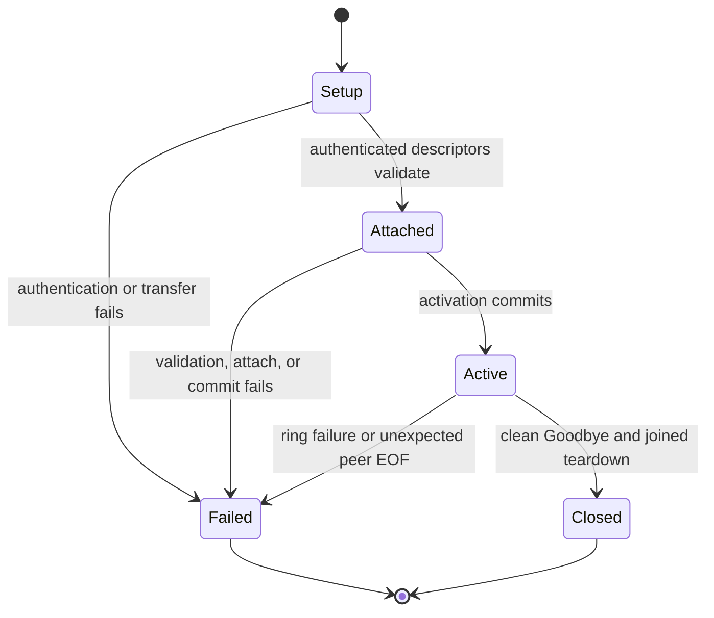

# mc-host shared-memory transport

## Status

The fixed sparse ring is the only application transport. `linux-x64-gnu` clients use the owner-only Unix setup socket to authenticate, receive two memfds and four eventfds, validate the current release identity, attach, and commit activation. Application frames never use the setup socket or eventfds. Darwin shared-memory execution is unsupported and rejected during package capability selection.

There is no runtime transport selector, alternate shared-memory backend, compatibility reader, or degraded data path. A transport failure is terminal for the affected connection.

The accepted identity is fixed by the release:

- profile: `mc-host-eventfd-ring-v2`
- wire version: `2`
- descriptor schema: `3`

An install that cannot load the native addon or establish this identity fails before application traffic.

## Ring and ownership

Each connection owns two bounded single-producer/single-consumer rings, one per direction. Each ring has a fixed descriptor depth and sparse 64 MiB payload arena. Setup touches control pages only. A producer reserves capacity, writes into the shared arena, and publishes the exact body length with the wire header. A receiver validates the descriptor and header before exposing a scoped lease. FIFO reclamation removes only fully released, page-aligned interiors with `MADV_REMOVE`; partial neighboring pages remain mapped and capacity is published only after successful removal.

The process-wide admission controller charges descriptors, arena bytes, receive leases, mappings, mapping file descriptors, endpoint workers, client instances, and pinned workers before creating ring resources. Active and quarantined charges are reported separately. Every configured limit is finite and validated at startup.

## Connection lifecycle

Setup proceeds through these phases:

1. Authenticate the peer over the owner-only Unix socket.
2. Admit the fixed ring charge.
3. Transfer exactly two memfds and four eventfds.
4. Validate the profile, wire version, descriptor schema, grants, and activation token.
5. Attach both directions and commit activation.
6. Keep the setup socket open as the peer-lifetime sentinel.

Any setup, attachment, activation, ring, or peer-lifetime failure terminates the affected connection. A caller may create a fresh connection.

Clean `Goodbye` and unexpected setup-socket closure are distinct. Unexpected closure records peer death, cancels ring work, and tears down the exact connection. Joined endpoint teardown returns its admission charge when the mapping is unmapped. Native aliases whose detachment fails keep their channel and mapping alive until cleanup succeeds.

## Doctor and diagnostics

`magic-context daemon doctor` reports either a healthy fixed ring or one terminal class:

- `missing_addon`
- `identity_mismatch`
- `setup_failure`
- `peer_death`
- `resource_exhaustion`

A healthy report includes only bounded, aggregate data:

- fixed artifact identity;
- process bounds;
- active and quarantined accounting;
- completed attachment and activation counts;
- observed peer-death count;
- completed reclamation count;
- observed exhaustion count.

Client diagnostics use the same terminal-class set. Frame events retain only numeric header identity and byte length. Emission remains rate-limited to the configured per-second cap, and all string fields use fixed closed values or a 128-byte display bound.

Reports never include setup-socket paths, native handles, mapping descriptors, grants, activation tokens, authentication keys or proofs, payload bytes, mapped addresses, or provider error text. Peer-controlled text is either reduced to a closed class or redacted and length-bounded before rendering.

## Resource bounds

The fixed profile charges both directions. One connection charges 64 ring descriptors, 128 MiB of sparse virtual arena capacity, 64 receive leases, two mappings, six transferred file descriptors, no endpoint or pinned worker, and one client instance. Native JS integration adds one environment watcher, not one watcher per connection. Process bounds multiply this profile by the configured maximum connection count with checked arithmetic. Resident memory grows on first touch and returns through FIFO page removal; the virtual arena charge stays fixed.

Exact-capacity admission succeeds. Capacity plus one fails without creating another mapping or worker. Repeated peer crashes must not increase active charges after reclamation, and quarantined charges remain within the configured process bound.

## Platform contract

Shared-memory production support is `linux-x64-gnu` only. The package manifest and addon checksum are verified before loading. Build profile and target identity are checked before setup. Managed Rust clients use the same setup protocol, ring profile, wire version, and descriptor schema.

Repository Darwin package use is inventoried. Existing Darwin host payload packages remain for unrelated host distribution, but `@cortexkit/mc-shm-native` has no Darwin selector, Darwin addon payload, or macOS shared-memory CI execution. This publishes support withdrawal for the native shared-memory path. Active-deployment absence still needs owner confirmation; any deployment that requires Darwin shared-memory transport blocks release instead of selecting another readiness or reclaim implementation.

Clean-install gates must complete one cross-process application round trip on Linux x64. A missing package, addon, manifest, checksum, or platform capability fails the gate; unsupported or omitted results are not success states.
