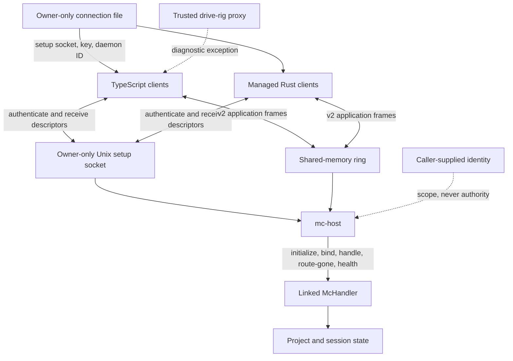
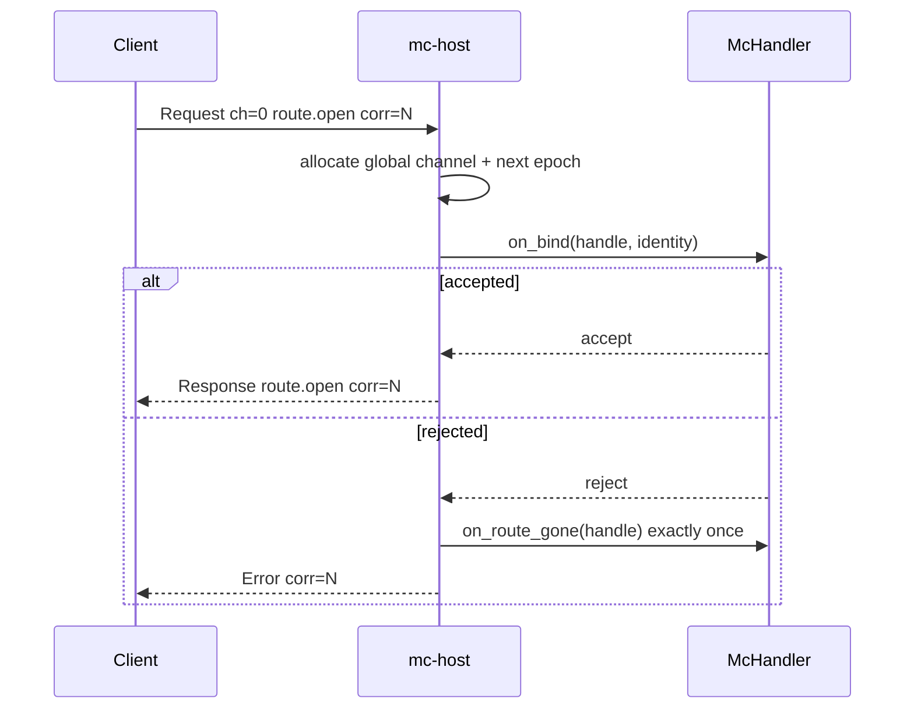
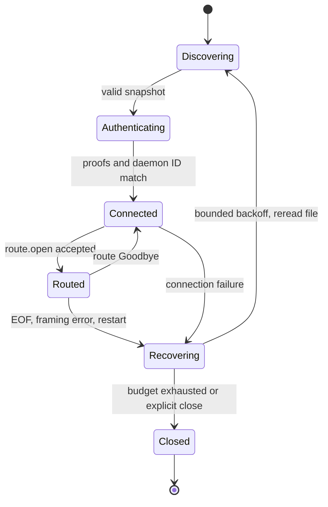

# `mc-host` Wire Protocol and Handshake

Status: normative direct-linked static three-target profile
Wire version: 2
Connection-file schema: 1
Task: `magic-context-c50.2`; two-target revision and Synapse application protocol: `magic-context-c50.6`; three-target revision and reserved capacity classes: `magic-context-c50.11`

## 1. Conformance and authority

The key words **MUST**, **MUST NOT**, **SHOULD**, **SHOULD NOT**, and **MAY** are normative as defined by RFC 2119 and RFC 8174.

This document is the direct-only wire authority. `mc-host` owns the Rust wire, authentication, discovery, control, routing, and managed-client contracts. Repository implementations and conformance tests provide executable evidence; historical published-package behavior is provenance only and cannot enable a compatibility path.

Canonical version-2 literals remain part of this contract even when they retain `subc` spelling. In particular, `subc_ops`, `subc-connection.json`, `SUBC_MODULE_ID`, `SUBC_LAUNCH_NONCE`, `subc-server-v1`, and `subc-client-v1` MUST NOT be renamed without a separately versioned wire or lifecycle migration.

## 2. Profile, actors, and trust boundary

`mc-host` directly links one static composite handler and serves exactly three immutable modules: `magic-context` (role `tool_provider`), `synapse` (role `management_surface`), and `broca` (role `management_surface`). The composition is fixed at startup: there is no dynamic registration, catalog mutation, plugin loading, or module supervision, and `mc-host` is not a remote transport.

Actors:

- **Host:** `mc-host`; owns credentials, connection generations, ring setup, channels, epochs, correlations, and component lifecycle.
- **Managed TypeScript client:** `McHostClient` and `McHostModuleTransport`; own secure discovery, authentication, mandatory ring attachment, route epochs, deadlines, cancellation, Ping/Pong, and cleanup for plugin, Synapse, wake-plane, CLI, and fixture callers.
- **Managed Rust client:** `mc_host::Client`; owns the same boundary for `HistorianProducer` and Rust fixtures, including typed send outcomes, streaming, checked correlation allocation, reserved control admission, and deterministic close.
- **Handler:** the directly linked static composite; receives initialization, target-aware bind, request, route-gone, internal health, and shutdown callbacks and dispatches each to `magic-context`, `synapse`, or `broca`.

The 32-byte connection key is a bearer capability. Possession grants every direct-profile operation — including host-global `host.shutdown` (Section 7.6) — and permits any `BindIdentity`. Client `role`, `consumer_identity`, `project_root`, `harness`, and `session` are claims or scoping metadata; none grants authority. A key reader MUST therefore be trusted as the same local security principal as the host, and every key reader is stop-capable: a diagnostic or proxy principal that holds the bearer is not read-only, whatever its role label or mount permissions claim.

Production application transport is the local shared-memory ring. The owner-only Unix setup socket carries authentication and descriptor transfer only, remains open as a peer-lifetime sentinel, and cannot carry application frames. Remote transport is unsupported.

Initial secure publication support is Unix-like systems. Windows support is deferred until atomic replacement, ACL validation, instance locking, link handling, and ownership-fenced cleanup have a reviewed contract.



## 3. Terms

- **Host incarnation:** one process lifetime with one fresh key and daemon ID.
- **Connection generation:** client-local identity for one authenticated ring connection. It is not sent on wire.
- **Catalog generation:** `u64` catalog-state version returned by `catalog.list`; unrelated to connection generation.
- **Route handle:** `(channel, epoch)` created by the host before invoking handler bind and published to the client only after bind succeeds. A rejected bind still observed the handle, which is why route-gone fires exactly once on rejection (Section 8.2).
- **Live channel:** nonzero `u16` route slot from one host-global namespace across all consumer connections.
- **Route epoch:** nonzero `u32` incarnation of a channel. Reuse is allowed only after prior cleanup and at a strictly higher epoch.
- **Correlation:** nonzero `u64` request identity allocated monotonically within one connection generation. Each direction owns an independent correlation namespace: host-originated correlations (`Ping`) and consumer-originated correlations never collide even when numerically equal.
- **Full request identity:** `(connection generation, direction, channel, epoch, correlation)`. Direction is implied on wire by frame type, never encoded as bytes.
- **Terminal frame:** first matching `Response`, `Error`, or `StreamEnd` for a correlation.
- **`not_sent`:** sender proves the request frame was not published to the ring.
- **`outcome_unknown`:** any request with a partial, completed, or uncertain write whose terminal frame was not observed.
- **`terminal`:** matching terminal frame was observed; its success or failure applies only to that correlation.
- **Transport-ready:** setup socket bound, handler initialized, and connection file published.
- **Storage-ready:** linked handler can serve storage-dependent operations. Transport readiness does not imply it.

## 4. Discovery and credential publication

### 4.1 Canonical path and schema

Clients MUST read `${dataDir}/cortexkit/run/subc-connection.json`. Host and client configuration MAY supply an explicit equivalent path. The host MUST publish schema 1:

```json
{
  "schema": 1,
  "wire_version": 2,
  "setup_socket": "/run/user/1000/cortexkit/mc-host.sock",
  "key": [0, 1, 2, 3, 4, 5, 6, 7, 8, 9, 10, 11, 12, 13, 14, 15, 16, 17, 18, 19, 20, 21, 22, 23, 24, 25, 26, 27, 28, 29, 30, 31],
  "daemon_id": [96, 97, 98, 99, 100, 101, 102, 103, 104, 105, 106, 107, 108, 109, 110, 111],
  "pid": 4242,
  "daemon_ver": "mc-host/0.1.0"
}
```

Example bytes are deterministic and non-secret. Real key and daemon-ID bytes MUST come from the OS CSPRNG.

Writers MUST include numeric `wire_version: 2`. Clients MUST reject an absent, null, string, fractional, or non-2 value before opening the setup socket. There is no omission default and no version downgrade.

A client MUST:

1. open the parent and connection file without following links, then take one descriptor-anchored regular-file snapshot capped at 65,536 bytes;
2. reject a larger file before JSON parsing;
3. require schema 1, numeric wire version 2, one nonempty absolute `setup_socket`, exactly 32 key bytes, exactly 16 daemon-ID bytes, a numeric PID, and a nonempty daemon version;
4. verify owner-only regular-file metadata before and after the read and verify the directory entry still names the same file;
5. reject relative or empty setup-socket paths, replacement, and insecure ownership or permissions.

The validated descriptor snapshot is the sole source of credentials and setup-socket authority. A client MUST NOT validate by pathname and then reopen that pathname for the key, daemon ID, or socket path.

Publication and acceptance require exactly 32 key bytes so all direct implementations use one credential shape.

### 4.2 File and link safety

The host MUST acquire a single-instance lock before minting credentials, binding, publishing, or removing the file. The runtime directory and lock MUST be owner-controlled. Publication MUST:

1. generate a fresh 32-byte key and 16-byte daemon ID for every host incarnation;
2. create a unique owner-only temporary regular file in the directory containing the resolved canonical path (by default `${dataDir}/cortexkit/run/`; a configured equivalent path per Section 4.1 uses its own directory), so both names share one filesystem and `rename(2)` cannot fail `EXDEV`, without following links;
3. write complete JSON, flush it as required by deployment durability policy, and atomically rename it over the canonical path;
4. leave the final file mode `0600` with no group or other permission bits;
5. redact key bytes in logs, errors, panic formatting, metrics, and diagnostics.

Stale publication temporaries matching the host's private naming pattern MAY be removed after ten minutes. Cleanup is best effort and MUST NOT delay publication. The host MUST never publish through a symlink.

Host publication, client discovery, and cleanup MUST reject symbolic links and unsafe ancestors. Deployment bind mounts are outside pathname traversal; the mounted file must still pass regular-file, owner, mode, bounded-read, replacement, and descriptor-identity checks.

Shutdown removal MUST occur while the instance lock is held. Before unlinking, the host MUST reread metadata without following links and confirm that the file is its own publication, including matching daemon ID. An old process MUST NOT remove a replacement host's credential. The handler is dropped before lock release.

### 4.3 Lifecycle record and native state probe

The host additionally maintains `${dataDir}/cortexkit/run/mc-host-lifecycle.json`, an owner-only (0600) strict schema-1 record written atomically through the same pinned runtime-directory descriptor as the publication:

```json
{
  "schema": 1,
  "phase": "running",
  "launch_id": "<32 lowercase hex>",
  "daemon_id": "<32 lowercase hex>",
  "payload_manifest_digest": "<64 lowercase hex>",
  "pid": 4242,
  "written_at_ms": 1755838080000
}
```

`payload_manifest_digest` is the canonical 64-character lowercase-hex payload manifest digest. Exactly one other value is accepted: the empty string, which is the pre-coordination legacy shape written by releases that predate the digest and is read as a legacy record rather than a current one. Any other value is corruption and the record is rejected as malformed.

`phase` is `starting` (after lock acquisition, before publication), `running` (after publication), or `stopping` (from graceful-shutdown step 1). `pid` is display metadata only: no reader may signal it, infer liveness from it, or authorize anything with it. Record cleanup is fenced by matching launch and daemon identity and runs under the instance lock before lock release, mirroring publication cleanup.

`payload_manifest_digest` is required payload identity: exactly 64 lowercase hex characters, validated as host input before any lock is taken, and byte-identical across every `starting`, `running`, and `stopping` record one incarnation writes. An empty, oversized, or otherwise noncanonical digest never decodes as a valid record, so it can never support a `running` classification. A record whose JSON carries an unknown `schema` is quarantined: its bytes are preserved byte-for-byte, probes classify it `unsupported_state_schema`, and a host start against it fails closed rather than interpreting, migrating, or overwriting it.

Lifecycle state is derived from lock ownership plus this evidence, never from PID existence. Two locks participate: the stable lifetime fence (`lifetime.lock`, below) and the runtime-directory instance lock.

| Lifetime fence | Instance lock | Evidence | State |
| --- | --- | --- | --- |
| free | free | anything, including stale record or publication | `stopped`; nothing is unlinked |
| free | free | record with an unknown schema | `stopped` with `unsupported_state_schema`; bytes preserved |
| held | free (or the runtime directory is missing) | anything | `wedged` after a bounded reread: a live incarnation's namespace was replaced, or a start/teardown window persisted |
| free | held | anything | `wedged` after a bounded reread: a holder without the stable fence is never coherent |
| held | held | fresh `starting` record, with or without a predecessor's leftover publication | `starting` |
| held | held | `running` record and publication with the same daemon ID | `running` |
| held | held | `running` record with a missing or daemon-ID-mismatched publication | `wedged` |
| held | held | fresh `stopping` record, with or without a predecessor's leftover publication | `stopping` |
| held | held | record with an unknown schema | `wedged` with `unsupported_state_schema`; bytes preserved |
| held | held | missing, corrupt, insecure, or expired *record* (including a noncanonical digest), or a corrupt or insecure *publication* (any phase) | `wedged` |

A missing publication is `wedged` only under a `running` record (the row above); `starting` and `stopping` require no publication at all. A free replacement runtime-directory lock is never proof that the first daemon ended; only the stable lifetime fence proves that.

A publication whose daemon ID differs from the record's is crash residue during `starting` and `stopping`: a killed incarnation leaves its publication behind, and its successor writes a `starting` record before its own publication overwrites the file (symmetrically, an incarnation that fails before publishing demotes to `stopping` without ever owning the leftover). Only the `running` claim requires the publication to match the record; the freshness windows still age a hung start or stop to `wedged`.

`wedged` is observational: probes and clients MUST NOT kill processes, break locks, or repair files. Probes use a validation-only opener (no create, no chmod, no link following, and no blocking on a non-regular file), test the instance lock nonblockingly and in shared mode so concurrent probes cannot alias each other into a false holder reading, and reread evidence boundedly when identities change mid-sample. Because a daemon must hold the instance lock before it can write its `starting` record, a held lock with no record is rechecked over a bounded grace window before it classifies `wedged`. An evidence name that is present but not a secure regular file — a symlink, FIFO, directory, or wrong owner or mode — is `insecure`, never `missing`.

Cross-process lifecycle serialization lives in a fixed, version-neutral, owner-only directory directly under the data root: `${dataDir}/.mc-host-coordination/`, containing the never-renamed regular files `transaction.lock` and `lifetime.lock`. Supported code never renames, replaces, or unlinks the directory or either file; same-UID replacement of that root or an ancestor is trusted-policy replacement outside this boundary.

- `transaction.lock` carries the exclusive flock serializing mutating lifecycle transactions (launcher start/stop, owned by downstream packaging work); probes take it shared, without creating anything, when it exists. Shared acquisition is bounded, not awaited: four attempts 25 ms apart, after which a probe that still finds a mutator holding the lock samples on evidence alone. A probe therefore does not always exclude an in-flight mutation, and may observe an intermediate lifecycle state; the bounded reread loop, not the lock, is what makes such a sample coherent. Lock absence degrades the same way, since a probe never creates the coordination root.
- `lifetime.lock` carries the daemon's whole-incarnation exclusive flock, acquired before the runtime-directory instance lock and held through publication cleanup, component shutdown, and callback reaping.

Neither the runtime-directory inode nor a lock on the managed `${dataDir}/cortexkit/lifecycle` directory prevents replacement-induced overlap on its own: both live inside the replaceable managed subtree, so renaming `run`, `lifecycle`, or the whole `cortexkit` tree would let a successor anchor fresh inodes under the same names. Because the coordination files sit outside that subtree and are never renamed, replacing the managed subtree cannot split either lock: a mutator still contends on the same `transaction.lock` inode, and a successor daemon still blocks on the same `lifetime.lock` inode until the displaced incarnation fully tears down. The runtime-directory instance lock remains as the descriptor-relative publication/cleanup fence. A mutator holding `transaction.lock` must additionally anchor named-namespace mutations to retained `cortexkit`/child descriptors and abort its named-namespace result when parent or child identity drifts.

## 5. Pre-envelope authentication

### 5.1 Admission and framing

Authentication starts when the owner-only setup socket accepts a peer and uses one absolute deadline across every length read, body read, write, comparison, descriptor transfer, and failed-handshake shutdown. Recommended host default is 2 seconds, matching current clients; deployment MAY shorten it but MUST publish a client-compatible value operationally.

The host MUST bound unauthenticated handshake slots separately from authenticated connections. Excess accepts MUST be closed immediately without reading client bytes. Every success, parse failure, proof failure, timeout, EOF, or shutdown MUST release its slot. Slot count is finite deployment policy, not a wire constant.

Each authentication message is `u32` little-endian byte length followed by that many UTF-8 JSON bytes. Length MUST be at most 4,096. Length 4,096 is valid; 4,097 is rejected before allocation. EOF during either prefix or body fails authentication.

### 5.2 Messages and proofs

Host-owned authentication uses these fixed parameters:

| Parameter | Value |
| --- | --- |
| Client nonce | 32 OS-CSPRNG bytes |
| Server nonce | 32 OS-CSPRNG bytes |
| Proof | 32-byte HMAC-SHA256 |
| Server domain | ASCII `subc-server-v1` |
| Client domain | ASCII `subc-client-v1` |

Only lengths and domains are constants. Both nonces MUST be freshly generated from the OS CSPRNG for every handshake attempt and MUST NOT be reused within or across connections or host incarnations. Server-nonce freshness is the replay defense: a reused server nonce would let an observer replay a previously captured `client_auth` under a replayed client nonce.

Exchange:

```mermaid
sequenceDiagram
  participant C as Client
  participant H as mc-host
  C->>H: ClientHello {client_nonce, role}
  H-->>C: ServerProof {daemon_id, server_nonce, daemon_ver, server_proof}
  Note over C: verify server proof, then daemon ID, then daemon version
  C->>H: ClientAuth {client_auth}
  Note over H: constant-time verify
  H-->>C: two ring descriptors + activation data
  Note over C,H: validate current identity, attach, commit; v2 ring traffic enabled
```

Canonical JSON shapes:

```json
{"client_nonce":[32,33,34,35,36,37,38,39,40,41,42,43,44,45,46,47,48,49,50,51,52,53,54,55,56,57,58,59,60,61,62,63],"role":"client"}
```

```json
{"daemon_id":[96,97,98,99,100,101,102,103,104,105,106,107,108,109,110,111],"server_nonce":[64,65,66,67,68,69,70,71,72,73,74,75,76,77,78,79,80,81,82,83,84,85,86,87,88,89,90,91,92,93,94,95],"daemon_ver":"mc-host/0.1.0","server_proof":[64,154,84,68,23,100,116,189,2,121,137,79,177,172,107,52,108,174,152,208,218,25,249,160,154,212,42,68,91,108,85,131]}
```

```json
{"client_auth":[184,138,243,55,0,189,88,52,54,27,4,112,129,214,202,57,252,146,75,221,119,177,247,0,193,206,206,26,90,147,247,187]}
```

Those proofs use key bytes `00..1f`, client nonce `20..3f`, server nonce `40..5f`, daemon version `mc-host/0.1.0`, and daemon ID `60..6f`. For domain `D`, proof bytes are:

```text
HMAC-SHA256(key, ASCII(D) || client_nonce || server_nonce ||
            u32be(len(UTF8(daemon_ver))) || UTF8(daemon_ver) || daemon_id)
```

`u32be(len(daemon_ver))` is the byte length of the UTF-8 `daemon_ver` encoded as a **big-endian** `u32`. It is the only big-endian integer in this otherwise little-endian protocol; the length prefix keeps the transcript injective because `daemon_ver` is the only variable-length field between the fixed-length nonces and the trailing `daemon_id`. Binding `daemon_ver` into both proofs means a peer without the key cannot tamper with the reported daemon version: a substituted version fails the server-proof check on the client and the client-auth check on the host.

The client MUST compare server proof in constant time, then require `ServerProof.daemon_id` to equal the connection-file daemon ID, then require `ServerProof.daemon_ver` to equal the connection-file `daemon_ver`. It MUST emit no `ClientAuth` until all three checks succeed. The server MUST compare client proof in constant time. `role` is unverified reporting metadata and MUST NOT affect privilege, admission, or capacity.

The proofs authenticate the reported `daemon_ver`; the connection-file comparison separately requires that authenticated value to match the same discovery snapshot as the key and daemon ID. An attacker who can rewrite the owner-only connection file can replace all three values, so secure publication remains part of the trust boundary.

Any malformed JSON, wrong array length, oversized message, nonce-generation failure, proof mismatch, daemon-ID mismatch, daemon-version mismatch, EOF, or deadline expiry MUST close the socket. No envelope may be read or written on a failed handshake. Mixed-generation key, daemon-ID, and daemon-version values therefore fail closed.

## 6. Envelope framing

### 6.1 Header

After authentication, peers exchange a fixed 21-byte v2 header followed by `len` opaque body bytes. Integers are little-endian.

| Offset | Width | Field | Constraint |
| ---: | ---: | --- | --- |
| 0 | 4 | `len: u32` | `0..=67,108,864` |
| 4 | 1 | `ver: u8` | exactly 2 |
| 5 | 1 | `type: u8` | `0..=11` per table below |
| 6 | 1 | `flags: u8` | valid bit fields below |
| 7 | 2 | `channel: u16` | 0 is control; routed channels are nonzero |
| 9 | 4 | `epoch: u32` | 0 on channel 0; routed epochs are nonzero |
| 13 | 8 | `corr: u64` | request correlation; 0 only where this document permits |

The first five bytes (`len` then `ver`) are the frozen prefix. A reader MUST read the prefix, reject unsupported version, read the remaining 16 header bytes, validate the complete header, and only then allocate/read the body.

Flags:

| Bits | Meaning | Values |
| --- | --- | --- |
| 0 | body encoding hint | 0 JSON/opaque application bytes; 1 binary |
| 1-2 | priority | 0 Passive, 1 Interactive, 2 Background; 3 invalid |
| 3 | last | final frame of a streamed message |
| 4-5 | admission class | 0 Normal, 1 Expedite, 2 Sheddable; 3 invalid |
| 6-7 | reserved | MUST be zero |

`Sheddable` is legal only on `Push` and `StreamData`; a `Sheddable` admission class on any other frame type is invalid flags and closes the generation (Section 6.3). Pure-header frames (`Cancel`, `Ping`, `Pong`, `Goodbye`) MUST set `binary = 0`, `last = 0`, and admission class `Normal`; priority MAY be any valid value. A conforming `Ping` therefore never carries flags whose mandated `Pong` echo the host would have to reject. Admission classes are preserved and validated for numeric compatibility; this single-module profile defines no deployment admission policy from them.

### 6.2 Frame types and direct-profile classification

| Value | Type | Direct-profile status | Direction and use |
| ---: | --- | --- | --- |
| 0 | `Request` | required | consumer to host; channel-0 control or routed opaque request |
| 1 | `Response` | required | host to consumer; unary or control success terminal |
| 2 | `Push` | reserved | decoded and fenced; host does not emit it in this profile |
| 3 | `StreamData` | required | host to consumer; zero or more nonterminal stream items |
| 4 | `StreamEnd` | required | host to consumer; terminal, usually zero body |
| 5 | `Error` | required | host to consumer; terminal canonical `ErrorBody` |
| 6 | `Cancel` | required | consumer to host; best-effort cancellation of matching request |
| 7 | `Ping` | required | host to consumer liveness probe |
| 8 | `Pong` | required | consumer to host; echoes Ping control identity and flags |
| 9 | `Hello` | reserved, role-invalid | external provider registration is unsupported; never valid from a consumer |
| 10 | `HelloAck` | reserved, role-invalid | external provider registration is unsupported; never valid on a consumer connection |
| 11 | `Goodbye` | required | either direction; route or connection teardown |

`Cancel`, `Ping`, `Pong`, and `Goodbye` are pure-header frames and MUST declare `len = 0`. A nonzero body is malformed. `Hello` and `HelloAck` numeric assignments remain reserved, but receiving either on an authenticated consumer connection is a role violation. The host MUST close that generation; it MUST NOT reinterpret the peer as a provider.

A consumer-originated `Response`, `Push`, `StreamData`, `StreamEnd`, or `Error`, and every host-originated `Request`, are role-invalid. The receiver MUST close the generation rather than extend this profile implicitly.

Frame legality after header decoding:

| Type | Required channel / epoch / correlation | Body | State-invalid disposition |
| --- | --- | --- | --- |
| `Request` control | `0 / 0 / nonzero` | tagged JSON | unknown operation gets terminal `unsupported_operation` |
| `Request` routed | `nonzero / nonzero / nonzero` | opaque | absent or stale route gets terminal `unknown_channel`; no handler dispatch |
| `Response`, `Error` | exact pending identity, nonzero correlation | opaque / canonical error JSON | client drops unmatched or stale terminal |
| `StreamData`, `StreamEnd` | exact pending routed identity, nonzero correlation | opaque; direct-profile StreamEnd is empty | client drops unmatched, stale, duplicate, or post-terminal frame |
| `Push` | current nonzero route, correlation 0 | opaque | client drops absent/stale route; host never emits in direct profile |
| `Cancel` | current nonzero route and pending nonzero correlation | empty | stale route or unknown/terminal correlation is idempotent no-op |
| `Ping` | `0 / 0 / nonzero` | empty | client returns matching Pong |
| `Pong` | exact outstanding Ping identity | empty | host drops unmatched Pong |
| route `Goodbye` | current `nonzero / nonzero / 0` | empty | stale/unknown route is idempotent no-op |
| connection `Goodbye` | `0 / 0 / 0` | empty | orderly generation close |

Any structurally illegal channel, epoch, correlation, body, or direction closes the generation. `StreamEnd` is not a pure-header frame at the framing layer, but the direct profile requires an empty `StreamEnd` body: receiving `StreamEnd` with `len > 0` is a structurally illegal body under the table above and closes the generation, even though frame alignment itself is intact. Valid but stale state uses the explicit dispositions above; it is not framing corruption.

### 6.3 Reading, limits, and corruption

The interoperability body maximum is exactly 64 MiB (`67,108,864` bytes). A conforming implementation MUST be able to accept one otherwise valid maximum-size frame on an admitted authenticated connection. A deployment MAY cap concurrent connections, aggregate buffered bytes, routes, pending correlations, handler tasks, queues, and diagnostics, but MUST NOT advertise v2 conformance while rejecting an otherwise valid frame solely because its declared length is at or below 64 MiB.

Aggregate resource policy takes effect between frames, before admitting more connections/work, or after a complete frame reaches a profile/application limit. For example, `McHandler` may return terminal `invalid_params` for its 1 MiB facade or 32 MiB transform limits after transport framing accepts the body. Local limits never change header bytes.

Waiting for the next frame on an idle connection is unbounded at the framing layer; idle lifetime is governed separately by liveness policy (Section 9.3). A published ring descriptor names one complete header and body. The receiver MUST validate all offsets, lengths, sequence metadata, header fields, and descriptor identity before exposing a scoped receive lease.

Clean `Goodbye` followed by joined teardown is orderly connection close. Unexpected setup-socket EOF, an invalid ring descriptor, truncated declared frame, unsupported version, unknown type, invalid flags, nonzero channel-0 epoch, zero epoch on a routed channel, pure-header body, or body declaration above 64 MiB retires the connection without resynchronization or reuse of uncertain storage.

Writers MUST verify header `len` equals body length, reserve enough bounded ring capacity for the complete frame, fill the reservation, and publish exactly once. Each direction has one logical writer and FIFO publication order. A failed or underfilled reservation aborts without publication. Once publication begins, a missing terminal leaves the request outcome unknown.

### 6.4 Byte examples

The compact canonical `route.open` request defined in Section 7.2 is 173 UTF-8 bytes. Its `Request` header uses Interactive/Normal flags, control channel, epoch 0, correlation 1:

```text
ad 00 00 00  02 00 02  00 00  00 00 00 00  01 00 00 00 00 00 00 00
|--- len ---| ver ty fl | ch  |--- epoch --|--------- corr ----------|
```

Hex without spacing: `ad0000000200020000000000000100000000000000`.

A routed 44-byte Background/Normal request on channel 7, epoch 77, correlation 2 has header:

```text
2c00000002000407004d0000000200000000000000
```

## 7. Control and application messages

### 7.1 Body rules and metadata bounds

Channel 0 accepts UTF-8 JSON only (`binary = 0`), with tagged request and response objects using the `op` field. The direct profile caps a channel-0 body at 65,536 bytes even though framing permits more. Oversize control requests receive terminal `Error{code:"invalid_control_request"}`. A channel-0 header declaring `len` greater than 65,536 already proves the violation: the host MAY emit that terminal as soon as header validation completes, MUST NOT buffer the oversize body, and drains and discards the declared bytes under the frame's absolute deadline to preserve stream alignment (deadline expiry closes the generation as usual). The early terminal is authoritative for its correlation even if the declared body then truncates, stalls, or EOFs: that later failure closes the generation per Section 6.3 without a further `Error`, the already-settled correlation stays `terminal`, and only other pending work becomes `outcome_unknown` at the close. This early rejection does not violate the Section 6.3 acceptance requirement, which applies to otherwise valid frames. Routed application request and response bodies remain opaque to transport and may be JSON or binary as flags indicate.

Before filesystem work or handler bind, host MUST enforce these UTF-8 byte limits:

| Field | Limit and validation |
| --- | --- |
| `op` | 64 bytes; nonempty; no NUL. Value recognition is not structural validation: an unrecognized `op` dispatches to operation classification (Section 7.4) and gets terminal `unsupported_operation`, not `invalid_control_request` |
| `module_id` | 128 bytes; nonempty; no NUL |
| `project_root` | 4,096 bytes; absolute platform path; no NUL |
| `harness` | 128 bytes; nonempty; no NUL |
| `session` | 256 bytes; nonempty; no NUL |
| `consumer_identity.module_id` | 128 bytes; no NUL |
| `consumer_identity.launch_nonce` | 256 bytes; no NUL |
| each consumer capability | 64 bytes; at most 32 entries |
| `admission_facts` | at most 8,192 encoded bytes and 32 nesting levels |
| `identity.credential_fingerprints` | optional object; keys only `anthropic`, `google`, `openai`; at most 3 entries; each value exactly 64 lowercase hex |

Malformed JSON, duplicate recognized fields, invalid UTF-8, invalid field type, excessive nesting, out-of-range field, or relative project root receives terminal `invalid_control_request` for that correlation. Unknown fields are ignored for published serde forward compatibility but still count toward body and nesting limits. `admission_facts` size is its compact UTF-8 JSON serialization; collection depth is 1 at the subtree root and increases for each nested object/array. No handler callback or filesystem work runs on rejection. `BindIdentity` still grants no authority. Host MAY verify an absolute project root against its real filesystem when handler semantics require it; caller and handler MUST NOT derive privilege from existence or path spelling. Error `code` is stable; `message` is diagnostic unless this document states exact text.

### 7.2 `route.open`

Required compact canonical request:

```json
{"op":"route.open","target":{"kind":"tool_provider","module_id":"magic-context"},"identity":{"project_root":"/workspace/project","harness":"opencode","session":"session-1"}}
```

Optional `consumer_identity` is `{module_id, launch_nonce}`. Optional `consumer_capabilities` is an array of strings. Optional `admission_facts` is any bounded JSON value. Managed callers may include `identity.credential_fingerprints`, a provider-to-HMAC map derived from the authenticated connection bearer and the current qualified credential row. The derived key is `HMAC-SHA256(connection_key, "subc-broca-credential-v1")`; each value is `HMAC-SHA256(derived_key, canonical_row_encoding)` rendered as 64 lowercase hex, where canonical row encoding is the U9 length-prefixed `harness-provider-name-length-value/1` contract. Values are protocol-internal and never credentials. Absence means no claim/capability/facts; it is not a denied claim. The bearer key remains authority.

Successful response MUST retain the tag:

```json
{"op":"route.open","route_channel":7,"route_epoch":77}
```

The direct profile routes exactly three static target pairs. Classification runs only after every structural bound in Section 7.1 held, and each rejection is one stable terminal code:

| `target.kind` | `target.module_id` | Result |
| --- | --- | --- |
| `tool_provider` | `magic-context` | handler bind for the Magic Context component |
| `management_surface` | `synapse` | handler bind for the Synapse component |
| `management_surface` | `broca` | handler bind for the Broca component |
| `tool_provider` | `synapse` or `broca` | terminal `target_unavailable` (known module, unsupported role); zero bind calls |
| `management_surface` | `magic-context` | terminal `target_unavailable` (known module, unsupported role); zero bind calls |
| any recognized kind above | any other module | terminal `unknown_module`; zero bind calls |
| any other kind (`internal_service`, model-runner kinds, unknown strings) | any module | terminal `target_unavailable`; zero bind calls |

A successful classification carries the validated typed target into the handler bind, so the composite dispatches on host-validated data and never re-parses the client body. The Synapse target stays in this matrix even when its model bundle is missing or invalid: classification still succeeds, the bind is invoked, and the component rejects it with terminal `artifact_invalid` (Section 7.5.1). The Broca component serves the five-operation LLM-run management protocol consumed by `HistorianProducer` (`session.send`, `session.subscribe`, `run.status`, `run.cancel`, `session.delete`); its application protocol is specified by the Broca revision that implements it, not this section. That protocol's load-bearing properties for this profile are: run lifetime is detached from transport lifetime (waiter loss never stops a run; only `run.cancel`, `session.delete`, or host shutdown does, and each terminates and reaps the complete harness subprocess group before settling), run state is process-local and bounded (a restarted host reports old run IDs as strict `missing`), and subprocess execution is confined to the hardened OpenCode/Pi adapter trust boundary (no shell, private prompt delivery, provider-scoped child environment, bounded redacted output). Before `session.send` creates a run, Broca derives the requested provider row fingerprint from its frozen startup snapshot and incarnation bearer and constant-time compares it with the route-frozen managed caller value; missing, oversize, unsupported, or changed rows return `harness_unavailable` with the closed credential subreason and spawn no child. A Broca bind additionally requires harness `opencode` or `pi`; any other harness is rejected at bind with `invalid_identity` and no run state. Dynamic routing, provider discovery, and `internal_service` routing remain outside this document.

The direct component exposes no `thalamus` resolver route. A facade request without an explicit or route-bound session returns the existing typed `session_unresolved` result locally and opens no resolver transport route. Bound OpenCode sessions retain their proven direct path.

### 7.3 `catalog.list`

Requests MAY omit `module_id` to list all entries or supply a filter. Unknown filters return an empty `modules` array, not an error:

```json
{"op":"catalog.list","module_id":"not-linked"}
```

```json
{"op":"catalog.list","generation":1,"modules":[],"subc_ops":["route.open","catalog.list","host.shutdown","host.status"]}
```

An unfiltered request MUST return exactly three entries — `magic-context`, then `synapse`, then `broca`, in that deterministic order — and an exact-module filter MUST return that one entry, each derived without lossy rewriting from its startup manifest:

| Response field | Required value |
| --- | --- |
| `op` | `catalog.list` |
| `generation` | current catalog-state generation |
| `modules[i].module_id` | `magic-context`, `synapse`, or `broca` |
| `modules[i].module_version` | that manifest's exact build version |
| `modules[i].roles` | that manifest's complete `provides` array, including tool schemas |
| `modules[i].control_ops` | implemented module control operations only; the direct profile never includes `wake.create` |
| `subc_ops` | `route.open`, `catalog.list`, `host.shutdown`, `host.status` |

The Synapse and Broca entries are immutable identity, not readiness: each stays in the catalog even when its component cannot currently serve a bind (Section 7.5.1). The direct host is final-decision unsupported for `wake.create`: an advertised `wake.create` entry is an ownership certificate for the complete scheduled-wake lifecycle (durable scheduling, agent-callable lifecycle operations, backlog adoption, and readiness withdrawal), not a readiness hint, and the direct profile owns none of it. Wake-plane probing therefore remains fail-open against this profile; only a future host that owns the complete lifecycle may advertise the capability. `generation` changes only when catalog content changes and is unrelated to connection generation.

### 7.4 Operation classification

`route.open`, `catalog.list`, `host.shutdown` (Section 7.6), and `host.status` are the only required channel-0 operations. Every other operation receives terminal `unsupported_operation`; host stays connected if framing remains valid. `host.status` reads the last completed host-owned health snapshot; it never invokes a handler callback on the requesting connection and exposes only closed component states and sanitized metrics, never handler detail text.

Canonical error body:

```json
{"code":"unknown_module","message":"module magic-context-next is unavailable"}
```

Errors may add an advisory retry delay:

```json
{"code":"queue_full","message":"query admission capacity is exhausted","retry_after_ms":50}
```

`retry_after_ms` is an optional unsigned integer. It tells the caller how long to wait before retrying; it is not a lease or an admission guarantee. Clients MUST accept error bodies without it and MUST ignore unknown error-body fields. A host omits it when no operation-specific delay applies.

`Error` terminates only its matching correlation. It does not itself close a route or connection unless the error table below says so.

### 7.5 Synapse application protocol

Routed requests on the `synapse/management_surface` route are UTF-8 JSON objects (`binary = 0`) of the shape `{"method": string, "params": object}`. Successful responses are JSON objects whose operation payload lives under a `result` object. Failures are transport `Error` terminals with the canonical `{code, message, retry_after_ms?}` body. The service implements exactly four methods — `models.list`, `embed.query`, `embed.batch`, and `embed.result` — and MUST NOT add job-management, health, cancellation, or model-management methods. Legacy field aliases (`entries`, `items`, `results`, `embedding`, `complete`, `cursor` as a response field) are TypeScript read compatibility only; the Rust host MUST NOT emit them.

#### 7.5.1 Validation, bounds, and error codes

Every request body is parsed strictly: duplicate object keys, non-object roots, invalid UTF-8, unknown `method` values, wrong field types, and out-of-bound sizes are rejected before hashing or inference. Whole-body nesting is bounded at 8 levels, counted so that each open object or array is one level and a scalar or key is one more level below its container: at most 7 nested containers may hold a value, an empty 8th container is accepted, and a value nested inside 8 containers is rejected before typed decoding. So `{"a":{"b":{"c":{"d":{"e":{"f":{"g":1}}}}}}}` is valid and `{"a":{"b":{"c":{"d":{"e":{"f":{"g":{"h":1}}}}}}}}` is not; no valid request needs more than 5 levels. JSON delimiters inside strings never count toward depth. `embed.batch` accepts between one and `max_batch_items` elements inclusive, and rejects the element after the maximum before decoding any of its fields. The host's resident-byte cap (`max_resident_bytes`) additionally covers Synapse request parser scratch and request-owned inputs (query text, queued batch items, retained job key and item metadata, and the id/hash copies a ready result page holds while its response is encoded) as named logical payloads — it is an accounting boundary, not an exact process-RSS claim. Those payloads draw on a reserved slice of the cap that is separate from the pool admitting inbound frames, so Synapse parse scratch and retained job inputs can never delay or fail another connection's frame admission, and the Synapse queue and retained-result limits below remain separate, independent gates. A body whose parse reservation exceeds that reserved slice can never be served by this host and is rejected as `schema_violation`, not `queue_full`, so a client does not retry a permanently unservable size.

`embed.query` admits one running query plus at most `max_waiting_queries` waiters. The default is zero, preserving immediate loss-system rejection. Once all `1 + max_waiting_queries` slots are held, the next query receives `queue_full` with `query_retry_after_ms`. Waiters are served in the order they register for the CPU permit, which bounds each waiter's wait and rules out starvation; concurrent requests have no wire-level total order, so the host does not promise that service order matches admission order. A queued query retains its decoded text charge, observes the original request deadline, and performs no engine call if its deadline expires, its route disappears, or shutdown starts before it obtains the CPU permit. A deadline that expires while the engine call is already running fails the request as `timeout`: a vector produced after the deadline is discarded rather than returned. Startup validates that all query slots, the full queued-batch byte budget, and the worst parse reservation fit together in the reserved scratch pool, and that the query slots leave at least one free general handler-task slot; an infeasible combination of configured limits fails host startup with the violated bound rather than silently disabling the lane. The scratch pool carries headroom for up to four waiters at the default text limits; a larger `max_waiting_queries` requires lowering `max_queued_request_bytes`, `max_text_bytes`, or another queue budget, and the rejection message names the candidates.

The application error vocabulary is closed:

| Code | Meaning | Retry disposition |
| --- | --- | --- |
| `queue_full` | admission capacity (job count, aggregate queued request bytes, or query-lane slot) exhausted before admission, or the fail-fast resident-byte reservation for request parsing and input ownership could not be acquired; in every case no state was created | bounded client-side retry; query-lane admission rejection carries the configured `query_retry_after_ms`, while other rejection sites omit the field |
| `model_loading` | reserved; not emitted by the current host — initialization completes before publication, so loading faults surface as bind-time `artifact_invalid` | bounded retry |
| `timeout` | request-scoped deadline expired host-side | caller policy |
| `artifact_invalid` | bundle missing/invalid (bind rejection) or response identity guard failed | permanent; no retry |
| `substitution_rejected` | request named a model/fingerprint/epoch the lane does not serve, or `allow_equivalent`/`accept_declared` was not `false` | permanent |
| `not_certified` | reserved; not emitted by the current host — certification faults surface as bind-time `artifact_invalid` | permanent |
| `probe_required` | reserved; not emitted by the current host — probe faults surface as bind-time `artifact_invalid` | permanent for this incarnation |
| `idempotency_conflict` | retained `request_key` reused with a conflicting payload | permanent |
| `schema_violation` | malformed request, hash/key mismatch, bad cursor, bound violation, or a body whose resident requirement exceeds the host's entire resident capacity | permanent |
| `module_restarted` | job unknown to this host incarnation (restart, expiry, or eviction) | resubmit the same page once from cursor `null` |
| `cancelled` | client `Cancel` (Section 9.2) or host shutdown cancellation won | caller-requested cancellation: no generic retry. Host-shutdown cancellation is evidence about one host incarnation: the TypeScript embedding client retries it as a transport-class failure within the caller's deadline so the retry can land on the restarted incarnation |

The host-generic `internal_error` (Section 7.4) additionally covers response construction or task failure on a routed synapse correlation, including a batch worker that exits without publishing: that is a host task failure, not a lane fault, so the lane keeps serving and the code stays retryable.

Every capacity is finite and host-owned; request fields can never select capacities, models, or filesystem paths. Defaults: 1 concurrent CPU inference, 64 admitted jobs, 64 MiB aggregate queued request text, 64 retained completed jobs, 64 MiB retained vector bytes, 64 items and 8 MiB total text per batch, 1 MiB text per item or query, 16 vectors or 2 MiB encoded output per result page, 15-minute completed-job retention. Query-lane admission errors advise a 50 ms retry delay through `query_retry_after_ms`; this setting is independent of the 50 ms batch job and pending-result polling cadence.

#### 7.5.2 `models.list`

Request `params` MUST be an empty object (or absent). Result:

```json
{"result":{"models":[{"model":"tiny-test-model","fingerprint":"<hex>","table_epoch":1,"dims":8,"max_input_tokens":8,"max_input_bytes":1048576,"certified":true,"status":"ready","provenance":{"source":"owner-provisioned"},"recommended_batch":{"rows":16,"token_budget":8192}}]}}
```

Exactly one model is served — the certified bundle pinned at startup. `fingerprint` covers the complete embedding-space contract (artifact hashes, dimensions, pooling, output selection, truncation, quantization, and fixed L2 post-processing). `table_epoch` is the manifest's destination-table epoch. `max_input_tokens` is the bundle's own truncation window: text longer than this window is silently truncated by the tokenizer while the item's `content_sha256` still covers the whole text. `max_input_bytes` is the host's UTF-8 byte ceiling for each query or batch item. Clients MUST size chunks against both values rather than assume a fixed token-to-byte ratio.

#### 7.5.3 Fixed lane constraints

Every `embed.*` request MUST carry the fixed constraints and the host MUST validate each one exactly:

```json
{"model":"tiny-test-model","required_fingerprint":"<hex>","required_epoch":1,"allow_equivalent":false,"accept_declared":false}
```

A wrong model, fingerprint, or epoch, or either flag not literally `false`, is terminal `substitution_rejected`. The service never adapts a response to a different model or embedding space.

#### 7.5.4 `embed.query`

`params` adds `text` (bounded string) and optional `deadline_ms` (bounded positive integer). The response is synchronous and carries complete lane metadata:

```json
{"result":{"model":"tiny-test-model","fingerprint":"<hex>","table_epoch":1,"dims":8,"done":true,"vectors":[{"id":"query","content_sha256":"<hex of text>","vector":[0.1,0.2]}]}}
```

`embed.query` is a pure computation: it creates no job, no ledger state, and no retained result, which is what permits the TypeScript client's `outcome_unknown` retry without an idempotency token. Route loss cancels only the response wait; a started native inference call is joined by the Synapse incarnation tracker, never orphaned.

#### 7.5.5 `embed.batch`

`params` adds `request_key` (64 lowercase hex chars) and `items`, a bounded ordered array of `{"id": string, "text": string, "content_sha256": string}`. The host recomputes each item's UTF-8 SHA-256 and the canonical request key (Section 7.5.7); any mismatch, duplicate ID, or bound violation is `schema_violation` with zero job creation. A valid batch always returns an ephemeral job descriptor — never inline vectors, even when inference completes immediately:

```json
{"result":{"job_id":"<opaque>","request_key":"<echoed>","done":false,"status":"queued","retry_after_ms":50}}
```

Reusing a retained `request_key` with the byte-identical canonical payload returns the same `job_id` and runs inference at most once. Reusing it with any differing payload (order, IDs, texts, or hashes) is terminal `idempotency_conflict`; the original job is never replaced or rerun. Jobs are process-local and host-incarnation-fenced: they do not survive restart, and the durable recovery authority is the TypeScript ledger.

#### 7.5.6 `embed.result`

`params` adds `job_id`, the echoed `request_key`, and `cursor` — JSON `null` for the first page, else the opaque `next_cursor` from the previous page. While work is pending the response is explicit and cannot be mistaken for an empty result:

```json
{"result":{"job_id":"<opaque>","done":false,"status":"running","retry_after_ms":50}}
```

Ready results are returned as ordered bounded pages preserving input order. Every non-final page carries `done:false` and a non-null `next_cursor`; the final page carries `done:true` and no `next_cursor`:

```json
{"result":{"model":"tiny-test-model","fingerprint":"<hex>","table_epoch":1,"dims":8,"done":false,"next_cursor":"<opaque>","vectors":[{"id":"item:0","content_sha256":"<hex>","vector":[0.1]}]}}
```

Cursors are opaque and bound to their job. A malformed, cross-job, or never-issued cursor is `schema_violation`. Any previously issued cursor (including `null`) MAY be replayed and re-serves the same page, so a lost response is retried with the same cursor. A `job_id` from another incarnation, or one that is unknown, expired, or evicted, is `module_restarted` — the client's single resubmission rule. A failed job reports its terminal error code on `embed.result`.

#### 7.5.7 Canonical request key

The request key is the lowercase-hex SHA-256 of a canonical JSON object with keys in this exact order and JavaScript `JSON.stringify` string escaping:

```text
{"accept_declared":false,"allow_equivalent":false,"content_sha256":[...ordered recomputed hashes...],"ids":[...ordered ids...],"model":"<model>","op":"embed.batch","required_epoch":<int>,"required_fingerprint":"<fingerprint>"}
```

Golden vectors (model `tiny-test-model`, fingerprint `fp-1`):

| Case | Inputs | Key |
| --- | --- | --- |
| empty items, epoch 1 | `ids:[] content_sha256:[]` | `581e663acbdeee7021b440822f8f054afa1089ca89f3be3585bf0e8032502186` |
| two ASCII items, epoch 1 | ids `item:0`,`item:1`; texts `hello world`, `second text` | `ce9a0b29a7c3339ba91851d71b1164f93a35ea6053629f1e9a97ac26c2c02ece` |
| escaped + non-ASCII, epoch 7 | id `id "q"\ü\n` (literal quote, backslash, u-umlaut, newline); text `café \u2028 "quoted\" \n tab\t` | `abdb2e55e593fb0f05dfd9f01e3bbaba88f88452daa01cf19bb1ba43da933979` |

Both languages MUST produce identical bytes: UTF-8 pass-through for non-ASCII, two-byte short escapes for `"` `\` and control characters `\b \t \n \f \r`, six-byte `\u00XX` for remaining control characters, and no escaping of U+2028/U+2029. The host additionally stores a server-side payload digest that includes the item texts, so a repeated key is classified as same-payload (job reuse) or conflict.

#### 7.5.8 Traceability

| Rule | Verified by |
| --- | --- |
| target matrix and catalog (Section 7.2, 7.3) | `crates/mc-host/tests/composite_routing.rs` |
| reserved pending/task classes, declaration floors, and retained-byte ingress subtraction (Section 8.3) | `crates/mc-host/tests/dispatch.rs`, `crates/mc-host/tests/handler_contract.rs` |
| bundle identity, offline CPU inference, degraded isolation | `crates/mc-host/tests/synapse_bundle.rs` |
| request validation, bounds, idempotency, cursors, restart fencing | `crates/mc-host/tests/synapse_protocol.rs`, `crates/mc-host/tests/synapse_jobs.rs` |
| depth boundary (7 containers holding a value valid, 8 rejected, strings inert) | `crates/mc-host/src/synapse/protocol.rs` (unit tests), `crates/mc-host/tests/synapse_protocol.rs` |
| batch item bound rejected before decoding the extra element | `crates/mc-host/src/synapse/protocol.rs` (unit tests) |
| resident reservation: reserved scratch pool independent of frame admission, fail-fast `queue_full`, permanent rejection above the slice, no state, exact release | `crates/mc-host/src/config.rs` (pool-split unit test), `crates/mc-host/src/wire.rs`, `crates/mc-host/src/synapse/jobs.rs` (unit tests), `crates/mc-host/tests/synapse_protocol.rs` |
| four operations over a real authenticated route, shutdown cleanup | `crates/mc-host/tests/synapse_roundtrip.rs` |
| request-key golden vectors | `crates/mc-host/src/synapse/protocol.rs` (unit tests), `packages/plugin/src/features/magic-context/memory/embedding-synapse.test.ts` (matching TypeScript golden test) |
| durable ledger recovery, receipts, atomic application | `packages/plugin/src/features/magic-context/migrations-v83.test.ts`, `storage-embedding-measurements.test.ts`, domain writer suites |

### 7.6 `host.status` and `host.shutdown`

`host.status` is a bearer-authenticated, route-free readiness observation:

```json
{"op":"host.status"}
```

The response has `op:"host.status"`, `health:"ok|degraded|failing"`, and a
sanitized `metrics.components` object. The fixed profile reports Magic
Context `storage_state` as `ready | starting | unavailable`, Synapse
`synapse_state` as `ready | starting | degraded | unsupported`, and Broca
`broca_state` as `ready | unavailable`. It reads the latest host-owned health
snapshot and sends no routed application body. During post-publication
activation, starting components refresh on a bounded 50 ms cadence; after
activation settles, polling returns to the configured health interval.
Handler detail strings are tainted and omitted.

The `magic-context` component additionally carries a sanitized
`metrics.epochs` object holding exactly these five compatibility epochs, in
this order:

| epoch | meaning |
| --- | --- |
| `memory_render_epoch` | memory render format |
| `compartment_render_epoch` | compartment render format |
| `profile_epoch` | serializer profile |
| `tagger_epoch` | tagger feature |
| `state_sync_epoch` | state-sync format |

Sanitization is all-or-nothing and admits only the exact set: the object MUST
carry all five names, no others, and each value MUST be an unsigned integer no
greater than `u32::MAX`. Any unknown key, missing key, extra key, or
out-of-range or non-integer value drops the whole `epochs` object from the
response rather than reporting a partial set. Managed clients treat a missing
or unequal epoch as a hard compatibility failure, so a host that omits
`epochs` fails every managed lifecycle gate; adding a sixth epoch is a
breaking change on both sides, never an additive one.

`host.shutdown` is the authenticated host-global stop. Request and success response are both compact tagged objects; unknown request fields are ignored under the Section 7.1 bounds:

```json
{"op":"host.shutdown"}
```

```json
{"op":"host.shutdown"}
```

Authorization is the bearer key alone. `role` and every other claim MUST NOT grant or deny the operation: any authenticated connection may stop the host, so no supported key-bearing principal is read-only (Section 2).

The host owns one shutdown commit latch per incarnation with phases `open -> response_in_flight -> committed`:

1. The first requester to find the latch `open` owns the attempt and enqueues its correlated success response on its own connection's single writer.
2. Full-frame publication acknowledgement of that response commits the latch. Only then does the host cancel admission and begin the normal graceful shutdown order of Section 12. The requester therefore observes the complete response before Goodbye or EOF on that connection.
3. Any failure before acknowledgement — enqueue rejection, writer retirement, partial write, write deadline expiry, requester disconnect or cancellation — reopens the latch so a later authenticated requester can commit. The reopen is unconditional; when the host is already tearing down for an independent reason, the reopened latch is moot because admission is refused.
4. Concurrent requesters wait for the active attempt's outcome. After a commit, each waiting or later `host.shutdown` request settles with its own correlated success response while its generation is still live to emit it — a generation already retiring during the drain settles nothing further — and no second commit occurs; cancellation fires at most once per incarnation.

Commit runs inside retained host work (the connection writer task), so cancelling the requester's task after enqueue cannot lose an acknowledged shutdown. `host.shutdown` performs no PID signaling and no publication cleanup of its own: stop-side effects are exactly the Section 12 sequence, and stop verification (publication removal, instance-lock release) is observed through Section 4.3 evidence.

### 7.7 Mandatory ring setup

Transport setup is complete before the application wire becomes active. The owner-only Unix setup socket authenticates the peer, transfers exactly two ring mapping descriptors, validates the fixed release identity and one-use activation token, and commits the ring. It has no application-envelope decoder or router. The ring is the only application frame channel.

Setup accepts only the release's current wire version, descriptor schema, and ring profile. Missing native support, malformed ancillary data, duplicate or extra descriptors, identity mismatch, token mismatch, admission failure, attachment failure, timeout, or setup-socket loss retires the connection before application traffic. Runtime ring corruption or unexpected setup-socket EOF also retires the connection. No setup or runtime failure changes transport or replays an uncertain request.

```mermaid
stateDiagram-v2
  [*] --> Authenticating
  Authenticating --> Attaching: peer proof succeeds
  Authenticating --> Failed: proof, deadline, or socket failure
  Attaching --> Active: descriptors and identity validate; activation commits
  Attaching --> Failed: admission, transfer, validation, attach, or commit failure
  Active --> Closed: clean Goodbye and joined teardown
  Active --> Failed: ring failure or unexpected setup-socket EOF
  Failed --> [*]
  Closed --> [*]
```



`Failed` and `Closed` are terminal for that connection. A caller may establish a fresh connection, which reruns discovery, authentication, descriptor transfer, validation, and attachment from the beginning.

## 8. Host and handler lifecycle

### 8.1 Startup and readiness

Host startup order is normative:

1. acquire the single-instance lock;
2. mint a fresh key and daemon ID;
3. construct trusted `HostInit` storage and capability configuration;
4. invoke linked component initialization exactly once and wait for it to return;
5. bind the owner-only Unix setup socket;
6. atomically publish the connection file;
7. accept clients and routes.

There is no provider registration socket or transport-selection handshake. `Hello` and `HelloAck` remain role-invalid on consumer connections.

`McHandler::initialize` may begin asynchronous store opening. Publication therefore means transport-ready, not storage-ready. Discovery, authentication, ring attachment, catalog, and route bind MUST work while storage opens. A storage-dependent request during that window receives terminal application error `store_unavailable`; the client MUST NOT classify it as a transport disconnect.

```mermaid
sequenceDiagram
  participant M as Linked McHandler
  participant H as mc-host
  participant F as Connection file
  participant C as Client
  H->>H: lock, fresh key and daemon ID
  H->>M: HostInit; initialize once
  H->>H: bind owner-only setup socket
  H->>F: atomic owner-only publish
  C->>F: bounded validate/read
  C->>H: setup socket + three-message authentication
  H-->>C: two descriptors + fixed identity + activation
  C->>H: commit attachment
  C->>H: application v2 frames through ring
```

### 8.2 Route allocation and bind

For every valid `route.open`, host MUST:

1. allocate a nonzero channel unused across all live consumer connections;
2. choose a nonzero epoch strictly greater than every prior epoch used for that channel in this host incarnation;
3. create handler-visible route handle and identity;
4. call handler bind with the validated typed target (module and role from the Section 7.2 matrix) before publishing the route to client;
5. on acceptance, install route then return tagged `route.open` response;
6. on rejection, call route-gone exactly once because handler observed the handle, release it after callback completes, then return terminal bind error.

The channel namespace is process-global, and `McHandler` keys bindings and cleanup by the complete `(channel, epoch)` handle. Two simultaneous connections, two roots for one session, and two sessions MUST never hold the same live channel. Channel reuse is permitted only after all prior work is settled or cancelled, route-gone completes exactly once, and the epoch advances strictly. Late frames and callbacks for an old epoch cannot observe, mutate, or remove new route state. At `u32::MAX`, that channel is permanently retired for the host incarnation. If all channels are live or retired, the host returns terminal `target_unavailable` without calling bind.

A bind stores `project_root`, `harness`, and `session` as handler scope. Multiple routes for one session are valid. Host MUST NOT merge them by session alone.



Local close racing `route.open` wins. A late successful bind MUST NOT enter client cache. Client sends best-effort route `Goodbye`; if it cannot queue cleanup safely, it closes the connection. Host still invokes route-gone exactly once.

An abandoned `route.open` reaches the same state by a different route: a caller that drops or times out after the request is written leaves a correlation the client will not settle, and identity `0/0` has no legal `Cancel` to withdraw the operation (Section 6.2), so the host may still bind and answer. That `Response` arrives unmatched. Dropping it as an ordinary unmatched terminal would strand the binding for the life of the generation, because the client never learns the handle and can therefore send no route `Goodbye` for it; each repeated abandon would consume another host route and channel permit. The client MUST therefore treat an unmatched control `Response` that names a route as a late bind it cannot own and apply the same remedy. A bind already present in the client route cache belongs to a caller that received it and MUST NOT be released this way.

### 8.3 Request identity and allocation

Each sender allocates correlations monotonically from 1 within a connection generation. The two directions are independent namespaces: a host `Ping` correlation MAY be numerically equal to a pending consumer correlation on the same connection, and neither affects the other. Matching is direction-scoped by frame type — `Response`, `Error`, `StreamData`, and `StreamEnd` settle only consumer-originated requests; `Pong` settles only host-originated `Ping`. The no-reuse rule applies within one sender's namespace. A correlation MUST NOT be reused, even after terminal completion. `u64::MAX` may identify one final request; before another request, sender MUST retire the generation and reconnect.

Host pending state is keyed by full request identity. Sender-side no-reuse alone cannot stop a buggy client: a reused correlation on a different route keys a distinct pending entry and would dispatch a mutating handler operation twice. The host therefore enforces the monotonic allocation rule on ingress with a per-generation watermark: it MUST track the highest consumer `Request` correlation seen on the generation and treat any consumer `Request` (control or routed) whose correlation is not strictly greater than that watermark as a protocol violation that closes the generation before any dispatch. One `u64` per generation makes the check exact and bounded; it also obligates the sender to write `Request` frames in allocation order. `Cancel`, `Pong`, and `Goodbye` reference existing identities and are exempt. For ingress, a routed `Request` to an absent or stale route gets terminal `unknown_channel` and never reaches handler; stale or unknown `Cancel`/`Goodbye` is an idempotent no-op. For client ingress, unmatched or stale response/stream frames are dropped with redacted rate-limited diagnostics. First terminal wins; duplicate or late terminals are dropped. No frame from an old generation, wrong channel/epoch, unknown correlation, or terminal correlation may affect current work.

Implementations MUST use finite limits for live connections, routes, pending correlations, handler tasks, queued requests, and aggregate buffered bodies. Limit exhaustion before dispatch of a routed or control request returns terminal `server_busy` for that correlation; `target_unavailable` is reserved for route admission — `route.open` failures such as channel exhaustion (Section 8.2) — so each code keeps exactly one recovery rule in Section 10.2. Rejection MUST NOT silently queue without a deadline.

Pending-request and handler-task capacity is split into two independent permit classes. Each component declares, immutably and before handler initialization, its reserved handler tasks, reserved unsettled (pending) requests, retained resident bytes, an upper bound on general-class handler tasks it can hold concurrently parked on internal admission, and route class; the direct profile's Broca component is the only reserved-class declarer, and `magic-context` and `synapse` keep zero reservations and the general class, with `synapse` declaring a parked-task bound of `1 + max_waiting_queries` for its query lane. Startup checked-sums every declaration and MUST refuse to initialize unless, after subtracting the reservations, at least one general pending slot, one general handler-task slot, and one maximum-size ingress body remain, and the summed parked-task bounds leave at least one free general handler-task slot — declared retained bytes are subtracted from the frame-admission (ingress) pool alongside the resident catalog, never from the egress or scratch reserves. Every routed request draws both its pending and its task permit from the class stored on its installed route at bind time: the host never parses the application body to pick a class, saturating one class never consumes the other, and exhaustion of either class returns the same pre-dispatch `server_busy` terminal. A handler whose declarations are all zero observes the original single-pool behavior.

## 9. Requests, streams, cancellation, and close

### 9.1 Unary and streaming terminals

A routed `Request` carries exactly one correlation. Host may produce:

- unary: one `Response` or `Error` terminal;
- streaming: zero or more `StreamData` frames, then exactly one `StreamEnd` or `Error` terminal.

All response frames MUST echo channel, epoch, and correlation. `StreamData` is nonterminal. `StreamEnd` is transport terminal; application protocols may define an earlier in-band terminal event. The managed Rust historian treats its in-band run terminal as authoritative and treats premature `StreamEnd` as failure.

Transport never parses routed application bodies. Handler `Response(Vec<u8>)` becomes `Response`; handler `Error` becomes canonical `ErrorBody`; handler `Streamed` ends with `StreamEnd` after emitted stream items.

### 9.2 Cancellation

Client sends pure-header `Cancel` with target route and correlation. If request is pending, host requests task cancellation and emits exactly one terminal `Error{code:"cancelled"}` when cancellation wins. If work already terminated, Cancel is a no-op. Cancellation is best effort: without an observed terminal, caller outcome remains `outcome_unknown`.

### 9.3 Liveness and health

Consumer liveness uses pure-header `Ping`/`Pong`, not a channel-0 JSON health operation. Host sends Ping on channel 0; client returns Pong with identical version, flags, channel, epoch, and correlation. A missed Pong invalidates the connection only under host's bounded liveness policy.

Managed Rust and TypeScript readers own Ping/Pong independently of application waits and stream consumption. A Ping during a unary or streaming request MUST produce Pong without settling, cancelling, or delaying the application request. Stream queue saturation MUST NOT block this liveness path.

Handler health is host-internal. Host invokes `McHandler::health` on a dedicated control task, never as an ordinary routed request and never while holding handler/store locks. Current handler health is atomics-only and returns `ok`, `degraded`, or `failing` plus optional detail and metrics. Waiting for a predecessor's storage lease reports `degraded` without making transport unready.

### 9.4 Route and connection `Goodbye`

Route close is pure-header `Goodbye` on nonzero channel and current epoch with correlation 0. Host stops new dispatch, settles/cancels route work within its close budget, calls route-gone exactly once, then permits cleanup-gated channel reuse. Duplicate route Goodbye is idempotent.

Connection close is Goodbye on channel 0, epoch 0, correlation 0, followed by joined ring teardown and setup-socket close. Unexpected setup-socket EOF has equivalent retirement effect but no peer drain guarantee. Any published request lacking an observed terminal at close is `outcome_unknown`; queued requests proven unpublished are `not_sent`.

## 10. Send outcomes, errors, and retry ownership

### 10.1 Outcome taxonomy

| Event | Outcome | Generic replay? |
| --- | --- | --- |
| encode/admission/queue/deadline fails before frame write | `not_sent` | policy may issue fresh RPC |
| local stale handle/generation detected before write | `not_sent` | open fresh route then retry within owner deadline |
| ring writer proves request frame was not published | `not_sent` | policy may retry |
| host returns `unknown_channel` before handler dispatch | terminal no-dispatch proof | one fresh-route retry allowed |
| request may have been published to the ring, no terminal observed | `outcome_unknown` | **no** generic replay |
| matching `Response`, `Error`, or `StreamEnd` observed | `terminal` | only operation-specific policy may issue new RPC |

A completed ring publication is not proof of handler dispatch, but absence of proof is insufficient for replay. Uncertain publication is always `outcome_unknown`.

Managed Rust and TypeScript clients retry only proven pre-send failures and the host's no-dispatch stale-route response unless an application contract explicitly owns idempotent replay. Any request that may have reached the socket without a terminal returns `outcome_unknown`. Outer caller policy MUST NOT silently multiply client retries.

### 10.2 Error and retry matrix

| Code/event | Terminal for current correlation | Fresh-RPC owner and rule |
| --- | --- | --- |
| `unknown_module` | yes | managed SDK MAY retry `route.open` with new correlation under bounded route deadline |
| `module_reloading` | yes | same |
| `target_unavailable` | yes | same |
| `module_timeout` | yes | same; old control RPC remains terminal |
| `unknown_channel` on routed request | yes; host proves no handler dispatch | managed SDK MAY evict route and retry once on fresh route |
| `server_busy` | yes; host proves no handler dispatch (limit exhaustion before dispatch, Section 8.3) | managed SDK MAY retry with backoff and a new correlation under its owning request deadline |
| `cancelled` | yes; cancellation won (Section 9.2) | no generic retry; caller requested cancellation, only explicit application policy may issue a fresh RPC |
| `invalid_control_request`, `unsupported_operation`, bind rejection | yes | no generic retry |
| `store_unavailable` | yes, application error | caller MAY issue later fresh application request; transport stays connected |
| application `Error` | yes | application-specific only |
| malformed framing / EOF | no terminal possible | classify pending writes from byte evidence; invalidate generation |
| request deadline after possible write | no | `outcome_unknown`, no generic retry |

A retry is always a new RPC with a new correlation. Terminality of one `unknown_module` response does not prohibit managed-client policy from issuing a later `route.open` within its owning deadline.

## 11. Deadlines and backoff layers

Every operation owns one absolute deadline; per-stage timers MUST NOT multiply it. Separate domains are authentication, frame body read, route-open policy, request/response, shutdown, SDK reconnect, and plugin reconnect.

Managed Rust and TypeScript client defaults:

| Owner | Default / bound |
| --- | --- |
| discovery, setup-socket authentication, descriptor transfer, and ring attachment | one 2 s absolute handshake deadline |
| frame completion after first header byte | one 30 s absolute deadline; idle first-header wait is unbounded |
| route open, including retries and backoff | one 30 s absolute deadline |
| request | one caller-overridable 30 s absolute deadline |
| client shutdown and cleanup | one 5 s absolute deadline |
| ordinary queued data frames | 256 slots |
| reserved pure-header `Pong`, `Cancel`, and `Goodbye` frames | 32 slots |

Data and reserved-control frames share one queued-byte budget; reserved admission is not a byte-budget bypass. Data traffic cannot consume control slots. Exhausting control reserve retires the generation and deterministically settles pending work. Backoff counts the first attempt, and retry delay or a later stage never resets the owning deadline.

The 2-second handshake deadline spans discovery, setup-socket authentication, descriptor transfer, validation, and ring attachment together, while Section 5.1's recommended host authentication deadline is also 2 seconds. A deployment that needs the full host window for authentication MUST raise the client handshake deadline above it, because these two values are not independent.

## 12. Reconnect, restart, and shutdown

Any EOF, authentication failure, framing corruption, liveness failure, or explicit connection close retires the connection generation. Client MUST immediately invalidate its routes, pending correlations, capability/catalog caches, and late responses. The host has the mirror obligation for every handler-visible route on the retired generation: stop new dispatch, settle or cancel route work within a finite close budget, invoke `on_route_gone` exactly once, and release each global channel only after that callback completes — otherwise a reconnect finds handler bindings and channels still held by the dead generation. Reconnect MUST reread the connection file and rerun authentication; credentials MUST NOT be cached across host incarnations.

Host restart MUST close the old setup socket and generations, mint a fresh key and daemon ID, bind and publish under lock, and reject mixed-generation authentication. Reopened routes receive new connection-fenced handles. Route-only module restart uses new channels or strictly higher epochs and preserves the same connection only if host can prove route cleanup.



Graceful host shutdown order:

1. stop accepting connections and route opens, and freeze new routed-request dispatch: a complete, valid routed `Request` arriving after this point receives terminal `server_busy` (host proves no handler dispatch) instead of new handler work, so a busy client cannot starve the drain;
2. while holding instance lock, daemon-ID-fenced remove own connection file;
3. drain or cancel work within finite shutdown deadline, emitting terminal `Response`, `StreamEnd`, or `Error{code:"cancelled"}` frames while generations are still live;
4. send best-effort connection Goodbye; receiving it retires the generation client-side (Section 6.2), so it MUST follow the drain, or drain-phase terminals would arrive on a retired generation and be dropped;
5. invoke route-gone exactly once for every handler-visible route;
6. invoke the handler shutdown callback exactly once, after route cleanup and health-probe quiescence; the callback must not be aborted — a deadline overrun or panic marks the shutdown non-graceful, but the handler, host state, and instance lock remain owned until every native call and lifecycle callback has actually stopped. Inside that single callback the static composite drains its children in fixed order — `broca`, then `synapse`, then `magic-context` — and a child's panic or returned shutdown error MUST NOT skip a later child's drain: failures are collected as typed, redacted diagnostics and surfaced as one deterministic non-graceful failure only after every child has drained, with the instance fence still held. On the forced path (the drain deadline already expired) the callback still runs exactly once, but residual route-gone callbacks that themselves overran their deadline may still be in flight beside it; that incarnation is already fatal;
7. drop handler only after all route-gone callbacks and the shutdown callback complete;
8. ring mappings and setup sockets close as their owning tasks exit (no later than this step);
9. release instance lock.

Work without an observed terminal remains `outcome_unknown`. Forced shutdown may skip wire Goodbyes but MUST preserve local exactly-once route-gone and handler-drop ordering.

An authenticated `host.shutdown` (Section 7.6) initiates this same graceful order, starting only after its committing response is fully acknowledged. The `stopping` lifecycle record (Section 4.3) is written at step 1 and removed with the publication-side cleanup before lock release. Every teardown path MUST demote the phase to `stopping` before retiring the publication, including abandoned or aborted runs: a `running` record whose publication is already gone classifies `wedged`, so unpublishing first would report an operator-visible fault for an orderly stop.

## 13. End-to-end normative examples

### 13.1 Startup, route, call, close

1. Host locks runtime state, creates fresh credentials, initializes directly linked components, binds the owner-only setup socket, and publishes schema 1 with `wire_version: 2`.
2. Client validates one descriptor-anchored snapshot, authenticates, receives two ring descriptors, validates the fixed identity, attaches, and commits activation.
3. Client sends channel-0 `route.open` correlation 1 through the ring.
5. Host allocates global channel 7, epoch 77, binds the component, and returns the tagged response.
6. Client sends an opaque request on `(7,77,2)`.
7. Host dispatches once and returns one terminal on `(7,77,2)`.
8. Client sends route Goodbye `(7,77,0)`.
9. Host blocks reuse until task settlement and exactly one route-gone callback complete; any reuse of channel 7 has epoch greater than 77.

### 13.2 Storage opening

Host may publish after `McHandler::initialize` starts asynchronous storage acquisition. A client can authenticate, attach the ring, list catalog, and bind a route. A storage-dependent request returns terminal `store_unavailable`. A later fresh request succeeds after storage opens; no reconnect is required.

### 13.3 Temporary target absence

A `route.open` correlation receiving `unknown_module` is complete. Managed SDK may wait within its route-open deadline and send a new `route.open` with a new correlation. It never reuses the terminal correlation and never sends application body before route success.

### 13.4 Managed Rust streaming client

`HistorianProducer` uses `mc_host::Client` to discover, authenticate, attach the ring, open separate command and subscription routes for one identity, send unary commands, and consume matching `StreamData` until its application run terminal. Transport `StreamEnd` before that event is failure. The managed reader answers Ping while the stream is pending. Every terminal path closes both route handles.

For `session.send`, the producer freezes exact request bytes, authenticated daemon ID, and `(project, harness, session)` identity. After `outcome_unknown`, it may reconnect and resend those bytes once only if daemon ID and identity are unchanged. Daemon or identity change preserves the typed unknown outcome and performs no resend; the durable driver applies backoff and stops that firing before another model.

### 13.5 Timeout after write

Client completes or may partially complete a request write, then deadline expires before terminal. It closes or invalidates pending state and returns `outcome_unknown`. It does not resend generically. Application may later reconcile by operation-specific durable identity; transport cannot infer safety.

### 13.6 Host restart

Old host fences connection-file removal by daemon ID, closes generations, and drops handler after route-gone. New host creates unrelated key/daemon ID and atomically publishes. Client invalidates old state, rereads file, authenticates, and opens new routes. Old credentials, route handles, correlations, and late frames cannot affect new generation.

## 14. Conformance scenario matrix

Every scenario has one required outcome. These are review vectors; executable fixtures belong to downstream tasks.

| ID | Scenario | Expected result |
| --- | --- | --- |
| AE1 | Fresh authenticated call | Valid version-2 file, three-message auth, fixed ring attachment, tagged route response, and matching terminal succeed |
| AE2 | Malformed envelope or setup | Unsupported frame version, type, flags, oversize, truncation, invalid descriptor, identity mismatch, or attachment failure closes the generation; no application dispatch or alternate transport |
| AE3 | Caller-supplied identity | Key holder may select identity; fields scope handler state and add no authority |
| AE4 | Temporarily unavailable module | Each `unknown_module` terminates one correlation; policy retry uses a new correlation and never sends body early |
| AE5 | Unknown routed channel | Host dispatch count stays zero; client may reopen and retry body exactly once on fresh route |
| AE6 | Deadline after possible send | Result is `outcome_unknown`; generic policy does not replay |
| AE7 | Host restart | Fresh credentials and generation; old state invalid; reconnect rereads/re-authenticates |
| AE8 | Close races route open | Close wins; late route not cached; best-effort Goodbye or connection close |
| AE9 | Degraded storage health | Internal health reports degraded; clients continue Ping/Pong, not JSON health |
| AE10 | Wake-plane catalog probe | Truthful catalog lacks `wake.create`; standalone evaluation remains enabled |
| AE11 | Concurrent client routes | Distinct host-global channels; reuse only after cleanup at higher epoch |
| AE12 | Transport-ready while storage opens | Auth/catalog/bind work; storage call returns terminal `store_unavailable` |
| AE13 | Host shutdown | Stop admission, fenced unlink, bounded drain/cancel, route-gone once, drop handler, unlock |
| V1 | Valid JSON file padded with whitespace to exactly 65,536 bytes | Pass size/JSON validation and attempt setup-socket connection |
| V2 | File 65,537 bytes | Reject before JSON parsing or key logging |
| V3 | Connection file mode `0644` | Reject as insecure; do not connect |
| V4 | Empty or relative setup-socket path | Reject before connect |
| V5 | Symlinked connection file or unsafe ancestor | Reject before opening the setup socket; do not follow the link |
| V6 | Link target swapped during read | Fail closed; do not combine snapshots |
| V7 | Old cleanup after new publish | Daemon-ID mismatch prevents unlink |
| V8 | Valid auth JSON padded with whitespace to exactly 4,096 bytes | Pass size/JSON validation and advance to next handshake stage |
| V9 | Auth message 4,097 bytes | Reject before allocation; close within same absolute deadline |
| V10 | Bad server proof or daemon ID | Client emits no ClientAuth; closes |
| V11 | Pre-auth slots exhausted | Excess accept closes immediately; existing slots remain deadline-bounded |
| V12 | Frame body exactly 64 MiB | Framing accepts and reads under finite deadline; application may terminally reject |
| V13 | Frame body 64 MiB + 1 | Close generation before body allocation |
| V14 | Partial header/body EOF | Close as corruption; pending write outcomes use byte evidence |
| V15 | Invalid priority/admission/reserved bits | Close generation |
| V16 | Control body/identity exceeds profile cap | Terminal `invalid_control_request`; no bind/filesystem work |
| V17 | Role-invalid Hello from consumer | Close generation; never switch connection role |
| V18 | Two connections both use correlation 1 plus interleaved requests | Full generation/channel/epoch identity isolates every terminal and dispatch |
| V19 | Duplicate/late terminal | First terminal remains final; later frame dropped and rate-limited |
| V20 | Route close then reuse | route-gone completes once before higher-epoch reuse |
| V21 | Channel epoch reaches `u32::MAX` | Clean route, retire channel permanently |
| V22 | Correlation reaches `u64::MAX` | Use once, then retire/reconnect generation before another request |
| V23 | Unauthenticated slow reader | Absolute deadline closes and releases handshake slot |
| V24 | Sensitive diagnostics | Key/proof/body/identity secrets redacted; bounded counters remain observable |
| V25 | Managed Rust unary Error | Matching Error becomes typed terminal `CallError`; no hidden replay |
| V26 | Managed Rust stream disconnect | No complete stream terminal; outcome classification and fenced replay remain caller-owned |
| V27 | Two roots for same session | Separate routes and bindings; no session-only aliasing |
| V28 | Aggregate resource pressure | Reject new admission/work finitely; one admitted valid max frame remains interoperable |
| V29 | Retryable then non-retryable route errors | Allowlisted error may create one fresh correlation; `invalid_control_request` creates none |
| V30 | Possible-send timeout | One body send and at most one handler dispatch; result `outcome_unknown`, never replay |
| V31 | Reused channel receives old-epoch Request | Terminal `unknown_channel`; new binding sees zero dispatch |
| V32 | Reused channel receives old-epoch Cancel/Goodbye | Idempotent no-op; new binding and pending work remain live |
| V33 | Cancel wins race | Cancellation is requested; one `cancelled` terminal wins; no later frame settles that correlation |
| V34 | Completion wins Cancel race | Original terminal remains sole terminal; late Cancel is no-op |
| V35 | Host Ping | Client Pong exactly echoes version, flags, channel 0, epoch 0, correlation |
| V36 | Handler rejects bind | Error follows bind; route-gone occurs once; channel not reused before callback completes |
| V37 | Proven zero-byte write | Result `not_sent`; policy may issue fresh RPC with new correlation |
| V38 | Normal stream | Ordered zero-or-more StreamData then one StreamEnd/Error; duplicate terminal ignored |
| V39 | Bad client proof | Host closes, releases handshake slot, and reads no envelope |
| V40 | Catalog filters | Unfiltered request returns `magic-context`, `synapse`, `broca` in order; an exact filter returns that entry; unknown filter returns empty list |
| V41 | Unsupported control op | One `unsupported_operation` terminal; connection remains usable; no handler callback |
| V42 | Host sends structurally valid `Request` | Client closes generation without dispatching or responding |
| V43 | Host `Ping` correlation numerically equals a pending consumer correlation | `Pong` settles only the Ping; consumer terminals settle only the consumer request; no cross-settlement |
| V44 | Consumer `Request` reuses a pending, terminal, or lower-than-watermark correlation, on any route | Host closes the generation before dispatch; handler dispatch count for the duplicate stays zero |
| V45 | Authenticated `host.shutdown` | One correlated success response is fully written before Goodbye/EOF and before admission cancels; shutdown then follows Section 12 |
| V46 | Shutdown attempt fails before acknowledgement | Latch reopens; a later authenticated requester commits; cancellation fires at most once |
| V47 | `host.shutdown` under any role label, or without authentication | Every bearer-authenticated connection may stop the host; an unauthenticated socket can never reach the operation |
| V48 | Reserved-class saturation | Every reserved pending/task permit held through blocked settlement rejects the next reserved-class request `server_busy` while a general request still dispatches and settles; saturating the general class never consumes a reserved permit |
| V49 | Declarations exceed configured limits | A reservation that leaves zero general pending slots, zero general task slots, or less than one maximum ingress body fails startup before publication |
| V50 | Child shutdown failure | A Broca shutdown panic or returned error still drains Synapse and Magic Context; the incarnation reports one deterministic redacted non-graceful failure |
| V51 | Missing, null, string, fractional, or non-2 `wire_version` | Client rejects before setup-socket dial |
| V52 | Setup socket receives an application envelope | Host retires setup; zero application dispatch |
| V53 | Descriptor count, identity, token, or ring geometry is invalid | Client retires setup before mapping or application traffic |
| V54 | Native addon, attachment, or ring operation fails | Connection fails terminally; no alternate transport or frame replay |
| V55 | Authenticated `host.status` | One route-free response reports separate closed component states; no routed application body is sent and handler detail is omitted |

### 14.1 Fixture oracle

Fixtures MUST use committed literal bytes and an independent decoder/oracle; importing production proof, header, or frame helpers to generate expected values proves only self-consistency. V1-V55 define deterministic cases. A green suite establishes only that checked implementations, vectors, schedules, platforms, and bounds passed. Broad Rust E2E, mutation, performance, and release qualification remain owned by `magic-context-c50.9`.

## 15. Consumer traceability

| Consumer | Required contract | Verification owner |
| --- | --- | --- |
| `McHostModuleTransport` | strict version-2 discovery, mandatory ring attachment, generation and epoch route cache, opaque bodies, close races, outcome-safe retry | direct host-client tests |
| Synapse and wake-plane callers | managed calls, typed send outcomes, truthful catalog, and absent `wake.create` fail-open behavior | direct TypeScript caller tests |
| `HistorianProducer` | `mc_host::Client`, mandatory ring attachment, full route handles, streaming, Ping/Pong, same-incarnation exact-byte replay fence, and both-route cleanup | module historian and managed-client tests |
| session resolver | local typed `session_unresolved` absence with zero resolver route attempts when no session is proven | module resolver tests |
| `McHandler` | direct `PrimaryComponent`, initialize once, bind before response, full-handle route-gone, atomics-only health, and tracked shutdown | module adapter tests |
| direct-host fixtures | owner-only bounded Unix controls and host-owned clients; no provider process or sibling workspace | focused fixture tests; broad qualification in `magic-context-c50.9` |

## 16. Direct-boundary traceability

| Contract | Normative sections | Scenarios |
| --- | --- | --- |
| one host-owned wire and client authority | 1-3, 15, 17-18 | AE1-AE13 |
| strict descriptor version and secure snapshot | 4 | V1-V7, V51 |
| authentication and secret handling | 5 | V8-V11, V23-V24, V39 |
| framing, control, and canonical literals | 6-7 | V12-V17, V40-V42 |
| mandatory fixed-ring attachment and fail-closed setup | 7.7 | AE1-AE2, V52-V54 |
| full route handles, correlation, and terminal ownership | 8-10 | V18-V22, V27-V38, V43-V44 |
| managed-client deadlines, control reserve, cancellation, and liveness | 9-11 | AE4-AE9, V23, V29-V30, V33-V37 |
| restart and shutdown cleanup | 12-13 | AE7, AE13, V45-V50 |

## 17. Scope boundaries

This direct boundary owns secure connection-file primitives, version-2 wire and authentication, mandatory fixed-ring attachment, host-owned Rust and TypeScript API names, static composition, route epochs, managed-client behavior, and focused direct-host fixture proof.

`magic-context-c50.8` owns the production host executable and launcher, production connection-file orchestration during startup and teardown, user-facing configuration and doctor behavior, packaging, and distribution. This contract does not claim those lifecycle flows are delivered here.

`magic-context-c50.9` owns broad Rust E2E, mutation campaigns, performance qualification, and release evidence. Focused protocol, component, and fixture gates do not constitute broad release qualification.

The Broca application protocol remains normative in its owning revision. Flow credit, dynamic module supervision, remote transport, new plugin/tool APIs, storage semantics, and handler business semantics remain outside this wire contract.

## 18. Provenance ledger

`mc-host` source and conformance tests are current authority. Historical package sources established the frozen numeric values, version-2 frame layout, authentication domains and proof order, schema-1 fields, and control JSON shapes. `docs/subc-api-surface-inventory-2026-08-17.md` preserves checksums and compiler-closure history only; it does not recommend a compatibility dependency or shim.

`docs/rust-mode-transport-overhead-2026-08-10.md` remains measured framing-cost evidence only. Its historical queue prose is not topology authority. Any disagreement with old published or private behavior is migration history, not permission to add a compatibility branch.
