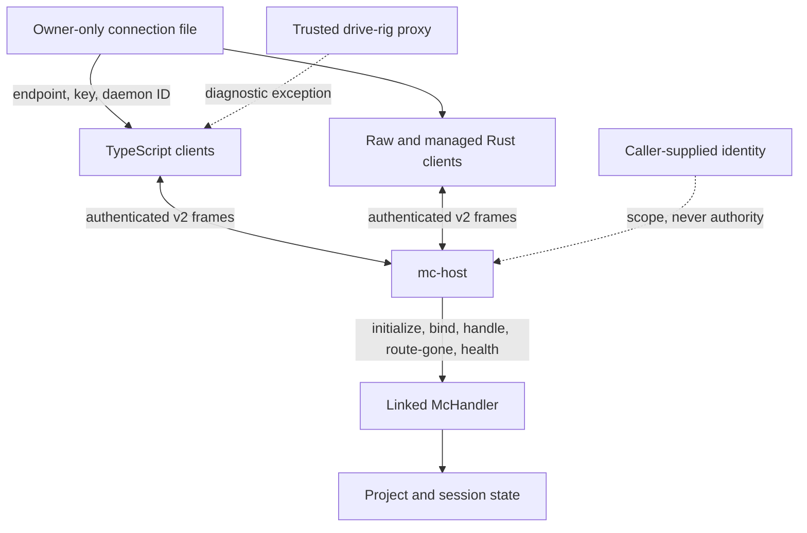
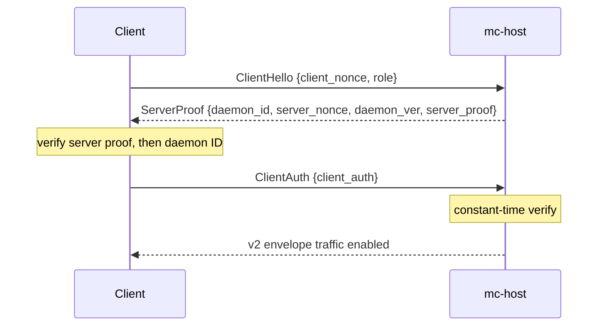
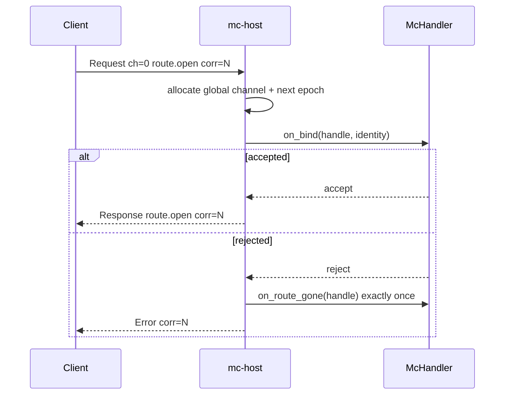
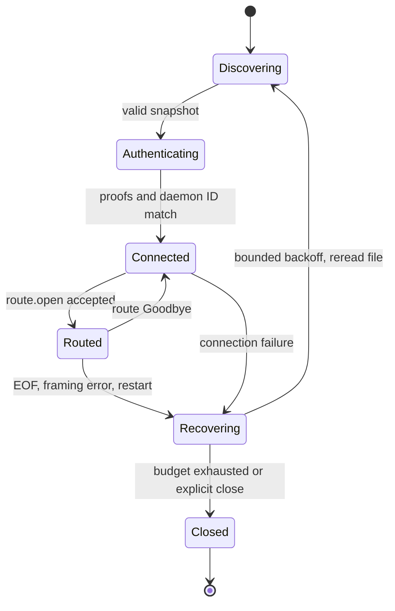

# `mc-host` Wire Protocol and Handshake

Status: normative direct-linked single-module profile
Wire version: 2
Connection-file schema: 1
Task: `magic-context-c50.2`

## 1. Conformance and authority

The key words **MUST**, **MUST NOT**, **SHOULD**, **SHOULD NOT**, and **MAY** are normative as defined by RFC 2119 and RFC 8174.

When sources disagree, implementations MUST use this authority order:

1. this direct-profile contract and its explicitly settled decisions;
2. exact published `@cortexkit/subc-client` 0.4.1 behavior;
3. behavior used from published `subc-protocol` 0.10.0, `subc-transport` 0.5.0, `subc-control` 0.1.1, and `subc-client-rs` 0.3.0;
4. current repository consumers and tests;
5. private-version observations, only where committed evidence states them.

Unobserved private behavior is not authority. The locked private versions (`subc-protocol` 0.12.0, `subc-transport` 0.5.1, `subc-control` 0.1.2, and `subc-client-rs` 0.3.1) remain compatibility risks owned by downstream compiler-closure work.

This document is sufficient to implement a compatible host and client without private source. Executable fixtures and host/client code are intentionally outside this task.

## 2. Profile, actors, and trust boundary

`mc-host` directly links one `McHandler` and serves one module, `magic-context`. It is not a general module supervisor or remote transport.

Actors:

- **Host:** `mc-host`; owns credentials, connection generations, channels, epochs, correlations accepted from each peer, and handler lifecycle.
- **TypeScript clients:** `SubcModuleTransport`, Synapse, and the wake-plane catalog probe.
- **Raw Rust client:** `HistorianProducer`; authenticates directly, opens command and subscription routes, sends unary and streaming requests, reads errors, and sends route `Goodbye`.
- **Managed Rust client:** published `SubcConsumer`; owns bounded reconnect and route-open policy around fresh control RPCs.
- **Handler:** linked `McHandler`; receives synthetic initialization, bind, request, route-gone, and internal health callbacks.

The 32-byte connection key is a bearer capability. Possession grants every direct-profile operation and permits any `BindIdentity`. Client `role`, `consumer_identity`, `project_root`, `harness`, and `session` are claims or scoping metadata; none grants authority. A key reader MUST therefore be trusted as the same local security principal as the host.

Production transport is unencrypted TCP on numeric IPv4 loopback only. It provides no secrecy or per-frame MAC after authentication. The drive rig's read-only credential mount plus authenticated loopback proxy is a trusted diagnostic exception; it does not make remote transport supported.

Initial secure publication support is Unix-like systems. Windows support is deferred until atomic replacement, ACL validation, instance locking, link handling, and ownership-fenced cleanup have a reviewed contract. A Windows build MUST NOT claim conformance merely because published `subc-transport` can create a file there.



## 3. Terms

- **Host incarnation:** one process lifetime with one fresh key and daemon ID.
- **Connection generation:** client-local identity for one authenticated TCP connection. It is not sent on wire.
- **Catalog generation:** `u64` catalog-state version returned by `catalog.list`; unrelated to connection generation.
- **Route handle:** `(channel, epoch)` created by the host before invoking handler bind and published to the client only after bind succeeds. A rejected bind still observed the handle, which is why route-gone fires exactly once on rejection (Section 8.2).
- **Live channel:** nonzero `u16` route slot from one host-global namespace across all consumer connections.
- **Route epoch:** nonzero `u32` incarnation of a channel. Reuse is allowed only after prior cleanup and at a strictly higher epoch.
- **Correlation:** nonzero `u64` request identity allocated monotonically within one connection generation. Each direction owns an independent correlation namespace: host-originated correlations (`Ping`) and consumer-originated correlations never collide even when numerically equal.
- **Full request identity:** `(connection generation, direction, channel, epoch, correlation)`. Direction is implied on wire by frame type, never encoded as bytes.
- **Terminal frame:** first matching `Response`, `Error`, or `StreamEnd` for a correlation.
- **`not_sent`:** sender proves zero bytes of the request frame reached the socket.
- **`outcome_unknown`:** any request with a partial, completed, or uncertain write whose terminal frame was not observed.
- **`terminal`:** matching terminal frame was observed; its success or failure applies only to that correlation.
- **Transport-ready:** listener bound, handler initialized, and connection file published.
- **Storage-ready:** linked handler can serve storage-dependent operations. Transport readiness does not imply it.

## 4. Discovery and credential publication

### 4.1 Canonical path and schema

Clients MUST read `${dataDir}/cortexkit/run/subc-connection.json`. Host and client configuration MAY supply an explicit equivalent path. The host MUST publish schema 1:

```json
{
  "schema": 1,
  "wire_version": 2,
  "endpoints": [{ "host": "127.0.0.1", "port": 43123 }],
  "key": [0, 1, 2, 3, 4, 5, 6, 7, 8, 9, 10, 11, 12, 13, 14, 15, 16, 17, 18, 19, 20, 21, 22, 23, 24, 25, 26, 27, 28, 29, 30, 31],
  "daemon_id": [96, 97, 98, 99, 100, 101, 102, 103, 104, 105, 106, 107, 108, 109, 110, 111],
  "pid": 4242,
  "daemon_ver": "mc-host/0.1.0"
}
```

Example bytes are deterministic and non-secret. Real key and daemon-ID bytes MUST come from the OS CSPRNG.

Current writers MUST include `wire_version: 2`. Published TypeScript 0.4.1 ignores this additive field. A legacy omission means fixed v2; it never negotiates a downgrade. Any present value other than 2 MUST fail before TCP connect.

A client MUST:

1. take one snapshot of the resolved regular file, capped at 65,536 bytes;
2. reject a larger file before JSON parsing;
3. require schema 1, at least one endpoint, exactly 32 key bytes for this profile, exactly 16 daemon-ID bytes, a numeric PID, and a nonempty daemon version;
4. select `endpoints[0]` only;
5. require host exactly `127.0.0.1` and port `1..=65535`;
6. reject wildcard addresses, IPv6, hostnames, malformed arrays, and insecure ownership or permissions.

Published Rust accepts key lengths of at least 32; this profile narrows publication and acceptance to exactly 32 so mixed implementations have one credential shape.

### 4.2 File and link safety

The host MUST acquire a single-instance lock before minting credentials, binding, publishing, or removing the file. The runtime directory and lock MUST be owner-controlled. Publication MUST:

1. generate a fresh 32-byte key and 16-byte daemon ID for every host incarnation;
2. create a unique owner-only temporary regular file in the directory containing the resolved canonical path (by default `${dataDir}/cortexkit/run/`; a configured equivalent path per Section 4.1 uses its own directory), so both names share one filesystem and `rename(2)` cannot fail `EXDEV`, without following links;
3. write complete JSON, flush it as required by deployment durability policy, and atomically rename it over the canonical path;
4. leave the final file mode `0600` with no group or other permission bits;
5. redact key bytes in logs, errors, panic formatting, metrics, and diagnostics.

Stale publication temporaries matching the host's private naming pattern MAY be removed after ten minutes. Cleanup is best effort and MUST NOT delay publication. The host MUST never publish through a symlink.

A trusted container MAY read an explicitly configured read-only symlink or bind mount. Client validation applies to the resolved target: one regular file, owner-controlled source, 64 KiB snapshot cap. Link replacement during validation MUST fail closed. This exception does not permit host publication or cleanup through links.

Shutdown removal MUST occur while the instance lock is held. Before unlinking, the host MUST reread metadata without following links and confirm that the file is its own publication, including matching daemon ID. An old process MUST NOT remove a replacement host's credential. The handler is dropped before lock release.

## 5. Pre-envelope authentication

### 5.1 Admission and framing

Authentication starts at TCP accept and uses one absolute deadline across every length read, body read, write, comparison, and failed-handshake shutdown. Recommended host default is 2 seconds, matching current clients; deployment MAY shorten it but MUST publish a client-compatible value operationally.

The host MUST bound unauthenticated handshake slots separately from authenticated connections. Excess accepts MUST be closed immediately without reading client bytes. Every success, parse failure, proof failure, timeout, EOF, or shutdown MUST release its slot. Slot count is finite deployment policy, not a wire constant.

Each authentication message is `u32` little-endian byte length followed by that many UTF-8 JSON bytes. Length MUST be at most 4,096. Length 4,096 is valid; 4,097 is rejected before allocation. EOF during either prefix or body fails authentication.

### 5.2 Messages and proofs

Fixed parameters from published `subc-transport` 0.5.0:

| Parameter | Value |
| --- | --- |
| Client nonce | 32 OS-CSPRNG bytes |
| Server nonce | 32 OS-CSPRNG bytes |
| Proof | 32-byte HMAC-SHA256 |
| Server domain | ASCII `subc-server-v1` |
| Client domain | ASCII `subc-client-v1` |

Only lengths and domains are constants. Both nonces MUST be freshly generated from the OS CSPRNG for every handshake attempt and MUST NOT be reused within or across connections or host incarnations. Server-nonce freshness is the replay defense: a reused server nonce would let an observer replay a previously captured `client_auth` under a replayed client nonce.

Exchange:



Canonical JSON shapes:

```json
{"client_nonce":[32,33,34,35,36,37,38,39,40,41,42,43,44,45,46,47,48,49,50,51,52,53,54,55,56,57,58,59,60,61,62,63],"role":"client"}
```

```json
{"daemon_id":[96,97,98,99,100,101,102,103,104,105,106,107,108,109,110,111],"server_nonce":[64,65,66,67,68,69,70,71,72,73,74,75,76,77,78,79,80,81,82,83,84,85,86,87,88,89,90,91,92,93,94,95],"daemon_ver":"mc-host/0.1.0","server_proof":[234,174,245,201,145,181,54,105,225,195,92,24,185,58,79,43,27,172,41,84,85,12,15,144,129,65,174,41,163,57,206,192]}
```

```json
{"client_auth":[168,51,199,61,160,183,32,109,223,82,6,97,222,1,81,240,135,27,140,91,196,171,21,161,69,59,214,117,64,99,228,205]}
```

Those proofs use key bytes `00..1f`, client nonce `20..3f`, server nonce `40..5f`, and daemon ID `60..6f`. For domain `D`, proof bytes are:

```text
HMAC-SHA256(key, ASCII(D) || client_nonce || server_nonce || daemon_id)
```

The client MUST compare server proof in constant time, then require `ServerProof.daemon_id` to equal the connection-file daemon ID. It MUST emit no `ClientAuth` until both checks succeed. The server MUST compare client proof in constant time. `role` is unverified reporting metadata and MUST NOT affect privilege, admission, or capacity.

Any malformed JSON, wrong array length, oversized message, nonce-generation failure, proof mismatch, daemon-ID mismatch, EOF, or deadline expiry MUST close the socket. No envelope may be read or written on a failed handshake. Mixed-generation key and daemon-ID values therefore fail closed.

## 6. Envelope framing

### 6.1 Header

After authentication, peers exchange a fixed 21-byte v2 header followed by `len` opaque body bytes. Integers are little-endian.

| Offset | Width | Field | Constraint |
| ---: | ---: | --- | --- |
| 0 | 4 | `len: u32` | `0..=67,108,864` |
| 4 | 1 | `ver: u8` | exactly 2 |
| 5 | 1 | `type: u8` | `0..=11` per table below |
| 6 | 1 | `flags: u8` | valid bit fields below |
| 7 | 2 | `channel: u16` | 0 is control; routed channels are nonzero |
| 9 | 4 | `epoch: u32` | 0 on channel 0; routed epochs are nonzero |
| 13 | 8 | `corr: u64` | request correlation; 0 only where this document permits |

The first five bytes (`len` then `ver`) are the frozen prefix. A reader MUST read the prefix, reject unsupported version, read the remaining 16 header bytes, validate the complete header, and only then allocate/read the body.

Flags:

| Bits | Meaning | Values |
| --- | --- | --- |
| 0 | body encoding hint | 0 JSON/opaque application bytes; 1 binary |
| 1-2 | priority | 0 Passive, 1 Interactive, 2 Background; 3 invalid |
| 3 | last | final frame of a streamed message |
| 4-5 | admission class | 0 Normal, 1 Expedite, 2 Sheddable; 3 invalid |
| 6-7 | reserved | MUST be zero |

`Sheddable` is legal only on `Push` and `StreamData`; a `Sheddable` admission class on any other frame type is invalid flags and closes the generation (Section 6.3). Pure-header frames (`Cancel`, `Ping`, `Pong`, `Goodbye`) MUST set `binary = 0`, `last = 0`, and admission class `Normal`; priority MAY be any valid value. A conforming `Ping` therefore never carries flags whose mandated `Pong` echo the host would have to reject. Admission classes are preserved and validated for numeric compatibility; this single-module profile defines no deployment admission policy from them.

### 6.2 Frame types and direct-profile classification

| Value | Type | Direct-profile status | Direction and use |
| ---: | --- | --- | --- |
| 0 | `Request` | required | consumer to host; channel-0 control or routed opaque request |
| 1 | `Response` | required | host to consumer; unary or control success terminal |
| 2 | `Push` | compatibility-only | decoded and fenced; host does not emit it in this profile |
| 3 | `StreamData` | required | host to consumer; zero or more nonterminal stream items |
| 4 | `StreamEnd` | required | host to consumer; terminal, usually zero body |
| 5 | `Error` | required | host to consumer; terminal canonical `ErrorBody` |
| 6 | `Cancel` | required | consumer to host; best-effort cancellation of matching request |
| 7 | `Ping` | required | host to consumer liveness probe |
| 8 | `Pong` | required | consumer to host; echoes Ping control identity and flags |
| 9 | `Hello` | compatibility-only, role-invalid | external provider registration; never valid from a consumer |
| 10 | `HelloAck` | compatibility-only, role-invalid | external provider registration; never valid on a consumer connection |
| 11 | `Goodbye` | required | either direction; route or connection teardown |

`Cancel`, `Ping`, `Pong`, and `Goodbye` are pure-header frames and MUST declare `len = 0`. A nonzero body is malformed. `Hello` and `HelloAck` values remain decodable so numeric compatibility is preserved, but receiving either on an authenticated consumer connection is a role violation. The host MUST close that generation; it MUST NOT reinterpret the peer as a provider.

A consumer-originated `Response`, `Push`, `StreamData`, `StreamEnd`, or `Error`, and every host-originated `Request`, are role-invalid. The receiver MUST close the generation rather than extend this profile implicitly.

Frame legality after header decoding:

| Type | Required channel / epoch / correlation | Body | State-invalid disposition |
| --- | --- | --- | --- |
| `Request` control | `0 / 0 / nonzero` | tagged JSON | unknown operation gets terminal `unsupported_operation` |
| `Request` routed | `nonzero / nonzero / nonzero` | opaque | absent or stale route gets terminal `unknown_channel`; no handler dispatch |
| `Response`, `Error` | exact pending identity, nonzero correlation | opaque / canonical error JSON | client drops unmatched or stale terminal |
| `StreamData`, `StreamEnd` | exact pending routed identity, nonzero correlation | opaque; direct-profile StreamEnd is empty | client drops unmatched, stale, duplicate, or post-terminal frame |
| `Push` | current nonzero route, correlation 0 | opaque | client drops absent/stale route; host never emits in direct profile |
| `Cancel` | current nonzero route and pending nonzero correlation | empty | stale route or unknown/terminal correlation is idempotent no-op |
| `Ping` | `0 / 0 / nonzero` | empty | client returns matching Pong |
| `Pong` | exact outstanding Ping identity | empty | host drops unmatched Pong |
| route `Goodbye` | current `nonzero / nonzero / 0` | empty | stale/unknown route is idempotent no-op |
| connection `Goodbye` | `0 / 0 / 0` | empty | orderly generation close |

Any structurally illegal channel, epoch, correlation, body, or direction closes the generation. `StreamEnd` is not a pure-header frame at the framing layer, but the direct profile requires an empty `StreamEnd` body: receiving `StreamEnd` with `len > 0` is a structurally illegal body under the table above and closes the generation, even though frame alignment itself is intact. Valid but stale state uses the explicit dispositions above; it is not framing corruption.

### 6.3 Reading, limits, and corruption

The interoperability body maximum is exactly 64 MiB (`67,108,864` bytes). A conforming implementation MUST be able to accept one otherwise valid maximum-size frame on an admitted authenticated connection. A deployment MAY cap concurrent connections, aggregate buffered bytes, routes, pending correlations, handler tasks, queues, and diagnostics, but MUST NOT advertise v2 conformance while rejecting an otherwise valid frame solely because its declared length is at or below 64 MiB.

Aggregate resource policy takes effect between frames, before admitting more connections/work, or after a complete frame reaches a profile/application limit. For example, `McHandler` may return terminal `invalid_params` for its 1 MiB facade or 32 MiB transform limits after transport framing accepts the body. Local limits never change header bytes.

Each accepted frame read MUST have a finite operation-owned absolute deadline covering header and body. Duration is deployment policy, not a wire constant. A peer that declares 64 MiB and stalls partway consumes its bounded slot only until that deadline.

Clean EOF before any byte of the next header is orderly connection close. EOF after the first header byte, truncated header/body, unsupported version, unknown type, invalid flags, nonzero channel-0 epoch, pure-header body, or body declaration above 64 MiB corrupts stream alignment. Receiver MUST close the connection generation without resynchronization and without sending an `Error` on that stream.

Writers MUST verify header `len` equals body length and SHOULD submit header plus body as one logical write. This is an efficiency requirement from published transport behavior, not an atomicity guarantee: partial socket writes remain possible and drive outcome classification.

### 6.4 Byte examples

The compact canonical `route.open` request defined in Section 7.2 is 173 UTF-8 bytes. Its `Request` header uses Interactive/Normal flags, control channel, epoch 0, correlation 1:

```text
ad 00 00 00  02 00 02  00 00  00 00 00 00  01 00 00 00 00 00 00 00
|--- len ---| ver ty fl | ch  |--- epoch --|--------- corr ----------|
```

Hex without spacing: `ad0000000200020000000000000100000000000000`.

A routed 44-byte Background/Normal request on channel 7, epoch 77, correlation 2 has header:

```text
2c00000002000407004d0000000200000000000000
```

## 7. Control and application messages

### 7.1 Body rules and metadata bounds

Channel 0 accepts UTF-8 JSON only (`binary = 0`), with tagged request and response objects using the `op` field. The direct profile caps a channel-0 body at 65,536 bytes even though framing permits more. Oversize control requests receive terminal `Error{code:"invalid_control_request"}`. A channel-0 header declaring `len` greater than 65,536 already proves the violation: the host MAY emit that terminal as soon as header validation completes, MUST NOT buffer the oversize body, and drains and discards the declared bytes under the frame's absolute deadline to preserve stream alignment (deadline expiry closes the generation as usual). This early rejection does not violate the Section 6.3 acceptance requirement, which applies to otherwise valid frames. Routed application request and response bodies remain opaque to transport and may be JSON or binary as flags indicate.

Before filesystem work or handler bind, host MUST enforce these UTF-8 byte limits:

| Field | Limit and validation |
| --- | --- |
| `op` | 64 bytes; nonempty; no NUL. Value recognition is not structural validation: an unrecognized `op` dispatches to operation classification (Section 7.4) and gets terminal `unsupported_operation`, not `invalid_control_request` |
| `module_id` | 128 bytes; nonempty; no NUL |
| `project_root` | 4,096 bytes; absolute platform path; no NUL |
| `harness` | 128 bytes; nonempty; no NUL |
| `session` | 256 bytes; nonempty; no NUL |
| `consumer_identity.module_id` | 128 bytes; no NUL |
| `consumer_identity.launch_nonce` | 256 bytes; no NUL |
| each consumer capability | 64 bytes; at most 32 entries |
| `admission_facts` | at most 8,192 encoded bytes and 32 nesting levels |

Malformed JSON, duplicate recognized fields, invalid UTF-8, invalid field type, excessive nesting, out-of-range field, or relative project root receives terminal `invalid_control_request` for that correlation. Unknown fields are ignored for published serde forward compatibility but still count toward body and nesting limits. `admission_facts` size is its compact UTF-8 JSON serialization; collection depth is 1 at the subtree root and increases for each nested object/array. No handler callback or filesystem work runs on rejection. `BindIdentity` still grants no authority. Host MAY verify an absolute project root against its real filesystem when handler semantics require it; caller and handler MUST NOT derive privilege from existence or path spelling. Error `code` is stable; `message` is diagnostic unless this document states exact text.

### 7.2 `route.open`

Required compact canonical request:

```json
{"op":"route.open","target":{"kind":"tool_provider","module_id":"magic-context"},"identity":{"project_root":"/workspace/project","harness":"opencode","session":"session-1"}}
```

Optional `consumer_identity` is `{module_id, launch_nonce}`. Optional `consumer_capabilities` is an array of strings. Optional `admission_facts` is any bounded JSON value. Absence means no claim/capability/facts; it is not a denied claim. The bearer key remains authority.

Successful response MUST retain the tag:

```json
{"op":"route.open","route_channel":7,"route_epoch":77}
```

The only current successful target is linked module ID `magic-context` with a role supported by its manifest. Other module IDs receive terminal `unknown_module`; unsupported target kinds receive terminal `target_unavailable`. Dynamic routing, provider discovery, `internal_service`, and model-runner routing are outside this single-module document; `magic-context-c50.11` owns model-runner route integration required by the Rust historian.

This exclusion has one known in-repo casualty: `RealSessionResolver` (`crates/mc-module/src/session_resolver.rs`), constructed whenever `McHandler` receives a connection file, unconditionally opens a `management_surface` route to module `thalamus`, and the linked manifest consumes that service. Against a conforming direct host that `route.open` receives a terminal error (`target_unavailable` for the unsupported `management_surface` kind), so stateful facade calls that resolve sessions fail at route-open. This contract deliberately does not add a thalamus-compatible route; `magic-context-c50.4` owns replacing or disabling that resolver path (for example, a host-served session-resolve equivalent or the existing `MissingSessionResolver` fallback) before mc-module runs against this profile.

The Synapse embedding lane has the same shape: when `embedding.provider` is `synapse`, `embedding-synapse.ts` opens a `management_surface` route to module `synapse` for every operation. Against this profile that route receives terminal `target_unavailable`, so the discovery probe fails over to the configured fallback embedding provider. That fail-over is the intended interim behavior, not silent breakage: `magic-context-c50.6` owns porting the synapse embedding service (`embed.batch`, `models.list`) to the Rust host, and until it lands the configured Synapse lane is unavailable against this host by design.

### 7.3 `catalog.list`

Requests MAY omit `module_id` to list all entries or supply a filter. Unknown filters return an empty `modules` array, not an error:

```json
{"op":"catalog.list","module_id":"not-linked"}
```

```json
{"op":"catalog.list","generation":1,"modules":[],"subc_ops":["route.open","catalog.list"]}
```

An unfiltered request and a `magic-context` filter MUST return exactly one entry derived without lossy rewriting from the linked manifest:

| Response field | Required value |
| --- | --- |
| `op` | `catalog.list` |
| `generation` | current catalog-state generation |
| `modules[0].module_id` | `magic-context` |
| `modules[0].module_version` | linked manifest's exact build version |
| `modules[0].roles` | linked manifest's complete `provides` array, including tool schemas |
| `modules[0].control_ops` | implemented module control operations only; currently no `wake.create` |
| `subc_ops` | `route.open`, `catalog.list` |

Current direct host does not implement `wake.create`, so wake-plane probing remains fail-open. `generation` changes only when catalog content changes and is unrelated to connection generation.

### 7.4 Operation classification

`route.open` and `catalog.list` are the only required channel-0 operations. Every other operation receives terminal `unsupported_operation`; host stays connected if framing remains valid. A client health operation MUST NOT proxy handler health, which remains host-internal.

Canonical error body:

```json
{"code":"unknown_module","message":"module magic-context-next is unavailable"}
```

`Error` terminates only its matching correlation. It does not itself close a route or connection unless the error table below says so.

## 8. Host and handler lifecycle

### 8.1 Startup and readiness

Host startup order is normative:

1. acquire single-instance lock;
2. mint fresh key and daemon ID;
3. construct one host-owned `ModuleHelloAckBody` from storage and capability configuration;
4. invoke linked handler initialization exactly once and wait for that callback to return;
5. bind `127.0.0.1` on a nonzero port;
6. atomically publish connection file;
7. accept clients and routes.

The synthetic acknowledgment preserves external registration lifecycle effects without a provider socket. `Hello`/`HelloAck` never appear on a consumer connection.

`McHandler::on_hello_ack` begins asynchronous store opening. Publication therefore means transport-ready, not storage-ready. Discovery, authentication, catalog, and route bind MUST work while storage opens. A storage-dependent request during that window receives terminal application error `store_unavailable`; client MUST NOT classify it as transport disconnect.

```mermaid
sequenceDiagram
  participant M as Linked McHandler
  participant H as mc-host
  participant F as Connection file
  participant C as Client
  H->>H: lock, fresh key and daemon ID
  H->>M: synthetic HelloAck; initialize once
  H->>H: bind numeric loopback
  H->>F: atomic owner-only publish
  C->>F: bounded validate/read
  C->>H: TCP + three-message authentication
  C->>H: v2 envelope traffic
```

### 8.2 Route allocation and bind

For every valid `route.open`, host MUST:

1. allocate a nonzero channel unused across all live consumer connections;
2. choose a nonzero epoch strictly greater than every prior epoch used for that channel in this host incarnation;
3. create handler-visible route handle and identity;
4. call handler bind before publishing the route to client;
5. on acceptance, install route then return tagged `route.open` response;
6. on rejection, call route-gone exactly once because handler observed the handle, release it after callback completes, then return terminal bind error.

The channel namespace is process-global because linked `McHandler` keys bindings by `u16` channel alone. Two simultaneous connections, two roots for one session, and two sessions MUST never hold the same live channel. Channel reuse is neither unconditional nor forbidden: it is permitted only after all prior work is settled/cancelled, route-gone completes exactly once, and epoch advances strictly. At `u32::MAX`, that channel is permanently retired for the host incarnation. If all channels are live or retired, host returns terminal `target_unavailable` without calling bind.

A bind stores `project_root`, `harness`, and `session` as handler scope. Multiple routes for one session are valid. Host MUST NOT merge them by session alone.



Local close racing `route.open` wins. A late successful bind MUST NOT enter client cache. Client sends best-effort route `Goodbye`; if it cannot queue cleanup safely, it closes the connection. Host still invokes route-gone exactly once.

### 8.3 Request identity and allocation

Each sender allocates correlations monotonically from 1 within a connection generation. The two directions are independent namespaces: a host `Ping` correlation MAY be numerically equal to a pending consumer correlation on the same connection, and neither affects the other. Matching is direction-scoped by frame type — `Response`, `Error`, `StreamData`, and `StreamEnd` settle only consumer-originated requests; `Pong` settles only host-originated `Ping`. The no-reuse rule applies within one sender's namespace. A correlation MUST NOT be reused, even after terminal completion. `u64::MAX` may identify one final request; before another request, sender MUST retire the generation and reconnect. Published `HistorianProducer` currently saturates at `u64::MAX`; compatibility work in `magic-context-c50.4` MUST replace saturation with checked exhaustion and generation retirement.

Host pending state is keyed by full request identity. For ingress, a routed `Request` to an absent or stale route gets terminal `unknown_channel` and never reaches handler; stale or unknown `Cancel`/`Goodbye` is an idempotent no-op. For client ingress, unmatched or stale response/stream frames are dropped with redacted rate-limited diagnostics. First terminal wins; duplicate or late terminals are dropped. No frame from an old generation, wrong channel/epoch, unknown correlation, or terminal correlation may affect current work.

Implementations MUST use finite limits for live connections, routes, pending correlations, handler tasks, queued requests, and aggregate buffered bodies. Limit exhaustion before dispatch returns terminal `target_unavailable` or `server_busy` for that correlation; it MUST NOT silently queue without a deadline.

## 9. Requests, streams, cancellation, and close

### 9.1 Unary and streaming terminals

A routed `Request` carries exactly one correlation. Host may produce:

- unary: one `Response` or `Error` terminal;
- streaming: zero or more `StreamData` frames, then exactly one `StreamEnd` or `Error` terminal.

All response frames MUST echo channel, epoch, and correlation. `StreamData` is nonterminal. `StreamEnd` is transport terminal; application protocols may define an earlier in-band terminal event. The raw Rust historian intentionally treats its in-band run terminal as authoritative and treats premature `StreamEnd` as failure.

Transport never parses routed application bodies. Handler `Response(Vec<u8>)` becomes `Response`; handler `Error` becomes canonical `ErrorBody`; handler `Streamed` ends with `StreamEnd` after emitted stream items.

### 9.2 Cancellation

Client sends pure-header `Cancel` with target route and correlation. If request is pending, host requests task cancellation and emits exactly one terminal `Error{code:"cancelled"}` when cancellation wins. If work already terminated, Cancel is a no-op. Cancellation is best effort: without an observed terminal, caller outcome remains `outcome_unknown`.

### 9.3 Liveness and health

Consumer liveness uses pure-header `Ping`/`Pong`, not a channel-0 JSON health operation. Host sends Ping on channel 0; client returns Pong with identical version, flags, channel, epoch, and correlation. A missed Pong invalidates the connection only under host's bounded liveness policy.

Compatibility note: current `HistorianProducer` (`crates/mc-module/src/historian_producer.rs`) implements no Ping handling — both receive loops discard every frame that does not match the awaited route and correlation, so it can never answer a host Ping. `magic-context-c50.4` owns adding the Pong echo to that client. Until it lands, a host deployment MUST NOT enable missed-Pong connection invalidation, or it will terminate healthy long-running historian awaits (up to 600 s) as dead peers.

Handler health is host-internal. Host invokes `McHandler::health` on a dedicated control task, never as an ordinary routed request and never while holding handler/store locks. Current handler health is atomics-only and returns `ok`, `degraded`, or `failing` plus optional detail and metrics. Waiting for a predecessor's storage lease reports `degraded` without making transport unready.

### 9.4 Route and connection `Goodbye`

Route close is pure-header `Goodbye` on nonzero channel and current epoch with correlation 0. Host stops new dispatch, settles/cancels route work within its close budget, calls route-gone exactly once, then permits cleanup-gated channel reuse. Duplicate route Goodbye is idempotent.

Connection close is Goodbye on channel 0, epoch 0, correlation 0, followed by socket shutdown. Clean EOF has equivalent state effect but no peer drain guarantee. Any sent request lacking an observed terminal at close is `outcome_unknown`; queued requests proven unwritten are `not_sent`.

## 10. Send outcomes, errors, and retry ownership

### 10.1 Outcome taxonomy

| Event | Outcome | Generic replay? |
| --- | --- | --- |
| encode/admission/queue/deadline fails before frame write | `not_sent` | policy may issue fresh RPC |
| local stale handle/generation detected before write | `not_sent` | open fresh route then retry within owner deadline |
| socket writer proves zero request-frame bytes written | `not_sent` | policy may retry |
| host returns `unknown_channel` before handler dispatch | terminal no-dispatch proof | one fresh-route retry allowed |
| any request byte may have reached socket, no terminal observed | `outcome_unknown` | **no** generic replay |
| matching `Response`, `Error`, or `StreamEnd` observed | `terminal` | only operation-specific policy may issue new RPC |

A completed socket write is not proof of handler dispatch, but absence of proof is insufficient for replay. Partial and uncertain writes are always `outcome_unknown`.

Current `SubcModuleTransport.call()` retries broad request-side connection failures on a fresh generation. That can execute a request twice and is nonconforming unless failure is proven `not_sent` or the operation explicitly owns idempotent replay. `magic-context-c50.5` MUST narrow it: retry only proven pre-send failures and the host's no-dispatch stale-route response; otherwise return `outcome_unknown`. Plugin outer retry MUST NOT silently multiply SDK retries.

### 10.2 Error and retry matrix

| Code/event | Terminal for current correlation | Fresh-RPC owner and rule |
| --- | --- | --- |
| `unknown_module` | yes | managed SDK MAY retry `route.open` with new correlation under bounded route deadline |
| `module_reloading` | yes | same |
| `target_unavailable` | yes | same |
| `module_timeout` | yes | same; old control RPC remains terminal |
| `unknown_channel` on routed request | yes; host proves no handler dispatch | managed SDK MAY evict route and retry once on fresh route |
| `server_busy` | yes; host proves no handler dispatch (limit exhaustion before dispatch, Section 8.3) | managed SDK MAY retry with backoff and a new correlation under its owning request deadline |
| `cancelled` | yes; cancellation won (Section 9.2) | no generic retry; caller requested cancellation, only explicit application policy may issue a fresh RPC |
| `invalid_control_request`, `unsupported_operation`, bind rejection | yes | no generic retry |
| `store_unavailable` | yes, application error | caller MAY issue later fresh application request; transport stays connected |
| application `Error` | yes | application-specific only |
| malformed framing / EOF | no terminal possible | classify pending writes from byte evidence; invalidate generation |
| request deadline after possible write | no | `outcome_unknown`, no generic retry |

A retry is always a new RPC with a new correlation. Terminality of one `unknown_module` response does not prohibit published managed-client policy from issuing a later `route.open`. Private 0.3.1 behavior is unverified drift and does not change this contract.

## 11. Deadlines and backoff layers

Every operation owns one absolute deadline; per-stage timers MUST NOT multiply it. Separate domains are authentication, frame body read, route-open policy, request/response, shutdown, SDK reconnect, and plugin reconnect.

Current repository guidance, not wire constants:

| Layer | Current value / bound |
| --- | --- |
| TypeScript handshake | 2 s |
| TypeScript transform attempt | 5 s |
| TypeScript ordinary attempt | 15 s |
| TypeScript wrapup attempt | 3,800 s |
| TypeScript connection probe backoff | starts 1 s, caps 30 s |
| Raw Rust handshake | 2 s |
| Raw Rust ordinary request | 30 s |
| Raw Rust historian await | 600 s; application redrain 60 s |
| Session-resolver whole call | 2 s, one configured route attempt |

Current TypeScript loop allows queue wait plus two full attempts: up to about 15 s for transform, 45 s for ordinary calls, and 11,400 s for wrapup when every phase consumes its bound. These are compatibility observations, not desired retry permission. After `magic-context-c50.5` enforces send outcomes, a second body send is allowed only for `not_sent` or explicit idempotent application policy.

Backoff budget counts the first attempt. Route-open retry and reconnect policy MUST stop at their owning deadline. Retry delay does not reset request deadline.

## 12. Reconnect, restart, and shutdown

Any EOF, authentication failure, framing corruption, liveness failure, or explicit connection close retires the connection generation. Client MUST immediately invalidate its routes, pending correlations, capability/catalog caches, and late responses. Reconnect MUST reread the connection file and rerun authentication; credentials MUST NOT be cached across host incarnations.

Host restart MUST close old listener/generations, mint fresh key and daemon ID, bind and publish under lock, and reject mixed-generation authentication. Reopened routes receive new connection-fenced handles. Route-only module restart uses new channels or strictly higher epochs and preserves the same connection only if host can prove route cleanup.



Graceful host shutdown order:

1. stop accepting connections and route opens;
2. while holding instance lock, daemon-ID-fenced remove own connection file;
3. drain or cancel work within finite shutdown deadline, emitting terminal `Response`, `StreamEnd`, or `Error{code:"cancelled"}` frames while generations are still live;
4. send best-effort connection Goodbye; receiving it retires the generation client-side (Section 6.2), so it MUST follow the drain, or drain-phase terminals would arrive on a retired generation and be dropped;
5. invoke route-gone exactly once for every handler-visible route;
6. drop handler only after all route-gone callbacks complete;
7. close sockets/listener;
8. release instance lock.

Work without an observed terminal remains `outcome_unknown`. Forced shutdown may skip wire Goodbyes but MUST preserve local exactly-once route-gone and handler-drop ordering.

## 13. End-to-end normative examples

### 13.1 Startup, route, call, close

1. Host locks runtime state, creates fresh credentials, invokes synthetic handler initialization, binds loopback, and publishes schema 1.
2. Client validates one bounded file snapshot and completes all three auth messages.
3. Client sends channel-0 `route.open` correlation 1.
4. Host allocates global channel 7, epoch 77, binds handler, and returns tagged response.
5. Client sends opaque request on `(7,77,2)`.
6. Host dispatches once and returns one terminal on `(7,77,2)`.
7. Client sends route Goodbye `(7,77,0)`.
8. Host blocks reuse until task settlement and exactly one route-gone callback complete; any reuse of channel 7 has epoch greater than 77.

### 13.2 Storage opening

Host may publish after `on_hello_ack` starts asynchronous storage acquisition. A client can authenticate, list catalog, and bind a route. A storage-dependent request returns terminal `store_unavailable`. Later fresh request succeeds after storage opens; no reconnect is required.

### 13.3 Temporary target absence

A `route.open` correlation receiving `unknown_module` is complete. Managed SDK may wait within its route-open deadline and send a new `route.open` with a new correlation. It never reuses the terminal correlation and never sends application body before route success.

### 13.4 Raw Rust streaming client

`HistorianProducer` authenticates from the same connection file, opens separate command and subscription routes for one identity, sends unary commands, and consumes matching `StreamData` until its application run terminal. Transport `StreamEnd` before that event is failure. On close it sends Goodbye for both routes. On connection loss it does not replay a possibly sent command; caller creates a fresh producer and application durable replay uses its own run ID/cursor semantics. Model-runner target availability is owned by `magic-context-c50.11`.

### 13.5 Timeout after write

Client completes or may partially complete a request write, then deadline expires before terminal. It closes or invalidates pending state and returns `outcome_unknown`. It does not resend generically. Application may later reconcile by operation-specific durable identity; transport cannot infer safety.

### 13.6 Host restart

Old host fences connection-file removal by daemon ID, closes generations, and drops handler after route-gone. New host creates unrelated key/daemon ID and atomically publishes. Client invalidates old state, rereads file, authenticates, and opens new routes. Old credentials, route handles, correlations, and late frames cannot affect new generation.

## 14. Conformance scenario matrix

Every scenario has one required outcome. These are review vectors; executable fixtures belong to downstream tasks.

| ID | Scenario | Expected result |
| --- | --- | --- |
| AE1 | Fresh authenticated call | Valid file, three-message auth, tagged route response, and matching terminal succeed |
| AE2 | Malformed envelope | Unsupported version, type, flags, oversize, or truncation closes generation; no resync/Error |
| AE3 | Caller-supplied identity | Key holder may select identity; fields scope handler state and add no authority |
| AE4 | Temporarily unavailable module | Each `unknown_module` terminates one correlation; policy retry uses a new correlation and never sends body early |
| AE5 | Unknown routed channel | Host dispatch count stays zero; client may reopen and retry body exactly once on fresh route |
| AE6 | Deadline after possible send | Result is `outcome_unknown`; generic policy does not replay |
| AE7 | Host restart | Fresh credentials and generation; old state invalid; reconnect rereads/re-authenticates |
| AE8 | Close races route open | Close wins; late route not cached; best-effort Goodbye or connection close |
| AE9 | Degraded storage health | Internal health reports degraded; clients continue Ping/Pong, not JSON health |
| AE10 | Wake-plane catalog probe | Truthful catalog lacks `wake.create`; standalone evaluation remains enabled |
| AE11 | Concurrent client routes | Distinct host-global channels; reuse only after cleanup at higher epoch |
| AE12 | Transport-ready while storage opens | Auth/catalog/bind work; storage call returns terminal `store_unavailable` |
| AE13 | Host shutdown | Stop admission, fenced unlink, bounded drain/cancel, route-gone once, drop handler, unlock |
| V1 | Valid JSON file padded with whitespace to exactly 65,536 bytes | Pass size/JSON validation and attempt endpoint connection |
| V2 | File 65,537 bytes | Reject before JSON parsing or key logging |
| V3 | Connection file mode `0644` | Reject as insecure; do not connect |
| V4 | Hostname, wildcard, IPv6, or port zero | Reject endpoint before connect |
| V5 | Trusted read-only link | Resolve one regular owner-controlled target and authenticate |
| V6 | Link target swapped during read | Fail closed; do not combine snapshots |
| V7 | Old cleanup after new publish | Daemon-ID mismatch prevents unlink |
| V8 | Valid auth JSON padded with whitespace to exactly 4,096 bytes | Pass size/JSON validation and advance to next handshake stage |
| V9 | Auth message 4,097 bytes | Reject before allocation; close within same absolute deadline |
| V10 | Bad server proof or daemon ID | Client emits no ClientAuth; closes |
| V11 | Pre-auth slots exhausted | Excess accept closes immediately; existing slots remain deadline-bounded |
| V12 | Frame body exactly 64 MiB | Framing accepts and reads under finite deadline; application may terminally reject |
| V13 | Frame body 64 MiB + 1 | Close generation before body allocation |
| V14 | Partial header/body EOF | Close as corruption; pending write outcomes use byte evidence |
| V15 | Invalid priority/admission/reserved bits | Close generation |
| V16 | Control body/identity exceeds profile cap | Terminal `invalid_control_request`; no bind/filesystem work |
| V17 | Role-invalid Hello from consumer | Close generation; never switch connection role |
| V18 | Two connections both use correlation 1 plus interleaved requests | Full generation/channel/epoch identity isolates every terminal and dispatch |
| V19 | Duplicate/late terminal | First terminal remains final; later frame dropped and rate-limited |
| V20 | Route close then reuse | route-gone completes once before higher-epoch reuse |
| V21 | Channel epoch reaches `u32::MAX` | Clean route, retire channel permanently |
| V22 | Correlation reaches `u64::MAX` | Use once, then retire/reconnect generation before another request |
| V23 | Unauthenticated slow reader | Absolute deadline closes and releases handshake slot |
| V24 | Sensitive diagnostics | Key/proof/body/identity secrets redacted; bounded counters remain observable |
| V25 | Raw Rust unary Error | Matching Error becomes terminal `ProducerErrorBody`; no hidden replay |
| V26 | Raw Rust stream disconnect | No complete stream terminal; outcome/recovery handled by caller's durable semantics |
| V27 | Two roots for same session | Separate routes and bindings; no session-only aliasing |
| V28 | Aggregate resource pressure | Reject new admission/work finitely; one admitted valid max frame remains interoperable |
| V29 | Retryable then non-retryable route errors | Allowlisted error may create one fresh correlation; `invalid_control_request` creates none |
| V30 | Possible-send timeout | One body send and at most one handler dispatch; result `outcome_unknown`, never replay |
| V31 | Reused channel receives old-epoch Request | Terminal `unknown_channel`; new binding sees zero dispatch |
| V32 | Reused channel receives old-epoch Cancel/Goodbye | Idempotent no-op; new binding and pending work remain live |
| V33 | Cancel wins race | Cancellation is requested; one `cancelled` terminal wins; no later frame settles that correlation |
| V34 | Completion wins Cancel race | Original terminal remains sole terminal; late Cancel is no-op |
| V35 | Host Ping | Client Pong exactly echoes version, flags, channel 0, epoch 0, correlation |
| V36 | Handler rejects bind | Error follows bind; route-gone occurs once; channel not reused before callback completes |
| V37 | Proven zero-byte write | Result `not_sent`; policy may issue fresh RPC with new correlation |
| V38 | Normal stream | Ordered zero-or-more StreamData then one StreamEnd/Error; duplicate terminal ignored |
| V39 | Bad client proof | Host closes, releases handshake slot, and reads no envelope |
| V40 | Catalog filters | Unfiltered/exact filter returns linked entry; unknown filter returns empty list |
| V41 | Unsupported control op | One `unsupported_operation` terminal; connection remains usable; no handler callback |
| V42 | Host sends structurally valid `Request` | Client closes generation without dispatching or responding |
| V43 | Host `Ping` correlation numerically equals a pending consumer correlation | `Pong` settles only the Ping; consumer terminals settle only the consumer request; no cross-settlement |

### 14.1 Downstream fixture oracle

Fixtures MUST use committed literal bytes and an independent decoder/oracle; importing production proof, header, or frame helpers to generate expected values proves only self-consistency. V1-V43 define the deterministic cases. A green suite establishes only that checked implementations, vectors, schedules, platforms, and bounds passed.

## 15. Consumer traceability

| Consumer | Required contract | Verification owner |
| --- | --- | --- |
| `packages/plugin/src/hooks/magic-context/module-transport.ts` | v2 auth/frame, route cache by generation, opaque bodies, close race, outcome-safe retry | `magic-context-c50.5` |
| `packages/plugin/src/features/magic-context/memory/embedding-synapse.ts` | managed call and `not_sent` / `outcome_unknown` / `terminal` distinction; its synapse `management_surface` route is unavailable under this profile until the Rust port lands (Section 7.2) | `magic-context-c50.5`, synapse route in `magic-context-c50.6` |
| `packages/plugin/src/features/magic-context/smart-notes/wake-plane.ts` | tagged truthful catalog; absent `wake.create` fails open | `magic-context-c50.5` |
| `crates/mc-module/src/historian_producer.rs` | raw auth, first endpoint, route open, monotonic correlation, streaming, Error, Goodbye; Ping/Pong echo required (Section 9.3, currently missing) | `magic-context-c50.4`, route target in `magic-context-c50.11` |
| `crates/mc-module/src/session_resolver.rs` | managed Rust route-open deadline and terminal module errors; its thalamus `management_surface` target is unsupported by this profile and MUST be replaced or disabled (Section 7.2) | `magic-context-c50.4` |
| `crates/mc-module/src/lib.rs` | initialize once, bind before response, route-gone once, atomics-only health, store readiness | `magic-context-c50.3` / `.4` |
| `packages/e2e-tests/tests/rust-park-self-heal.test.ts` | existing module-restart/park-heal evidence only; whole-host credential-rotation case still required | `magic-context-c50.9`, after `.11` |
| `scripts/drive-rig/*` | trusted credential mount and loopback proxy exception | drive-rig validation in downstream E2E |

## 16. Requirement traceability

| Requirement | Normative sections | Scenarios |
| --- | --- | --- |
| R1 single normative owner | 1, 17 | AE1-AE13 |
| R2 terms, authority, verified/private distinction | 1-3, 18 | AE1, AE4, AE7 |
| R3 byte/JSON examples and scenario tables | 4-7, 13-14 | AE1-AE13, V1-V43 |
| R4 no executable fixtures/implementation | 1, 17 | AE1-AE13 |
| R5 discovery schema/endpoints | 4.1 | AE1, AE7, V1-V4 |
| R6 publication/cleanup/redaction | 4.2, 12 | AE7, AE13, V5-V7, V24 |
| R7 authentication | 5 | AE1, V8-V11, V23, V39 |
| R8 envelope/caps/resources | 6 | AE2, V12-V15, V28, V35 |
| R9 frame/control classification/catalog | 6.2, 7 | AE9, AE10, V17, V40-V42 |
| R10 tagged control and opaque application bodies | 7, 9.1 | AE1, V16, V38, V41 |
| R11 route/bind/direct lifecycle | 8.1-8.2 | AE3, AE8, AE11-AE13, V20, V27, V31-V36 |
| R12 request identity/counters | 8.3 | AE5, AE7, AE11, V18-V22, V31-V32, V43 |
| R13 terminal/cancel/close/health | 9 | AE8, AE9, AE12, AE13, V19, V25-V26, V33-V35, V38 |
| R14 deadlines/outcomes | 10-11 | AE2, AE4-AE6, V23, V29-V30, V37 |
| R15 reconnect/rotation/stale state | 12 | AE7, AE13, V7, V22 |
| R16 terminal route error vs fresh retry | 10.2, 13.3 | AE4, AE5, V29-V30 |

## 17. Scope boundaries

In scope: discovery and secure publication, pre-envelope authentication, v2 framing, `route.open`, `catalog.list`, one linked module, routing/correlation/streaming/cancel/close, internal health, send outcomes, and generation recovery.

Deferred: executable cross-language golden fixtures; host, shim, and client code; private dependency compiler closure; model-runner routing; test-only TypeScript provider API; deployment-specific numeric quotas beyond required finite bounds.

Outside: flow-credit protocol, dynamic multi-module supervision, behavioral admission policy, production remote transport, new plugin/tool APIs, storage semantics, and handler business operations.

## 18. Source parity ledger

Numeric wire values and published behavior above come from:

- `subc-protocol` 0.10.0 `src/lib.rs`: version 2, 21-byte layout, 64 MiB cap, frame values, flags, validation, route/identity shapes.
- `subc-transport` 0.5.0 `src/auth.rs`, `connection_file.rs`, and `frame_io.rs`: domains, proof order, nonce/proof lengths, 4,096-byte auth cap, schema 1, owner-only file, atomic write, and complete-frame I/O.
- `subc-control` 0.1.1 `src/lib.rs`: tagged control request/response and catalog entry shapes.
- `subc-client-rs` 0.3.0 `src/consumer.rs`: fresh route-open retries, one no-dispatch `unknown_channel` retry, generation fencing, streaming, and send-outcome classification.
- exact `@cortexkit/subc-client` 0.4.1: TypeScript handshake/frame compatibility. Repository fake-peer tests exercise the flow but import package encoders/constants and are not an independent byte oracle.
- `docs/subc-api-surface-inventory-2026-08-17.md`: checksums, source-version provenance, and used-surface inventory.
- `docs/rust-mode-transport-overhead-2026-08-10.md`: measured framing cost only; its historical global-FIFO prose is not queue-topology authority.

Private version disagreement MUST be recorded as drift and routed to its downstream owner, never guessed into this wire contract.
