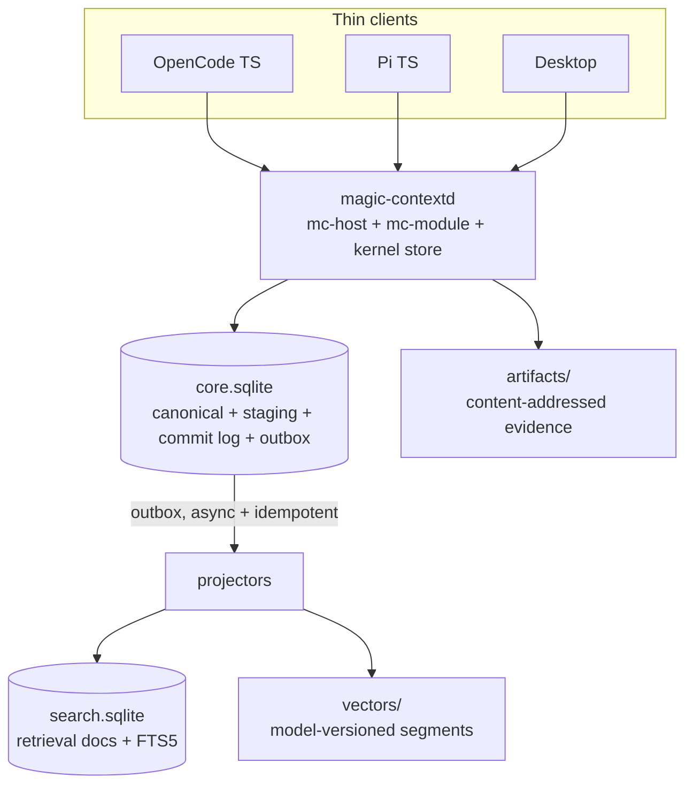
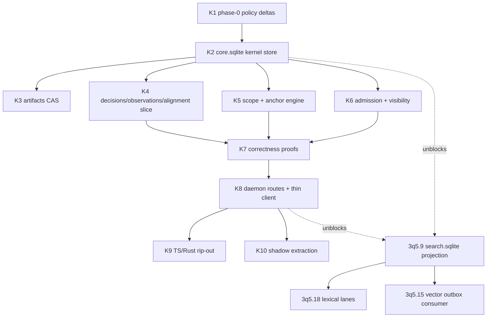

# Semantic Kernel and Truth-Maintenance Backlog Restructure - Plan

## Goal Capsule

- **Objective:** Beads backlog describe exactly one memory architecture, the daemon-authoritative semantic kernel, so implementer pick up any open task without hitting contradictory requirements, dead references, or work scheduled against deleted machinery. This plan file is interim architecture authority (KTD5); `ARCHITECTURE.md` and `docs/migration-version-lanes.md` realign later with kernel task K9.
- **Means:** Rewrite, close, create, re-wire beads per Bead Disposition Table. Stand up new kernel epic (KTD3, KTD5).
- **Authority:** This plan supersedes missing `docs/plans/2026-08-16-001-refactor-retrieval-storage-overhaul-plan.md` as tie-breaker for epic `magic-context-3q5` and new kernel epic. Bead conflict with this plan: plan wins until bead rewritten.
- **Stop conditions:** No production code changes. No `bd dolt push`, no git commit/push without explicit authorization. If completed-on-main verification (U5) finds unlanded scope, move residue into kernel-epic child instead of closing silently.
- **Tail ownership:** After beads operations land, `bd list --tree` and Verification Contract queries are completion evidence. Execution of kernel epics themselves is separate future work.

---

## Product Contract

### Summary

Restructure task backlog to semantic-kernel end state: create kernel epic (object registry, propositions, commit envelope, scope/anchor algebra, artifacts CAS, decision-observation-alignment slice), rewrite epic `magic-context-3q5` into retrieval lane consuming kernel stores, close tasks landed on main or serving only deleted compatibility machinery, re-wire dependencies. Finalized plan file is single authoring source for those beads operations.

### Problem Frame

Memory backlog anchored to abandoned architecture and to nonexistent plan file. Legacy identifiers below (U6/U6c/U7/U9, R31, R13-fallback, KTD14, KTD30) are defunct 2026-08-16 plan's vocabulary, still quoted in bead bodies; this plan's own R/U/KTD namespaces unrelated. Epic `magic-context-3q5` mandates "no new daemon" (legacy R31) and TS-fallback search (legacy R13), but settled direction is daemon-authoritative kernel with thin TS client. Several tracked tasks (legacy U6, U6c, U7, U9, trust policy v86) already landed on main but stay open. Cluster of open bugs patches claims-compat, mirror, authority-convergence machinery that kernel deletes wholesale. Every hour on those surfaces is churn on code scheduled for deletion.

### Key Decisions

- D1. **No versioning, no migrations, no legacy, no backward compatibility in semantic memory domain.** Incompatible memory database discarded and rebuilt fresh. (session-settled: user-directed; chosen over incremental compat/migration lanes: wholesale removal simplifies codebase.) Governs R6, R7.
- D2. **Daemon mandatory for memory.** Daemon unavailable: memory and memory search off (explicit degraded mode); no TS fallback pipeline maintained. (session-settled: user-approved; chosen over TS-first-then-converge: deleting parallel TS pipeline removes convergence machinery entirely.) Governs R1.
- D3. **Kernel outline is adopted end-state architecture.** Typed semantic stores over shared kernel; not universal object model. (session-settled: user-directed; chosen over gating-RFC-first approach: outline treated as decided.) Governs R1–R10.

### Requirements

**A. Kernel end-state architecture (normative content for rewritten and new beads)**

- R1. One local Rust daemon (magic-contextd, on `crates/mc-host`) is only writer and semantic authority for project memory. OpenCode, Pi, Desktop TS layers are thin clients over daemon routes. Daemon down ⇒ memory features report unavailable.
- R2. Physical storage is four classes with different durability and rebuild rules: `core.sqlite` (canonical semantic state, staging, commit log, accepted relations, outbox, small rebuildable projections), `artifacts/` (content-addressed evidence payloads), `search.sqlite` (retrieval documents, FTS5, projector checkpoint, rebuildable), `vectors/` (model-versioned embedding segments, manifests, tombstones, rebuildable). Build order: `core.sqlite` + `artifacts/` first; `search.sqlite` second; `vectors/` only when dense retrieval measured and justified.
- R3. Every canonical mutation commits inside transactional envelope: all changes in one SQLite transaction share one `commit_seq`; `known_as_of = N` read observes all commits through N and never partial repair. Outbox rows commit atomically with canonical change; search and vector projectors consume them asynchronously and idempotently.
- R4. Shared kernel provides: object registry (stable cross-type `object_id`, kind, domain, creation commit; no shared truth/status/confidence semantics), immutable proposition primitive (subject, predicate, value, value schema, normalized hash; no truth status), predicate schemas, entities and aliases, bounded scope algebra with typed anchors (git commits treated as DAG, never linear interval), evidence metadata, typed cross-object edges with asserted relations physically separate from inferred relations.
- R5. Canonical, staging, derived are hard classes. Staging (extraction runs, candidates, model scores, admission decisions) never reaches canonical retrieval or automatic prompt injection. Derived state (current projections, alignment, retrieval docs, FTS, embeddings) is rebuildable from canonical state.
- R6. Memory domain has exactly one schema shape, created at full shape. Identity detected via existing direct-format vocabulary (application id, format marker, pristine-or-exact open); any mismatch quarantines and rebuilds. No migration chain, no version fences beyond discard, no compat shims, no dual-read, no backfill. Wire-protocol and transform-domain version mechanics (mc-host `PROTOCOL_VERSION`, store.db transform tables, shm transport) out of scope for this rule.
- R7. v86 semantics carry forward re-expressed on kernel: maturity ladder (CANDIDATE→CORROBORATED→VERIFIED→APPROVED→ENFORCED), source-taint classes and promotion rules, visibility matrix, bitemporal validity, git-anchor applicability. v86 implementation (TS claims layer, claim mirror, authority convergence) deleted.
- R8. First vertical slice is decision → observation → intended/implemented alignment, proven with hand-authored fixtures and no LLM writes, covering: staging invisibility before admission, atomic multi-object repair under `known_as_of`, git-branch applicability, deterministic scope overlap/subsumption, append-only correction of false classification, evidence deletion propagating to derived support and search, no stale search result reaching prompt injection, restart/backup restoring identical canonical state, no unauthorized provider egress for sensitive artifacts, duplicate-processing idempotency.
- R9. Hypotheses, episodes, atomic policy-set revisions, topics, procedure automation are deferred phases. Procedures stay advisory documents; automatic execution excluded.
- R10. Evidence retention, sensitivity, redaction, provider-egress policy exist in kernel schema from start. Artifact write order: temp file → hash + fsync → atomic rename into CAS → commit canonical reference; never reference before durable. Deletion propagates to search documents, embeddings, derived support, admission status, and sets backfill barriers.

**B. Backlog restructure rules**

- R11. Edits to existing beads are full in-place content replacement via `bd update` (`--title`, `-d`/`--body-file`, `--acceptance`, `--design`, `--notes`); never `bd edit`; no "superseded by" annotations or tombstone prose inside task bodies.
- R12. Bead whose work already landed on main closes as completed with reason naming landing evidence; not rewritten. Residual unlanded scope moves to kernel-epic child before closing.
- R13. Bead existing only to serve deleted machinery (claims compat forks, mirror sync, authority convergence, TS retrieval pipeline) closes with one-line reason.
- R14. New kernel epic owns semantic kernel and truth-maintenance work; epic `magic-context-3q5` keeps retrieval, benchmark, vector-engine work, rewritten to consume kernel stores; both epics reference this plan file as authority.
- R15. Dependency edges re-wired per Disposition Table: no open bead keeps blocking dependency on bead this plan closes, and kernel-consuming retrieval tasks depend on kernel children that unblock them.

### Scope Boundaries

- No production code, schema, or docs-outside-this-plan changes in this work; kernel epics do that later.
- `docs/migration-version-lanes.md` and `ARCHITECTURE.md` updates folded into kernel rip-out task (K9), not done here.
- Deferred beads `magic-context-29d`, `magic-context-hds`, `magic-context-vyd` stay deferred and unedited; their content stays compatible with kernel plan.
- Epics `c50`, `pml`, `ymc`, `bx3` and all KEEP-bucket beads untouched.

#### Deferred to Follow-Up Work

- Full task bodies for hypotheses/episodes, policy sets, topics (stub beads only, created deferred).
- ANN/vector-index decisions (unchanged gate: measured recall need).
- Any scrubbing of `.beads/issues.jsonl` history (`magic-context-lxc` owns it).

---

## Planning Contract

### Key Technical Decisions

- KTD1. **Rust-native kernel from day one.** Kernel store implemented in Rust workspace (extend `crates/mc-store` following `sqlite_runtime.rs` open-gate and single-writer patterns; separate DB files per R2). TS never gains parallel kernel implementation. (session-settled: user-approved; chosen over TS-first-then-converge: avoids rebuilding authority-convergence machinery.)
- KTD2. **Close, don't rewrite, landed work.** Research confirmed U6/U6c/U7/U9 (direct claims cutover, commits `9d950c66`→`7e664657`) and trust-policy v86 (PR #24, merge `c092c880`) are on main; 89-migration chain, `storage-memory.ts`, all `hasMemoryClaimsCompatSchema` forks already deleted. Corresponding beads close as completed; rewriting them would falsify history.
- KTD3. **Two epics, not one.** New kernel epic beside rewritten `3q5` retrieval lane. `3q5` is ~39 children anchored to retrieval and benchmarks; folding kernel work in would bury it. (session-settled: user-approved; chosen over folding everything into 3q5.)
- KTD4. **Interim freeze on doomed TS pipeline.** Open TS-search/TS-memory polish tasks (`09u`, `3q5.1`, `3q5.2`) close as obsolete; unlanded semantics noted in rewritten retrieval tasks. Investment in surfaces scheduled for deletion is waste. (session-settled: user-approved via kill-list call-out.)
- KTD5. **This plan file is replacement authority.** Both epic bodies cite this file's repo-relative path. Referenced 2026-08-16 plan never existed in git history; dangling reference removed everywhere.
- KTD6. **Port direct-format identity vocabulary, don't reinvent it.** Landed discard-and-rebuild mechanics (`MCTX` application id, format marker, quarantine reset in `storage-format-epoch.ts` / `doctor-reset-db.ts`) already implement D1's policy; kernel stores adopt same vocabulary in Rust (K2).
- KTD7. **Notes and user-memories ride daemon.** `mc_notes` / `mc_user_memories` already Rust-owned; only TS↔Rust authority-convergence ceremony and mirrors die. They become kernel citizens when their surfaces next touched, not in this restructure.
- KTD8. **Rip-out proceeds without retrieval parity.** K9 (delete TS memory layer) lands once daemon writes work (K8); search rebased on `search.sqlite` lands after. Temporary reduced-search window accepted: greenfield, no deployed users.

### Kernel Design Baseline

Directional guidance for kernel-epic task bodies; not implementation specification.

**core.sqlite tables (single CREATE at full shape):**

```text
envelope:   commit_log(commit_seq, transaction_id, recorded_at, actor, cause)
            change_event(commit_seq, ordinal, object_id, change_kind, source_span_id, idempotency_key)
            outbox
kernel:     object_registry(object_id, object_kind, domain_id, created_commit_seq)
            domains, entities, entity_aliases
            propositions(id, subject_id, predicate_id, value, value_schema_id, normalized_hash)
            predicate_schemas, scopes, anchors, evidence_meta
            asserted_edges (relation registry constrains endpoint kinds, symmetry, cardinality)
staging:    extraction_runs, candidates, candidate_scores, admission_decisions
slice:      decisions, decision_events, observations, observation_dependencies
derived:    alignment_projection (+ later inferred_edges; all rebuildable)
```

**Scope algebra (bounded, no boolean expression language):** dimensions = domain, project/repo, entity/component, branch/worktree, environment, region, deployment/version, request class, caller class, provider/platform. Operations = exact, set membership, version range, git reachability, unspecified/all. Required predicates: `scope_matches`, `scope_overlaps`, `scope_subsumes`, `scope_equivalent`.

**Anchors:** `Exact(anchor)`, `ReachableFrom(oid)`, `ReachableBetween(start, end)`, `DeploymentRevision`, `ConfigRevision`, `PlatformVersion(range)`, `WallClockInterval`. Git reachability uses merge-base ancestry with patch-id fallback (port 3q5.40 engine design).

**Freshness classes (declarative, per-predicate assignment, no bespoke code per predicate):** Historical, Anchor-bound, Dependency-invalidated (via `observation_dependencies`), Time-windowed, Revalidation-required.

**Retrieval validation (kernel-era):** search returns candidate IDs + indexed source revision → daemon batch-loads canonical eligibility → rejects retracted/stale/wrong-scope/superseded/sensitive-for-provider → survivors proceed to rerank/injection. Eligibility cache keyed by `core_commit_seq`.

**SQLite profile:** WAL, `synchronous=FULL`, strict tables, foreign keys on, `trusted_schema=OFF`, no runtime extension loading, short transactions, online backup. `search.sqlite` may relax durability. Inherit `sqlite_runtime.rs` WAL-safety gate (pinned SQLite 3.46.0; bumping requires `commons` change).

### High-Level Technical Design

Target topology (end state beads describe):



Kernel-epic sequencing and retrieval-lane join points:



### Bead Disposition Table

Every affected bead appears exactly once. IDs abbreviated (`3q5.9` = `magic-context-3q5.9`). KEEP beads listed at end. "Untouched"/"KEEP" means no body, status, or parent edits; U7 edge operations may still add related edges referencing KEEP beads (6gq, c50.8): edge metadata, not content.

**CREATE, new kernel epic and children (U1):**

| ID | Title | Direction |
|---|---|---|
| KE | epic: Semantic kernel and truth maintenance | Epic body = R1–R10 summary + link to this plan; P1 |
| K1 | Phase-0 policy deltas | Retention/sensitivity/egress classes, artifact byte budgets, backup-restore objectives, max search-index lag; only deltas vs 3q5 measured gates |
| K2 | core.sqlite kernel store | Tables per Kernel Design Baseline; single-writer actor; commit envelope; `known_as_of` reads; direct-format identity vocabulary in Rust (KTD6); discard-and-rebuild |
| K3 | artifacts/ CAS store | Write order per R10; retention + sensitivity columns; GC of unreferenced objects; deletion propagation with backfill barriers |
| K4 | Decision-observation-alignment slice | Typed decision/observation stores, alignment projection, session-cache fixture scenario (LRU→Redis-on-branch→accepted-Redis); hand-authored fixtures, no LLM writes |
| K5 | Scope algebra + anchor engine | Bounded dims/ops, four predicates, EffectiveCondition variants, git-DAG reachability + patch-id fallback, read-repair on failed cheap checks (absorbs old 3q5.40 engine design) |
| K6 | Admission + visibility on kernel | Maturity ladder, taint promotion rules, visibility matrix re-expressed from v86 semantics (R7); deterministic narrow auto-admission only (explicit rejection/correction/replacement, accepted ADR, positive code/config observation) |
| K7 | Replay/repair correctness proofs | Property + integration tests for every R8 obligation |
| K8 | Daemon routes + TS thin client | Kernel write/read/eligibility-batch routes on mc-module; TS client replaces storage calls; explicit no-daemon degraded mode (D2) |
| K9 | Rip-out of replaced machinery | Delete `packages/plugin/src/features/magic-context/memory/`, claims schema components, `context-authority.ts`, claim machinery in `module-state-sync.ts`, `crates/mc-store/src/claim_mirror.rs` + claim-intent/authority tables, mc-module claim routes, CLI `doctor-authority.ts`; keep session-runtime schema and transform-domain tables; update `ARCHITECTURE.md` + `docs/migration-version-lanes.md` |
| K10 | Shadow-mode extraction | Staging-only candidate extraction for simple decisions/rejections/corrections/implementation observations; measure precision/recall/abstention via existing benchmark corpus machinery; no authoritative writes |
| KD1 | deferred: hypotheses + experiments | Scoped assessment per (scope, evaluation point, known_as_of); evidence events; no global status enum |
| KD2 | deferred: episodes | Timeline events + revisions on kernel edges |
| KD3 | deferred: atomic policy-set revisions | PolicySetRevision + deterministic evaluator (filter → tri-state conditions → explicit exceptions → authority → priority → compose → conflict); no latest-wins |
| KD4 | deferred: topics | Opaque repairable topic identity + facets; only after episode/retrieval use cases demand it |

**REWRITE in place, retrieval lane, stays under 3q5 (U3):** every REWRITE operation is full body replacement (R11); Direction column names semantic delta only.

| ID | Op | Direction |
|---|---|---|
| 3q5 | rewrite epic body | Scope = retrieval, benchmarks, vector engine on kernel stores; cite this plan; excise legacy R31/KTD14/KTD30/R13-fallback and 2026-08-16 plan reference; note dependency on KE |
| 3q5.9 | rewrite | Retrieval projection targets `search.sqlite` + `vectors/`, fed by core.sqlite outbox, daemon-side; depends on K2, K8 |
| 3q5.14 | rewrite | Daemon-native retrieval routes/queues; delete TS-fallback requirement; degraded mode per D2 |
| 3q5.15 | rewrite | Daemon owns outbox consumption and vector segment/manifest writes directly; drop TS-initiated push-route design |
| 3q5.17 | rewrite | Query analyzer + planner live daemon-side over kernel-era indexes |
| 3q5.18 | rewrite | Lexical lanes on search.sqlite FTS5; absorb 3q5.2's splitter/counter semantics |
| 3q5.21 | rewrite | Reranker cascade hosted in daemon |
| 3q5.22 | rewrite | Chunking + content addressing at daemon ingestion, artifacts/-aware |
| 3q5.23 | rewrite | tool_events captured into artifacts/ + staging ingestion |
| 3q5.25 | rewrite | Embedding-space contract on vectors/ manifests; drop registration-migration language |
| 3q5.26 | rewrite | Provider/token-aware batching daemon-side |
| 3q5.28 | rewrite (touch-up) | Storage-actor content survives; replace legacy "Phase 7 — authority convergence" framing and legacy R29/KTD14 quotes with plain statements citing this plan |
| 3q5.31 | rewrite | Bigram engine targets search.sqlite lane instead of notes_fts |
| 3q5.34 | rewrite | Evidence bundles read kernel asserted edges/conflict relations instead of legacy U6 claim tables; depends on K2 |
| 3q5.35 | rewrite (touch-up) | Canary fixtures re-keyed to kernel vocabulary (proposition/decision revision + scope), legacy R27 quote removed |
| 3q5.37 | rewrite (touch-up) | Epistemic metrics keyed to kernel staleness/applicability states instead of claims-layer vocabulary |

**REWRITE, kernel-adjacent beads (U4; 62w/cjs/8y6/lcb also reparent to KE):**

| ID | Op | Direction |
|---|---|---|
| 3q5.40 | absorb into K5, close | Engine design moves verbatim into K5; close with reason naming K5 |
| 62w | rewrite + reparent KE | Enforcement-artifact digest revalidation owned by daemon/kernel verification events |
| cjs | rewrite + reparent KE | Disposition events become daemon route writing kernel commit log |
| 8y6 | rewrite + reparent KE | Origin-guard rule (policy origin must be supporting evidence) enforced in kernel commit validation |
| lcb | rewrite + reparent KE | Revert-aligned rollback via commit log `known_as_of` + abandonment capsule |
| 9o6.1 | rewrite (stays under 9o6) | Anti-memory records as kernel typed lifecycle + propositions; depends on K2/K4 |
| 9o6.2 | rewrite (stays under 9o6) | Failure signatures over artifacts/ + staging (rewritten 3q5.23) |
| a9p | rewrite (standalone) | Drop migration-checklist language; provenance column exists in fresh kernel-era schema |

**CLOSE as completed on main (U5; verify residue first, KTD2):**

| ID | Evidence |
|---|---|
| 3q5.7 | U6 claims schema landed (direct-format schema components on main) |
| 3q5.32 | U6c bitemporal/anchor/trust columns landed at v85 |
| 3q5.39 | Trust policy v86 merged (PR #24, `c092c880`) |
| 3q5.8 | U7 direct cutover landed (commits labeled `u8`; migration chain + `storage-memory.ts` deleted) |
| 3q5.10 | U9 legacy-surface removal landed (compat forks: zero hits; cutover test pins schema inventory) |

**CLOSE as obsolete (U6, R13):**

| ID | Reason |
|---|---|
| 3q5.30 | Authority convergence machinery deleted, not converged (D2, KTD1) |
| 658 | Patches authority seed/drain mirror being deleted |
| x84 | TS-policy→module push channel moot under single daemon authority |
| d2z | Superseded by kernel batch validation before injection (R3, retrieval validation) |
| q4i | v85-writer compat machinery; incompatible DBs discarded (D1) |
| a7v | Native memory mirror deleted |
| 6bd | Native memory mirror deleted |
| 8ss | Claims-compat fork already deleted on main; unification moot |
| 80a | Refactors `claim_compatibility_write_state` inside deleted TS claims layer |
| 0fm | TS claims-replay adapter helper; commit envelope moves into kernel |
| 09u | Defect in TS unifiedSearch embed dispatch, surface scheduled for deletion (KTD4) |
| 3q5.1 | TS search hot-path polish frozen (KTD4); landed parts stay in git |
| 3q5.2 | TS pipeline splitter/counter work frozen (KTD4); semantics absorbed by rewritten 3q5.18 |

**Dependency re-wiring (U7, R15):** closing a bead does NOT delete its edges in bd; every removal below is explicit `bd dep remove`. Edge notation is `dependent → dependency` (depends-on).

- Add: KE children per K-sequencing diagram (K1 → nothing; K2 → K1; K3/K4/K5/K6 → K2; K7 → K4/K5/K6; K8 → K7; K9/K10 → K8). All K-edge wiring happens here in U7; U1 creates beads with parent links only.
- Add: `3q5.9` → K2 and K8; `9o6.1` → K2 (replacing its removed edge to 3q5.32); `lcb` → K2 (same); `3q5.34` → K2 (replacing its removed edge to 3q5.7); K6 related to `magic-context-6gq` (transmutation suggestions consume admission semantics).
- Add: K8 related to `magic-context-c50.8` (daemon lifecycle): related, not blocking; K2 is testable in-crate.
- Remove (`bd dep remove`, blocking edges from surviving open beads into beads this plan closes): `3q5.9 → 3q5.7`, `3q5.9 → 3q5.8`, `3q5.9 → 3q5.39`, `3q5.10 → 3q5.8` (dies with 3q5.10's close if sequenced later), `3q5.34 → 3q5.7`, `9o6.1 → 3q5.32`, `lcb → 3q5.32`.
- No removal needed: outbound edges owned by beads this plan closes (`3q5.30 → 3q5.14/.25/.28`, `3q5.40 → 3q5.10/3q5.32`, `3q5.39 → 3q5.32`) become inert closed-source edges; relates-to edges from KEEP beads (e.g. `3q5.38` ↔ 3q5.39/3q5.40) exempt from edge-integrity gate.
- `9o6.2 → 3q5.23` stays (3q5.23 rewritten in place keeps its ID).

**KEEP (untouched):** 3q5.3, 3q5.4, 3q5.5, 3q5.6, 3q5.11, 3q5.12, 3q5.13, 3q5.16, 3q5.19, 3q5.20, 3q5.24, 3q5.27, 3q5.29, 3q5.33, 3q5.38; epics c50, pml, ymc, bx3 and all their children; 9o6 epic body, 9o6.3; deferred 29d, hds, vyd (bodies keep legacy vocabulary until reactivated, KTD7 pattern); standalone 18r, 1cy, 1l7, 1or, 2my, 2y6, 47l, 4t7, 50m, 5ts, 6gq, 775, 89q, 8b6, 8vi, bux, c0c, c7t, chj, dha, dmv, ds8, fds, khb, kp5, ks4, ll1, lmp, lxc, mpy, mwx, nll, nlw, qm0, rnq, shb, thf, tzu, u51, vho, w4g, wxf, ys6, z00.

---

## Implementation Units

### U1. Create the kernel epic, phase-1 children, and deferred tail

- **Goal:** Kernel epic KE exists with children K1–K10 plus deferred stubs KD1–KD4, bodies composed from R1–R10, Kernel Design Baseline, CREATE table directions.
- **Requirements:** R1–R10, R14.
- **Dependencies:** none.
- **Files:** `.beads/issues.jsonl` via `bd create` (`--parent`, `-d`/`--body-file`, `--acceptance`) and `bd update -s deferred`.
- **Approach:**
  1. Create epic first; record its assigned ID; substitute it for "KE" in all later operations.
  2. Create K1–K10 as children with parent links only; all dependency edges wired in U7. Priorities: K1–K9 are P1 (critical path through rip-out), K10 is P2.
  3. Each body cites this plan path and R-IDs it implements instead of restating them.
  4. K5's body carries 3q5.40 engine design (reachability, patch-id fallback, read-repair, bounded budget, per-(anchor, HEAD, dirty-fingerprint) cache); copy it before 3q5.40 closed in U4.
  5. Create KD1–KD4 as 2–4 line stubs per CREATE table, then set them deferred; KD3 carries deterministic-evaluator ordering verbatim; no edges except parent.
- **Test scenarios:** Test expectation: none; tracker operations, correctness proven by Verification Contract queries.
- **Verification:** `bd show` on each new child renders full body; every child has parent edge to KE; `bd list --tree` shows KD1–KD4 under KE in deferred state.

### U3. Rewrite epic 3q5 and the retrieval-lane children

- **Goal:** `3q5` and its fifteen REWRITE-bucket children describe kernel-era retrieval with no reference to deleted machinery, phantom plan file, or legacy R31/KTD14/KTD30/TS-fallback vocabulary.
- **Requirements:** R11, R14; content per REWRITE table and R1–R5.
- **Dependencies:** U1 (bodies cite KE child IDs).
- **Files:** `.beads/issues.jsonl` via `bd update <id> --title ... --body-file -` (heredoc), `--acceptance`, `--design` as needed.
- **Approach:**
  1. Rewrite epic body first (scope, authority pointer to this plan, KE dependency note).
  2. Rewrite each child per its Direction row; preserve still-valid engineering content (benchmark gates, bounds, quoted constraints that survive) and replace storage/authority targets.
  3. 3q5.18 absorbs 3q5.2's unlanded splitter/counter semantics; note them explicitly.
- **Test scenarios:** Test expectation: none; tracker operations.
- **Verification:** Verification Contract's stale-token row passes for rewritten set; each rewritten bead cites this plan path.

### U4. Rewrite and reparent kernel-adjacent beads

- **Goal:** 62w, cjs, 8y6, lcb carry kernel-targeted bodies under KE; 9o6.1, 9o6.2, a9p rewritten in place; 3q5.40 closed after its content moves into K5.
- **Requirements:** R11; 3q5.40 close follows its Disposition Table direction (absorb into K5, content preserved, so neither R12 nor R13 applies).
- **Dependencies:** U1 (K5 must exist and carry engine design first).
- **Files:** `.beads/issues.jsonl` via `bd update <id> --parent <KE-id> --body-file -`; `bd close 3q5.40 -r "absorbed into <K5-id>"`.
- **Approach:** One bead at a time; reparent and rewrite in same `bd update` call where flags allow.
- **Test scenarios:** Test expectation: none; tracker operations.
- **Verification:** `bd show` confirms new parents; 3q5.40 closed with reason naming K5's real ID.

### U5. Close completed-on-main beads

- **Goal:** 3q5.7, 3q5.32, 3q5.39, 3q5.8, 3q5.10 closed as completed with evidence-bearing reasons.
- **Requirements:** R12; evidence per CLOSE-completed table.
- **Dependencies:** U1 (residue, if any, needs kernel child to land in).
- **Files:** `.beads/issues.jsonl` via `bd close <id...> -r "..."`.
- **Approach:**
  1. Per bead, verify landing evidence against git (`git log --oneline`, targeted `rg` for deleted/added surfaces) before closing.
  2. If any acceptance criterion genuinely unlanded, record residue as note on relevant K-child, then close.
  3. Several targets are `in_progress` with assignee; confirm no live session holds them before closing.
- **Execution note:** This is the one unit with real judgment step; do not batch-close without per-bead check.
- **Test scenarios:** Test expectation: none; tracker operations with git verification.
- **Verification:** All five closed; each close reason names commit, merge, or file-level evidence.

### U6. Close obsolete beads

- **Goal:** Thirteen CLOSE-obsolete beads closed with one-line reasons per table.
- **Requirements:** R13.
- **Dependencies:** U3 (3q5.18 must already record absorbed 3q5.2 semantics; rewritten bodies must not cite soon-closed beads).
- **Files:** `.beads/issues.jsonl` via `bd close <id...> -r "..."`.
- **Approach:** Batch by reason group (convergence/mirror machinery; compat surfaces; TS-pipeline freeze).
- **Test scenarios:** Test expectation: none; tracker operations.
- **Verification:** `bd list` shows none of thirteen open; each has close reason.

### U7. Re-wire dependencies and verify the tree

- **Goal:** Dependency graph matches re-wiring list; no open bead holds blocking dependency on bead this plan closes; no cycles.
- **Requirements:** R15.
- **Dependencies:** U1, U3–U6.
- **Files:** `.beads/issues.jsonl` via `bd dep add <issue> <depends-on>` / `bd dep remove`; bulk NDJSON via `bd dep add --file` if edge count warrants.
- **Approach:** Apply adds first, then removals, then run full verification battery.
- **Test scenarios:**
  - `bd ready` returns K1 (K2 blocked by K1) and no closed or contradiction-bearing bead as ready kernel work.
  - `bd list --tree` renders KE with K1–K10, KD1–KD4, and four reparented beads (62w, cjs, 8y6, lcb); 3q5 renders its rewritten lane.
  - For each bead this plan closes, dependency query shows no inbound blocking (depends-on) edge from open bead; relates-to edges exempt; pre-existing closed-bead edges elsewhere in tracker (c50, ymc history) out of scope.
- **Verification:** All three scenario checks pass; `bd dep` cycle check (default on) reports clean.

---

## Verification Contract

| Check | Command / evidence | Applies to |
|---|---|---|
| Tree shape | `bd list --tree` shows KE with 14 created children (K1–K10, KD1–KD4) plus 4 reparented (62w, cjs, 8y6, lcb); 3q5 with its rewritten lane; counts match Disposition Table | U1, U3, U4, U7 |
| No stale authority references | For every Disposition-Table bead still open after execution (REWRITE buckets + KE children): `bd show <id>` body contains none of `2026-08-16-001`, `R31`, `KTD14`, `KTD30`, `subc`, `hasMemoryClaimsCompatSchema`. Closed-bead bodies and untouched beads exempt (`c50`'s `subc daemon` references describe current binary; `.beads/issues.jsonl` history scrubbing belongs to `magic-context-lxc`) | U3, U4 |
| Closure hygiene | Every closed bead has `-r` reason; completed-on-main closes cite git evidence | U5, U6 |
| Edge integrity | No open bead holds blocking dependency on bead closed by this plan; no cycles; `bd ready` sane | U7 |
| No unauthorized sync | No `bd dolt push`, no git commit/push | all |
| Plan pipeline | This file passed `/ponytail-review` with accepted findings applied, then `/caveman-compress` (compressed file at this same path is beads-authoring source; `.original.md` backup retained) | pre-execution gate |

## Definition of Done

- Global: every bead in Disposition Table received exactly its listed operation; every open Disposition-Table bead describes only kernel-era architecture (deferred beads keep legacy vocabulary until reactivated); both epic bodies cite this plan file; Verification Contract table passes in full.
- Per-unit: each unit's Verification line holds before next dependent unit starts (U5's per-bead git check not skippable).
- Cleanup: no half-rewritten bead bodies (bead is either fully replaced or untouched); no leftover "superseded/see-new-task" prose anywhere; scratch files used for `--body-file` removed.