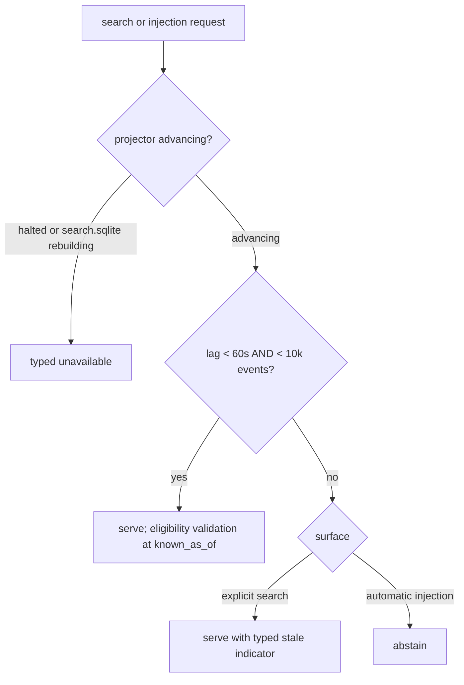
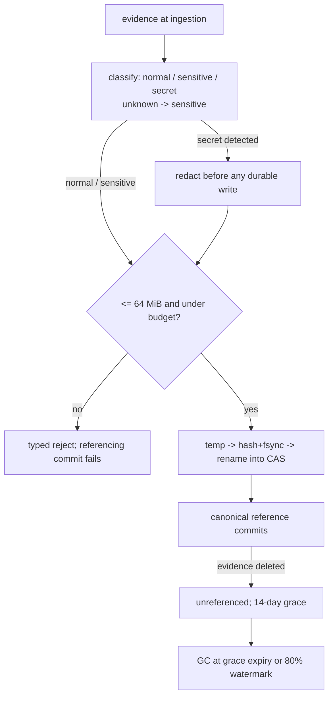

# Kernel Phase-0 Policy Deltas - Plan

## Goal Capsule

- **Objective:** Every task with Phase-0 policy obligation (`magic-context-kh8.2`, `kh8.3`, `kh8.6`, `kh8.7`, `kh8.8`, `kh8.10`, plus retrieval-lane `3q5.9`, `3q5.15`) starts with finite, unambiguous operational limits — implementers never invent retention, sensitivity, egress, budget, backup, or staleness behavior mid-task; each limit names enforcement owner + test oracle per enforcement facet. `kh8.2` (core.sqlite kernel store) unblocked.
- **Means:** This plan's Requirements = normative policy record; owning beads get citation notes, never restated values (KTD6).
- **Authority:** `docs/plans/2026-08-29-2016-refactor-semantic-kernel-beads-restructure-plan.md` (below: "restructure plan") = architecture authority. This file = policy-value authority for K2–K10 until K9 realigns `ARCHITECTURE.md`. Conflict: restructure plan wins on architecture; this record wins on policy values; 3q5 measured benchmark gate always wins over value here.
- **Stop conditions:** No production code, schema, or config changes. No `bd dolt push`, no git commit/push without explicit authorization.
- **Tail ownership:** After bead propagation + `kh8.1` close, enforcement lands in owning K-tasks. `bd show` queries in Verification Contract = completion evidence.

---

## Product Contract

### Summary

Define kernel policy deltas restructure plan's K1 assigns (restructure R2, R3, R8, R10): retention/sensitivity/redaction/provider-egress classes, finite artifact byte budgets + reclamation, backup-restore objectives for canonical state, max search-projector lag + stale/unavailable behavior — each value with named owning task + test oracle, duplicating no 3q5 benchmark gate. Execution propagates record into owning beads, closes `magic-context-kh8.1`.

### Problem Frame

Kernel epic storage, CAS, admission, route tasks need operational limits restructure plan names but never quantifies. Without one reviewed record, each K-task picks own retention windows, budgets, staleness rules; R8 correctness proofs (`kh8.7`) have no fixed values to prove against. `kh8.2` blocked on this task.

### Key Decisions

- D1. **This plan file is the policy record.** Beads cite it; no standalone `docs/` policy file until K9 documentation realignment. (session-settled: user-approved; chosen over separate docs/ policy file: matches restructure plan interim-authority pattern, one fewer artifact to drift.) Governs R13.
- D2. **Concrete Phase-0 default values, decided now.** Numbers below = reviewed defaults, not placeholders deferred to K-tasks. (session-settled: user-approved at scoping; chosen over values-later process record: K2–K10 need numbers to build + test against.) Governs R1–R12.

### Requirements

R-IDs local to this plan. Restructure plan citations written `restructure R<N>`.

**A. Retention classes (per restructure R2 storage class)**

- R1. Canonical rows in `core.sqlite` (object registry, propositions, evidence metadata, decisions, observations, edges): no age-based deletion. Correction append-only (restructure R8); removal only via evidence deletion with propagation (restructure R10).
- R2. Commit log (`commit_log`, `change_event`) retained indefinitely in Phase 0. Revisit trigger: R7 size alarm firing, never silent pruning.
- R3. Outbox rows pruned only after every required consumer checkpoint passes them: prune boundary = min acknowledged position across required-consumer set; absent checkpoint for required consumer pins retention; prune refuses outright when required-consumer set empty (matches `pruneClaimOperationEffectsInCurrentTransaction` in `packages/plugin/src/features/magic-context/memory/storage-claim-operations.ts`). R12d lag alarm guards unbounded growth.
  - Consumer-acknowledgement rows are K2-owned canonical control facts. They have no age pruning and survive derived-store discard.
  - Required-consumer registration is K2-owned and atomically creates its initial acknowledged checkpoint immediately before the oldest retained position, so the oldest row remains consumable under inclusive prune semantics. Only registered consumers are required. Deregistration succeeds after acknowledgement reaches the current outbox tip; otherwise it refuses unless an operator explicitly authorizes abandoning the pending position. Authorized abandonment records consumer identity, abandoned position, operator identity, and timestamp in the retained commit log.
- R4. Staging rows (`extraction_runs`, `candidates`, `candidate_scores`, `admission_decisions`) expire 30 days after run completes (mirrors `mc_transform_session_roots` 30-day prune in `crates/mc-store/src/lib.rs`). Rows referenced by admission decision that produced canonical state keep only decision row; expired staging content deleted.
- R5. Evidence artifacts in `artifacts/`: two retention states. `referenced` (cited by canonical `evidence_meta` — retained unconditionally); `unreferenced` (GC-eligible 14 days after last dereference; never-referenced objects: 14 days after CAS write — mirrors repo 14-day grace patterns). GC runs on daemon maintenance pass at grace expiry + at R8 soft watermark. Deletion propagation + backfill barriers per restructure R10.
- R6. Derived stores (`search.sqlite`, `vectors/`): no retention obligation — rebuildable, discardable any time (restructure R2, R5).

**B. Size and byte budgets**

- R7. `core.sqlite`: 1 GiB size alarm — daemon health metric flips to warning at/above. Alarm only; no enforcement, no write refusal in Phase 0.
- R8. `artifacts/`: finite byte budget, 4 GiB default, configurable via daemon config surface (typed-budget pattern in `crates/mc-host/src/config.rs`; K3 wires key). At 80% soft watermark: warn-only daemon health alarm (mirrors R7) + GC removes expired unreferenced artifacts (R5). At hard cap: new artifact writes rejected with typed error carrying current usage + cap — raising configurable cap = operator remedy — and canonical commit referencing rejected artifact fails atomically (write order per restructure R10). Reclamation never deletes referenced artifact. Hard-fail here vs R7 warn-only deliberate: refusing `core.sqlite` writes halts all memory; bounding bulky evidence admission loses no canonical state.
- R9. Single artifact payload capped 64 MiB (matches SHM frame cap in `crates/mc-shm-transport/src/arena.rs`). Oversized evidence rejected at ingestion with typed error. Cap bounds stored payload; daemon wire body max also 64 MiB, so K8 ingestion route must still accept cap-sized payload (chunked ingestion or same-machine path handoff — K8 design call).

**C. Sensitivity, redaction, and provider egress**

- R10. Every artifact + staging candidate carries one sensitivity class from `normal | sensitive | secret`, assigned at ingestion, stored in schema from first shape (restructure R10). Unclassifiable content defaults `sensitive` (fail closed).
  - `normal`: project/code facts with affirmative repo provenance (derived from repository files, tool output about repository, agent conversation about code). No provenance → never `normal`. Retrievable, injectable, may egress to user-configured remote providers.
  - `sensitive`: user-private content. Retrievable + injectable per K6 visibility matrix; egress local inference only.
  - `secret`: detected credentials/tokens/keys. Redacted at ingestion — detector runs once in shared daemon ingestion path, upstream of K2 staging writes AND K3 CAS writes, so fires before any durable write. Guarantee coverage-bounded: secret bytes matching ported detector vocabulary never durably stored; detector misses remediated by purge path below. Detection metadata restricted to detector identifier, secret type, match offset/length — never matched bytes or reversible derivation. Never egresses, never injected. Detector vocabulary ports from `packages/plugin/src/shared/redaction.ts`.
  - Purge: operator-invoked path deletes stored artifact later found holding secret bytes; propagates deletion per restructure R10 (owner: K3).
  - Boundary: sensitivity classes govern egress + redaction; K6 v86 visibility matrix governs retrieval audience (restructure R7). They compose; neither restates other.
- R11. Provider egress: two destination classes. `local` (in-process or daemon-owned inference: synapse, bundled ONNX); `remote` (any network socket, including loopback OpenAI-compatible endpoints). One egress gate in daemon routes (K8) enforces R10 mapping: gate derives each call's max sensitivity from stored R10 class of every artifact + staging record in payload — caller-supplied declaration = assertion checked against derived value; absent/unresolvable class treated `sensitive` (fail closed). Gate rejects `sensitive`→`remote` and any `secret` egress. K10 shadow extraction + all embedding/LLM dispatch go through gate — no direct provider calls from kernel code paths, enforced by negative oracle failing when any kernel path constructs/calls provider client outside gate.

**D. Backup and restore objectives (canonical state)**

- R12a. Backup = consistent snapshot of `core.sqlite` at one `commit_seq` plus `artifacts/` objects it references. Capture order: database snapshot first, then artifact copy — restructure R10 write order (artifact durable before canonical reference) makes every snapshot reference already durable. Capture must not lose referenced objects: GC + evidence-deletion propagation may not remove object in-progress capture references (snapshot-scoped GC pin or capture-long suspension both satisfy — K2/K3 call); referenced object missing at copy time fails backup, never partial.
- R12b. Restore objective: restored canonical state identical at backed-up `commit_seq` — semantic dump + `commit_seq` equality = oracle (restructure R8 restart/backup obligation). Derived stores not restored; rebuild from canonical state, search serving per R12d until caught up.
- R12c. Recovery-time objective: canonical memory reads + writes available within 5 minutes of restore start on developer machine, for canonical state at/below R7 1 GiB alarm threshold (size envelope making number falsifiable). Derived rebuild async, not in RTO. Backup scheduling out of Phase-0 scope; objectives bind capability, not cadence.
- R12e. Backup inherits max sensitivity class of contents, written to local-only destination, subject to R11 egress prohibitions (`sensitive`→`remote` and any `secret` egress rejected).

**E. Search-projector lag**

- R12d. Projector lag measured two ways from K2-owned facts in `core.sqlite`: events (max `commit_seq` minus min acknowledged `commit_seq` across all registered required outbox consumers; these are R3 consumer-acknowledgement rows, distinct from the `search.sqlite` internal projector bookmark named in restructure R2); wall-clock age of oldest unconsumed outbox row. Staleness threshold: 60 seconds or 10,000 events behind, whichever trips first.
  - Below threshold: search serves normally; canonical eligibility validation at `known_as_of` (restructure R3, Kernel Design Baseline) already rejects stale rows before injection.
  - At/beyond threshold: explicit search still serves with typed `stale` indicator; automatic prompt injection abstains entirely (fail closed — restructure R8 no-stale-injection obligation). Threshold guards index incompleteness, not row staleness: lagging projector means rows missing from index, which `known_as_of` validation cannot observe — rejects stale rows it sees, never absent rows. Typed indicator lets explicit search keep serving; automatic injection has no channel to disclose gap, so cannot.
  - Projector halted (checkpoint not advancing while outbox grows, or `search.sqlite` absent/rebuilding): search reports typed `unavailable`, matching restructure plan D2 degraded-mode vocabulary. Canonical writes unaffected.
  - Threshold trip also raises daemon health alarm (guards R3 outbox growth for every required consumer — vector consumer `3q5.15` included, not only search projector).

**F. Record propagation**

- R13. Owning beads (`kh8.2`, `kh8.3`, `kh8.6`, `kh8.7`, `kh8.8`, `kh8.10`, `3q5.9`, `3q5.15`) carry note citing this plan path + their policy IDs — citation, not restatement. `kh8.1` closes with reason citing this file.
- R14. No 3q5 benchmark gate value duplicated as policy value here (see Scope Boundaries for gate list).

### Success Criteria

- Every policy value in ownership matrix names enforcement owner + test oracle per enforcement facet (`kh8.1` acceptance bar).
- Implementer opening any owning bead finds policy obligations via bead citation + this record — no value invented mid-task.

### Scope Boundaries

- No production code, schema, config changes in this task; enforcement lands in owning K-tasks.
- 3q5-owned measured gates not policy values here, stay 3q5-owned: auto-search p95 ≤ 25 ms; vector memory 154 MB exact / 128 MB compressed-with-recall-gate; nDCG@10 / Recall@50 regression bounds; p95 regression ≤ 10%; bytes-per-transform-pass reduction; cold-index/embedding-provider degraded modes.
- `vectors/` byte budgets = 3q5's (memory gate above). This record only classifies `vectors/` rebuildable (R6).
- Wire-protocol + transform-domain versioning out of scope (restructure R6).
- K4 (slice), K5 (scope algebra), K9 (rip-out): no Phase-0 policy obligations; appear in no matrix row.
- Non-memory-domain surfaces keep existing behavior: historian dump files, session logs, transform telemetry budgets outside kernel policy domain.

#### Deferred to Follow-Up Work

- Backup scheduling/automation (Phase 0 defines objectives for capability only): `magic-context-kh8.16`.
- Sensitivity reclassification flows (upgrading/downgrading stored artifact class): `magic-context-kh8.17`.
- Per-project or per-domain budget overrides beyond single configurable `artifacts/` cap: `magic-context-kh8.18`.

---

## Planning Contract

### Key Technical Decisions

- KTD1. **Policy values are editable defaults, not benchmark gates.** Change = edit this record + owning bead note — no measurement campaign. K1-vs-3q5 boundary: 3q5 gates measured; K1 policies declared.
- KTD2. **Redact at ingestion, before the CAS write.** Secret bytes never become durable; stored artifact already redacted. (Chosen over redact-on-egress: one trusted surface instead of auditing every read path; composes with restructure R10 write order.)
- KTD3. **One egress gate in daemon routes (K8), not per-call-site checks.** Every provider dispatch flows through it, including K10 extraction. (Chosen over per-provider checks: one enforcement point = one oracle — e2e mock provider captured requests.)
- KTD4. **Budget pressure rejects new writes; reclamation never evicts referenced artifacts.** (Chosen over LRU eviction of referenced evidence: canonical support must not silently vanish; deletion explicit + propagating per restructure R10.)
- KTD5. **Lag policy ownership splits three ways:** K2 owns measurable facts (R3 consumer-acknowledgement rows + outbox age in `core.sqlite`; projector's own checkpoint lives in `search.sqlite` per restructure R2, rebuildable, never measured fact); K8 owns serving behavior (stale marker, injection abstention, typed unavailable); `3q5.9` owns making projector meet budget. (Research finding: projector lives in retrieval lane; without split, lag policy has no owner among K2–K10.)
- KTD6. **Beads cite policy IDs; values live only here.** Matches restructure plan bead-authoring rule (bodies cite plan path + IDs, no restating). One owner per rule; copies drift.

### Policy Ownership Matrix

Every value above, enforcement owner, test oracle. Each row's oracle lands in that row's enforcement-owner task; K7 (`kh8.7`) carries cross-check that every matrix row has landed oracle (its addition to restructure R8 proof obligations). E2e oracles use mock-provider capture in `packages/e2e-tests/`.

| Policy | Value | Enforcement owner | Test oracle |
|---|---|---|---|
| Canonical retention (R1) | append-only, no age deletion | K2 `kh8.2` | correction appends; deletion only via propagation test |
| Commit-log retention (R2) | indefinite, Phase 0 | K2 `kh8.2` | restore/replay proofs consume full log |
| Outbox retention (R3) | required-consumer min-checkpoint prune | K2 `kh8.2` | prune respects min required-consumer checkpoint; missing checkpoint pins rows; empty required-consumer set refuses prune |
| Consumer-acknowledgement retention (R3) | canonical control facts; no age pruning; survive derived-store discard | K2 `kh8.2` | age-prune pass and deletion/rebuild of `search.sqlite` and `vectors/` leave acknowledgement rows unchanged |
| Required-consumer membership (R3) | register atomically immediately before oldest retained position; only registered consumers required; explicit deregistration | K2 `kh8.2` | registration and checkpoint immediately before the oldest retained position appear atomically; first consumption includes the oldest row; unregistered consumer does not affect prune; caught-up deregistration succeeds; pending deregistration refuses; operator-authorized abandonment succeeds and records the required commit-log audit fields |
| Staging TTL (R4) | 30 days | K2 `kh8.2` | completed run retained at day 29 and deleted at day 31; admission-decision row survives |
| Unreferenced-artifact GC (R5) | 14-day grace (CAS-write clock when never referenced) | K3 `kh8.3` | boundary-time GC: referenced survives, expired unreferenced removed, rerun idempotent |
| Derived-store retention (R6) | no retention obligation; rebuildable and discardable | search `3q5.9`; vectors `3q5.15` | discard each derived store and rebuild identical logical identities and checkpoints from canonical state |
| core.sqlite size alarm (R7) | 1 GiB, warn only | K2 `kh8.2` | health metric flips at 1 GiB; writes continue |
| artifacts/ budget (R8) | 4 GiB; 80% warn alarm + soft GC; hard-cap reject | K3 `kh8.3` | configured cap overrides 4 GiB default; alarm fires at 80%; write at configured cap succeeds; cap+1 rejects typed with usage+cap; referencing commit fails atomically; referenced object never GC'd |
| Per-artifact cap (R9) | 64 MiB | K3 `kh8.3`; K8 `kh8.8` ingestion route | K3 accepts 64 MiB and rejects 64 MiB+1 typed; K8 route accepts a 64 MiB payload end to end |
| Sensitivity classes + default (R10) | normal/sensitive/secret; default sensitive | K2 `kh8.2` staging columns; K3 `kh8.3` artifact columns; K6 `kh8.6` visibility interplay | staging candidate and artifact both store class from first schema; unclassifiable ingest lands sensitive; false-normal fixture (user-personal content) lands sensitive |
| Redaction at ingestion (R10) | vocabulary-covered secret bytes never durable | K2 `kh8.2` staging writes; K3 `kh8.3` artifact writes | planted-secret fixture: CAS + staging-row bytes hold redacted form only; detection metadata holds no secret substring; known-miss corpus records measured coverage; vocabulary proven by one checked-in fixture consumed by both runtimes (`storage-format-epoch` cross-runtime pattern) |
| Secret purge (R10) | operator-invoked, propagates deletion | K3 `kh8.3` | purged artifact absent from CAS, search docs, derived support |
| Egress gate (R11) | derived max sensitivity; sensitive→local only; secret never | K8 `kh8.8`; K10 `kh8.10` delegates | e2e mock provider: normal payload observed; sensitive/secret case asserts gate's typed rejection AND no captured remote request (rejection = proof; absence alone race-prone); under-declared payload rejected; negative scan fails on any out-of-gate provider call |
| Backup consistency (R12a) | snapshot at one commit_seq, DB-then-artifacts, capture-pinned GC | K2 `kh8.2`; K3 `kh8.3` artifact participation | snapshot under concurrent writes, GC, evidence deletion references only durable artifacts |
| Restore identity (R12b) | identical canonical state at commit_seq | K2 `kh8.2` | backup → restore → semantic dump + commit_seq equality (restructure R8) |
| Restore RTO (R12c) | canonical available ≤ 5 min at ≤ 1 GiB | K2 `kh8.2` | timed restore of fixture at R7 threshold size |
| Backup confidentiality (R12e) | local-only destination; inherits max sensitivity | K2 `kh8.2` | backup inherits the maximum contained sensitivity class; backup to non-local destination rejected |
| Lag threshold (R12d) | 60 s / 10,000 events, min across required consumers | facts K2 `kh8.2`; behavior K8 `kh8.8`; performance `3q5.9`; consumer participation `3q5.15` | pause projector at 59 s/9,999 events, 60 s/10,000 events, and one beyond: fresh / stale-typed / stale-typed; injection abstains and health alarm fires at either threshold; vector consumer participates in minimum-checkpoint lag |
| Projector halted (R12d) | typed unavailable | K8 `kh8.8` | halted-projector fixture returns typed unavailable; writes unaffected |

### High-Level Technical Design

Search serving decision under projector lag (R12d):

Artifact lifecycle under sensitivity and budget policy (R5, R8–R11):

### Assumptions

- Three Phase-0 defaults have repo anchors: 64 MiB (SHM frame cap), 30 days (session-root prune), 14 days (embedding grace). Four are engineering judgment, no repo anchor: 4 GiB, 1 GiB, 60 s / 10,000 events, 5 min RTO — calibrate against measured `core.sqlite`/`artifacts/` size sample from real project when K2/K3 land; review pipeline on this plan adjusts direction, not calibration (D2).
- Daemon health surface will expose numeric metrics for R7, R8, R12d alarms; today `host.status` allowlists component state strings only (`crates/mc-host/src/control.rs`), so K2/K8 extend surface.

---

## Implementation Units

### U1. Propagate policy obligations into owning beads

- **Goal:** Each owning bead carries note citing this plan path + its policy IDs; implementers find obligations without record restatement.
- **Requirements:** R13; KTD6.
- **Dependencies:** none (record final once plan pipeline in Verification Contract has run).
- **Files:** Tracker records, changed through `bd update <id> --notes` (or `--body-file` where notes exist). `.beads/issues.jsonl` is a passive export, not the source or edit target.
- **Approach:**
  1. `kh8.2`: cite R1–R4, including R3 acknowledgement retention and required-consumer membership, R7, R10 staging/redaction ownership, R12a–R12c facts ownership, R12d facts, R12e.
  2. `kh8.3`: cite R5, R8–R10 (columns, redaction-before-durable-write, purge), R12a artifact participation.
  3. `kh8.6`: cite R10 sensitivity/visibility boundary.
  4. `kh8.7`: cite Policy Ownership Matrix cross-check as its addition to restructure R8.
  5. `kh8.8`: cite R9 ingestion-route obligation, R11, R12d serving behavior.
  6. `kh8.10`: cite R11 (extraction delegates to egress gate).
  7. `3q5.9`: cite R6 derived-store retention + R12d lag budget (cross-lane note; performance obligation only).
  8. `3q5.15`: cite R3 + R6 + R12d (cross-lane note; required-consumer registration, derived-store retention, and lag participation).
- **Test scenarios:** Test expectation: none — tracker operations; correctness via Verification Contract queries.
- **Verification:** `bd show` on each of eight beads renders citation note naming this plan's repo-relative path + policy IDs.

### U2. Close kh8.1 with evidence

- **Goal:** `magic-context-kh8.1` closed as completed; `kh8.2` becomes ready.
- **Requirements:** R13, R14.
- **Dependencies:** U1.
- **Files:** Tracker record, changed through `bd close magic-context-kh8.1 -r "..."`. `.beads/issues.jsonl` is a passive export, not the source or edit target.
- **Approach:**
  1. Run gate-duplication check (Verification Contract row) before closing.
  2. Close with reason citing this plan's repo-relative path as reviewed policy record.
- **Test scenarios:** Test expectation: none — tracker operations.
- **Verification:** `bd show magic-context-kh8.1` shows closed with citing reason; `bd ready` lists `magic-context-kh8.2`.

---

## Verification Contract

| Check | Command / evidence | Applies to |
|---|---|---|
| Owner + oracle completeness | Every Policy Ownership Matrix row names owner bead + oracle per enforcement facet; no row reads "TBD" | record |
| No 3q5 gate duplication | `rg -n "25 ms|154 MB|128 MB|nDCG|Recall@50|p95 regression|bytes-per-transform-pass|cold-index/embedding-provider" docs/plans/2026-08-30-0054-feat-kernel-phase0-policy-deltas-plan.md` matches only Scope Boundaries gate list and this check row itself | R14, U2 |
| Citation integrity | This file is present in `HEAD`; every cited R-ID exists in Requirements; each bead cites every matrix row that names it | R13, U1 |
| Bead propagation | `bd show` on `kh8.2 kh8.3 kh8.6 kh8.7 kh8.8 kh8.10 3q5.9 3q5.15` renders the repo-relative path and required policy IDs | U1 |
| Closure hygiene | `kh8.1` closed with reason citing this file; `bd ready` includes `kh8.2` | U2 |
| Plan pipeline | File passed `/rust-design-review`, `/typescript-design-review`, `/ponytail-review` with accepted findings applied, then `/caveman-compress`; compressed policy record retained at this path | pre-execution gate |
| Authorized sync only | User authorized commit, push, and stacked PR creation for this execution; no `bd dolt push` | all |

---

## Definition of Done

- Global: policy record (Requirements A–F) reviewed + final; every matrix row has owner + oracle; no 3q5 gate value duplicated; eight owning beads carry citation notes; `kh8.1` closed with evidence; Verification Contract passes in full.
- Per-unit: U1 eight `bd show` checks pass before U2 closes `kh8.1`.
- Cleanup: no scratch `--body-file` files left; no policy value restated in any bead body.

---

## Risks & Dependencies

- **SQLite pin vs WAL gate.** Restructure plan SQLite profile names pinned 3.46.0, but `crates/mc-store/src/sqlite_runtime.rs` fails closed below 3.47.1 (WAL-reset fix); workspace pins `rusqlite 0.32` (bundled 3.46.0) without `backup` feature. R12a–R12c assume K2 lands coordinated rusqlite/`commons` bump; for snapshot mechanism itself, `VACUUM INTO` (SQLite ≥ 3.27) = viable fallback needing no rusqlite `backup` feature. Owner: K2 `kh8.2`; this record only flags it.
- **Egress gate coverage window.** Until K8/K9 land, TS-side LLM + remote-embedding calls (`packages/plugin/src/features/magic-context/memory/embedding-openai.ts`, dreamer prompts) run outside R11 gate. Interim exposure accepted per restructure plan KTD8 reduced-parity window; gate binds all kernel-era paths.
- **Health-surface gap.** R7/R8/R12d alarms need numeric metrics on daemon status surface (today string-allowlisted). Small K2/K8 scope addition, flagged in Assumptions.

---

## Sources / Research

- Restructure plan (authority): `docs/plans/2026-08-29-2016-refactor-semantic-kernel-beads-restructure-plan.md` — R2, R3, R8, R10; Kernel Design Baseline; KTD5/KTD6/KTD8.
- Budget/limit patterns: `crates/mc-host/src/config.rs` (typed budgets), `crates/mc-shm-transport/src/arena.rs` (64 MiB frame cap).
- Retention precedents: `crates/mc-store/src/lib.rs` (30-day session-root prune), `packages/plugin/src/features/magic-context/project-embedding-registry.ts` + `storage-embedding-measurements.ts` (14-day grace), `packages/plugin/src/features/magic-context/memory/storage-claim-operations.ts` (consumption-driven outbox prune, checkpoint invariants).
- Redaction seed vocabulary: `packages/plugin/src/shared/redaction.ts`.
- Discard-and-rebuild identity: `packages/plugin/src/features/magic-context/storage-format-epoch.ts`, `packages/cli/src/commands/doctor-reset-db.ts`.
- Backup precedents: `packages/cli/src/lib/database-access.ts` (snapshot helper), `packages/cli/src/commands/doctor-repair-db.ts`.
- Oracle harnesses: `crates/mc-store/tests/` (storage invariants), `packages/e2e-tests/` (mock provider request capture).
- SQLite gate evidence: `crates/mc-store/src/sqlite_runtime.rs` (3.47.1 floor), root `Cargo.toml` (`rusqlite 0.32`, bundled, no `backup` feature).
