# Phase L2 Knowledge Base and Threat Model

**Repository**: `ahrav/magic-context` at `085f659b76fcaf4bf8da2d005b89a5e6dc4e486c`  
**Audit mode**: balanced  
**Evidence basis**: source, manifests, architecture docs, maintainer audit notes, and `piolium/attack-surface/advisory-summary.md`. No curated `piolium/KNOWLEDGE-BASE.md`, legacy `INFO.md`, external-doc seed, or Phase 1 `sbom.json` was present.

This is a model, not a vulnerability report. Risks and review candidates below remain hypotheses unless a later phase proves a defect.

## Project Type & Components

Magic Context is a **multi-surface local coding-agent system**: two privileged host plugins, a CLI, a local protocol module, a desktop app with an optional HTTP server, a local predicate-provider CLI/library, and a static documentation site. It is not primarily an internet SaaS. The main security subject is code that runs with the developer's OS account while processing repositories, conversations, model output, and local credentials.

| Component | Type / execution environment | Purpose and privileged effects | Evidence |
|---|---|---|---|
| OpenCode plugin | Plugin/library; TypeScript under Bun/Node | Registers host hooks and `ctx_*` tools, rewrites prompts, starts background agents, reads/writes local state, starts loopback RPC, calls providers, and can auto-update the plugin registration | `packages/plugin/src/index.ts:71,555-624`; `packages/plugin/package.json` |
| Pi/OMP plugin | Plugin/library; TypeScript under Node/Bun | Mirrors context transforms and tools, spawns Pi/OMP child-agent processes, and shares the SQLite store | `packages/pi-plugin/src/index.ts:723`; `packages/pi-plugin/package.json` |
| Shared feature core | Library; TypeScript | Config loading, project security filtering, prompt transforms, memory/search, SQLite migrations, smart-note compilation/sandboxing, hidden-agent policy | `packages/plugin/src/config/index.ts`; `packages/plugin/src/features/magic-context/`; `packages/plugin/src/agents/` |
| `magic-context` CLI | CLI; Node >=24 | Setup, doctor, cache operations, DB repair, authority drain, and cross-harness/session migration; writes user/host configuration and launches host tools | `packages/cli/src/index.ts:93-177`; `packages/cli/package.json` |
| `ck-mc` Rust module | Protocol/plugin/worker under `subc` | Implements transform, historian, tools, authority transitions, and a separate durable store over the internal subc wire | `crates/mc-module/src/main.rs:15-35`; `crates/mc-module/src/lib.rs`; `Cargo.toml:20-29` |
| Shared TypeScript SQLite store | Local datastore | Holds transcripts-derived state, memories, notes, workspaces, migrations, leases, and authority markers; shared across OpenCode and Pi | `ARCHITECTURE.md:8-16`; `packages/plugin/src/features/magic-context/storage-db.ts` |
| Tauri dashboard | Desktop app; Rust backend + Solid webview | Reads and mutates memories/config/session state, probes embedding endpoints, discovers models, and installs signed app updates | `packages/dashboard/src-tauri/src/main.rs:37-118`; `packages/dashboard/src-tauri/tauri.conf.json:27,48-52` |
| Dashboard serve mode | API/web app; Axum/Tokio | Serves embedded UI and a single authenticated `/api/invoke` command-dispatch endpoint; optionally binds non-loopback | `packages/dashboard/src-tauri/src/serve/mod.rs:136-183` |
| OpenCode TUI RPC | Local API/WebSocket; Bun loopback | Snapshot/dialog RPC and push notifications; token is published in an owner-private discovery file | `packages/plugin/src/shared/rpc-server.ts:71-80,121-205,259-287` |
| Smart-note runtime | LLM compiler + QuickJS/WASM | Compiles note conditions into JavaScript and evaluates them with bounded file, Git, and HTTPS capabilities | `packages/plugin/src/features/magic-context/smart-notes/compiler.ts`; `sandbox-runner.ts:110-184`; `capabilities.ts` |
| `retina-local-fs` | Library/CLI provider | Consumes one JSON request on stdin and evaluates bounded local file/Git predicates, returning JSON on stdout | `packages/retina-local-fs/src/cli.ts`; `packages/retina-local-fs/src/provider.ts`; `packages/retina-local-fs/README.md` |
| Docs site | Static web app/build tooling | Astro/Starlight build deployed as Cloudflare static assets; no Worker script is configured | `packages/docs/astro.config.mjs`; `packages/docs/wrangler.jsonc:5-15` |
| CI/release tooling | CI action / scripts | Builds, tests, installs host tools, packages npm/Tauri artifacts, and deploys docs | `.github/workflows/ci.yml`; `scripts/` |

### Execution modes that change security behavior

- OpenCode versus Pi versus OMP host contracts differ. Pi's `--tools` is an enforced registry filter; OMP appends discovered extension tools after filtering, so OMP's list is only an intended built-in budget (`packages/pi-plugin/src/subagent-runner.ts:324-329,406-408`).
- TypeScript versus experimental Rust transform mode changes the authoritative store and crosses the subc route/identity boundary (`ARCHITECTURE.md:15-16`; `packages/plugin/src/hooks/magic-context/module-transport.ts`).
- Compaction-on versus compaction-off changes whether deterministic storage failures block the request or pass messages through (`packages/plugin/src/index.ts:606-617`; `packages/plugin/src/plugin/messages-transform.ts:89-124`).
- Tauri desktop IPC and Axum `--serve` share command implementations but have different authentication and origin models (`packages/dashboard/src-tauri/src/main.rs`; `packages/dashboard/src-tauri/src/serve/dispatch.rs`).
- Production dashboard serve mode defaults to loopback; `--allow-remote` is an explicit transition to plain bearer-token HTTP (`packages/dashboard/src-tauri/src/serve/mod.rs:23,83-111`).
- Dashboard Vite dev exposure can be changed by `TAURI_DEV_HOST` (`packages/dashboard/vite.config.ts:5,15-21`).

## Project Classification

Primary classifications: **plugin**, **library**, **CLI**, **desktop**, **API/web app** (optional local serve mode), **protocol/worker** (subc module), and **static web app/CI build**. This section aliases the more detailed component classification above for downstream Phase 3 consumers.

## Architecture Model

### Main control and data planes

1. **Interactive plane**: a coding harness invokes plugin hooks and tools in-process. The plugin transforms the prompt and persists state.
2. **Agent plane**: hidden historian/dreamer/sidekick/compiler agents call an LLM and, depending on a locked allowlist, may read code, mutate memory, or edit project docs.
3. **Local state plane**: OpenCode, Pi, CLI, dashboard, and optionally the Rust module coordinate around local SQLite databases and filesystem discovery/config files.
4. **Local IPC plane**: TUI RPC uses loopback HTTP/WebSocket + bearer token; Tauri uses webview IPC; Rust mode uses subc connection-file discovery, authenticated handshake, bound route handles, channel epochs, and request schemas.
5. **External egress plane**: model/embedding APIs, smart-note HTTPS, npm update metadata/installer, Tauri update metadata/artifacts, and docs deployment.
6. **Build plane**: GitHub Actions runs repository code and remote installers on ephemeral hosted runners.

## Trust Boundaries

| ID | Source → destination | Data / channel | Security decisions and guarantees | Residual assumption |
|---|---|---|---|---|
| TB-01 | Cloned repository → config loader | `.cortexkit/magic-context.jsonc`, JSONC | Prototype-pollution keys rejected; project `{env:}`/`{file:}` expansion disabled; agent prompts/permissions/tools, embedding destinations, subc, storage policy, SQLite pragmas, updater controls, and other user-tier fields stripped; compaction thresholds are raise-only (`config/index.ts:126-137,570-585`; `project-security.ts:228-410`) | Every project-config loader path must call the same filter before merge; future fields must be classified user-tier or project-tier |
| TB-02 | Repository/conversation/tool output → LLM prompts | Host message hooks over provider API | Content is labeled in some compiler prompts; hidden agents receive deny-by-default tool maps and step caps (`agents/hidden-agent-registrations.ts`) | Prompt injection cannot be solved by labels alone; the primary coding agent remains intentionally privileged |
| TB-03 | Model output → host action | Tool calls, XML/JSON manifests, compiled smart-note JS | Tool schemas/runtime gates, per-agent allowlists, host-side parsing, ownership checks, and QuickJS capabilities constrain effects | Host framework must actually enforce the declared allowlists; OMP extension-tool behavior is weaker |
| TB-04 | OpenCode/Pi/plugin/dashboard → shared SQLite | Local file, SQLite WAL | Owner-private storage is default; schema fence, migrations, prepared statements, leases/CAS, authority markers, and transaction guards protect integrity | Same-OS-user processes are within the local trust domain; user can explicitly disable private mode for trusted-group deployments |
| TB-05 | TUI/browser-local process → OpenCode plugin RPC | Loopback HTTP and WebSocket | Random 256-bit token, constant-time compare, token on all RPC/WS calls, 1 MiB HTTP limit, WS auth timeout; discovery directory/file normally 0700/0600 (`rpc-server.ts:50-67,121-205,259-287`) | `/health` is intentionally public; a same-user local process that can read the token file is effectively trusted |
| TB-06 | Browser/network → dashboard serve | HTTP `/`, assets, SPA fallback, POST `/api/invoke` | API middleware checks Host, Origin when present, bearer token, JSON content type; 1 MiB body; 2 subprocess/network probes at once; CSP and no-store (`serve/mod.rs:136-161,243-275`) | Remote mode is plaintext. TLS, reverse-proxy normalization, and network ACLs are operator responsibilities |
| TB-07 | Bundled webview → Tauri Rust commands | Tauri IPC | Current Tauri 2.11.3 is above the origin-confusion fix; CSP applies; shell plugin is not registered; plugin permissions are declared (`main.rs:37-42`; `tauri.conf.json`) | App commands registered with `invoke_handler` are available to bundled frontend code; frontend compromise therefore reaches many data-mutating commands |
| TB-08 | TypeScript host → subc/`ck-mc` | Connection file + subc wire v2 | subc client handshake, route handle epoch, route-bound session/root, per-request version and session checks, bounded queues/timeouts; module refuses unbound/mismatched routes (`module-transport.ts:27-38,347-350`; `mc-module/src/lib.rs:130-136,3022-3026,4171-4179`) | The transport/auth implementation and sibling crates are absent from this checkout, so handshake and file-permission guarantees are not independently verified |
| TB-09 | Smart-note JS → host/files/network | QuickJS host capability object | 64 KiB code, 8 MiB heap, 512 KiB stack, 2 s interrupt; no ambient `eval`/`Function`; repo path/no-follow/secret denylist; Git uses `execFile`; HTTPS DNS resolves to global IPv4 then pins socket (`sandbox-runner.ts:110-184`; `capabilities.ts`; `ssrf-guard.ts`) | `readFile` and external `httpGet` deliberately coexist; the manifest is advisory, not enforcement (maintainer-accepted A50) |
| TB-10 | User config → embedding/model provider | HTTP(S), bearer API key, source text | Project cannot choose destination; runtime blocks direct metadata/link-local spellings and refuses redirects; dashboard user-scope probe resolves and pins DNS (`embedding-openai.ts:280-306`; `dashboard/.../embedding_probe.rs`) | Runtime OpenAI-compatible fetch uses a host-string denylist, not DNS pinning; loopback/private destinations are intentionally supported |
| TB-11 | CLI/stdin/args → filesystem, DB, subprocess | Local process | Structured argv parsing, JSON schema gates, atomic writes, backups/recovery journals, mostly argument-vector subprocess APIs | Operator invoking the CLI is trusted; PATH/login-shell resolution can select same-user-controlled binaries |
| TB-12 | Registry/update/CI sources → executable artifacts | npm, Tauri updater, GitHub Actions, remote install script | Tauri updater has a configured signing public key; npm version strings are semver-validated and exact-pinned before restart | npm package installation is not independently signature/provenance checked here; CI actions use mutable tags and CI runs `curl ... | bash` for OpenCode |
| TB-13 | Internet → static docs | HTTPS via Cloudflare static assets | Static output only; no app sessions or server handlers in this repository | Generated Starlight/Astro output and Cloudflare response headers were not inspected |

## Data-Flow Slices (DFD)

### DFD-1: malicious repository content to privileged coding-agent actions

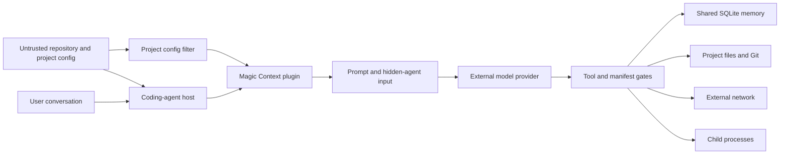

**Sources**: repository text, project JSONC, conversation/tool output. **High-risk sinks**: host tools, memory mutation, project-doc edits, subprocess/network calls. Project security filtering controls configuration, but repository text still reaches models as data and can attempt indirect prompt injection.

### DFD-2: dashboard serve request to local authority

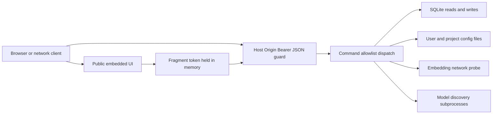

**Source type**: remote HTTP when `--allow-remote`, otherwise local browser. **Sink**: many read/write commands exposed behind one bearer credential. Static UI is pre-auth; `/api/invoke` is not.

### DFD-3: LLM-generated smart-note code to capability sinks

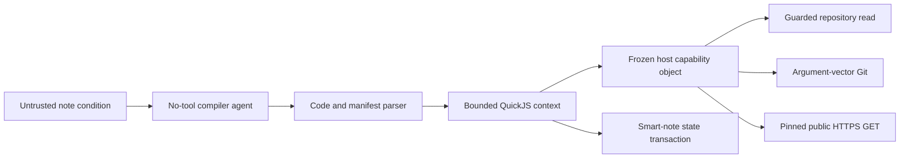

This is the principal dynamic-code path. The code itself is untrusted; safety depends on QuickJS isolation and capability implementations, not compiler prompt compliance or the advisory manifest.

### DFD-4: TypeScript-to-Rust authority transition

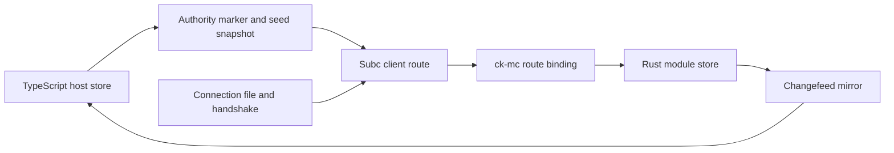

The identity boundary is route-bound `(channel, epoch, project root, session)`, not a project field supplied in each body. Authority states `TS → PREPARING → MODULE → DRAINING` gate which store may mutate memories/notes.

### DFD-5: local predicate provider

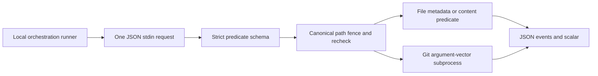

The provider can observe paths chosen by its caller but returns predicate results rather than arbitrary file content. The external runner is described as the authoritative fence but is outside this checkout.

## Control-Flow Slices (CFD)

### CFD-1: dashboard API authentication and routing

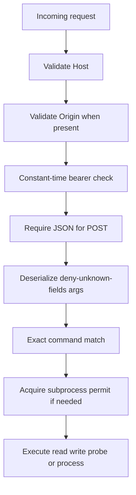

No `Forwarded` or `X-Forwarded-*` values participate. In wildcard-bind remote mode, any Host is accepted and an Origin, when present, must equal `http://<Host>`; non-browser requests may omit Origin.

### CFD-2: project-config privilege filtering

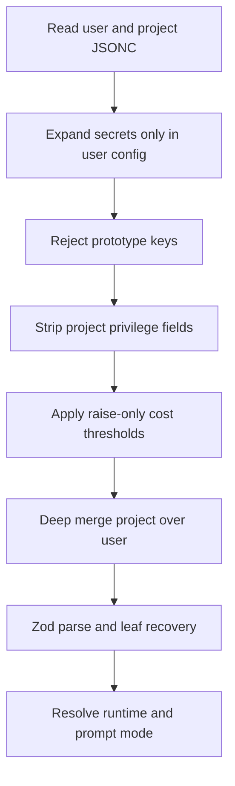

Security depends on filtering before merge and before legacy-field migration. Invalid non-agent leaves fall back to defaults with warnings; invalid agent blocks are dropped.

### CFD-3: hidden-agent capability selection

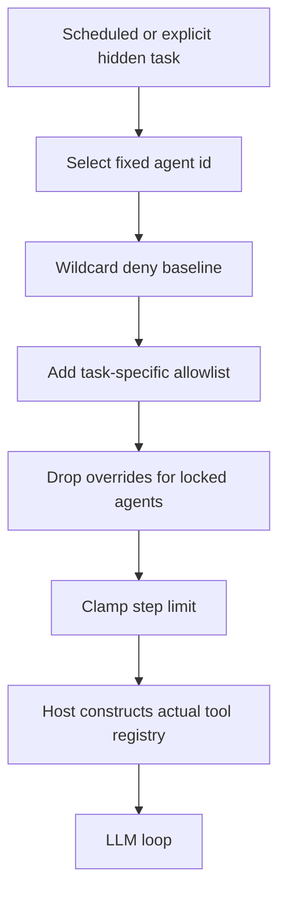

The final host registry is the real guard. OpenCode and Pi enforce this differently; OMP cannot use `--tools` to remove extension tools after extension discovery.

### CFD-4: Rust route and authority decision

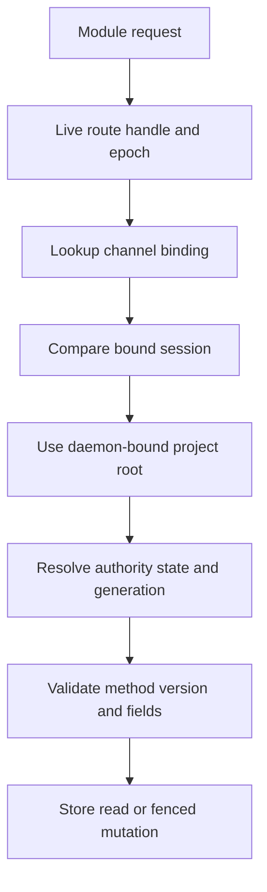

Unbound routes, session mismatches, stale epochs, and project-vocabulary mismatches fail closed.

## DFD/CFD Slices

The canonical high-risk slices are the five DFDs and four CFDs immediately above. They cover prompt/tool execution, dashboard authority, dynamic code, local file/process access, and TypeScript/Rust authority transitions.

## Attack Surface

| Surface | Attacker-controlled inputs | Execution context / reachable sinks | Primary guard |
|---|---|---|---|
| OpenCode/Pi host hooks | Conversation text, tool outputs, repository contents, model output, session metadata | Prompt rewriting, DB state, provider calls, registered `ctx_*` tools | Host lifecycle plus plugin schemas/ownership gates |
| Project config | Repo-committed JSONC and legacy spellings | Models, agents, provider destinations, runtime mode, SQLite settings | Pre-merge project security filter (`project-security.ts`) |
| Agent tools (`ctx_memory`, `ctx_note`, `ctx_search`, `ctx_expand`, `ctx_reduce`) | Model-generated structured args, session directory, agent identity | Shared DB reads/writes and Rust facade calls | Tool schemas, `toolContext.agent`, project/workspace ownership, authority state |
| Hidden agents | Repo/session/memory text and provider output | Read/search, memory mutation, or docs edits depending on fixed agent | Deny-by-default, task-specific tools, locked overrides, step/time caps |
| Smart-note sandbox | LLM-generated JavaScript derived from note text | Repo file reads, Git, external HTTPS, note state | VM resource limits + host capabilities; not manifest prose |
| Dashboard serve | HTTP method/path/headers, bearer, 1 MiB JSON `{cmd,args}` | DB/config mutation, endpoint probe, subprocess discovery | `api_guard`, exact command dispatch, serde `deny_unknown_fields` |
| OpenCode TUI RPC | Loopback path, headers/query token, JSON body, WS frames | Status RPC and notifications/dialog actions | Random token, private port file, size/auth timeout |
| Tauri webview IPC | Bundled frontend JS and rendered local data | All registered Rust commands; updater/dialog/process plugin defaults | Tauri local-origin/capability model, CSP, current patched Tauri |
| CLI | argv, prompts, env, config and DB files | Config edits, DB migration/repair, subprocesses, issue submission | Structured parsers, confirmation/dry run, atomic writes/redaction |
| `retina-local-fs` | One stdin JSON request with paths/needles/refs | File/Git predicate observations | Strict schema, canonical fencing/revalidation, argument-vector Git |
| subc module | Connection file, route binds, wire request bodies | Rust store, transforms, tools, authority state | Handshake, live epoch route, session/root binding, method schemas |
| External provider responses | Model text/tool calls, embedding vectors/model id, HTTP status/body | Prompt state, manifests, vector storage | Parsing, model substitution check, size/time limits |
| Update/build | npm metadata/package, Tauri metadata/artifact, CI actions/remote installer | Package execution, app replacement, release artifacts | Semver/exact pinning; Tauri signature; lockfile in CI |
| Docs | Public HTTP paths; repository-authored Markdown at build time | Static HTML/assets | Static deployment; framework build escaping |

## Key Dependencies

`sbom.json` was absent, so this subset is seeded from the advisory summary and verified against manifests/source.

| Dependency | Version evidence | Security role / reachability | Advisory note |
|---|---|---|---|
| Astro / Starlight | `astro@7.0.3`, Starlight `0.41.1` | Static docs build only | Four exact-version Astro advisories exist; required SSR/Hono/transition shapes were not found. `7.1.0` clears all four ranges (`advisory-summary.md`) |
| Vite / Solid | Vite `6.4.3`, Solid `1.9.12` | Dashboard dev/build and UI | Locked versions are outside listed recent affected ranges; Vite dev server remains development-only |
| Tauri | Rust `2.11.3`, npm API `2.11.1` | Desktop origin/IPC/update boundary | Current Rust lock is above Tauri origin-confusion fix `2.11.1`; shell plugin is a frontend manifest residue and is not registered in Rust |
| Axum / Tokio / reqwest | `0.7.9` / `1.52.3` / `0.12.28` | Dashboard serve API, concurrency, network probes | High reachability in optional server mode; no current exact advisory match from L1 |
| QuickJS emscripten + asyncify variant | `0.32.0` | Executes untrusted compiled checks | No direct advisory in L1; security is capability/resource-limit sensitive |
| `@opencode-ai/plugin` / SDK | `1.17.11` | Privileged host hook and tool contract | Host enforcement and lifecycle assumptions are security-critical |
| Pi coding agent | `0.80.2` peer/dev | Extension/tool registry and child processes | Above four recent listed fixes; OMP has a weaker extension-tool filter contract |
| SQLite wrappers / engine | Bun/Node built-ins; `rusqlite 0.31/0.32` bundled | Durable shared state and authorization/authority metadata | Treat DB files as sensitive; wrapper-package advisory coverage does not fully cover bundled engine/native behavior |
| `@cortexkit/subc-client` + sibling Rust crates | npm `0.4.1`; Rust paths unresolved | Authenticated local transport and route authority | Sibling source is absent, so versions and handshake implementation remain a major coverage gap |
| Transformers/ONNX | `@huggingface/transformers 4.2.0` lock | Local model download/loading and native/WASM parsing | Complex model/native input surface; no direct L1 advisory |
| Sharp/libvips | `sharp 0.35.2` | Docs image processing at build time | Above recent `<0.35.0` advisory; still dangerous for untrusted images in CI |
| Wrangler | `4.105.0` | Docs deployment with credentials | Above command-injection fix `4.59.1` |
| JSONC/Zod/TypeBox | `jsonc-parser 3.3.1`, `comment-json 5.0.0`, `zod 4.4.3` lock, `typebox 1.3.1` | Config and wire validation | Application trust-tier filtering is more important than package CVE signal |

## Framework Contracts and Hidden Control Channels

| Contract / channel | Security effect | Current behavior and assumption | Evidence |
|---|---|---|---|
| OpenCode legacy plugin export discovery | Extra exported functions can be invoked as plugin factories with wrong arguments, potentially failing all security hooks | Entry module exports only the real default plugin; helper builders live elsewhere | `packages/plugin/src/agents/hidden-agent-registrations.ts:3-25`; `packages/plugin/src/index.ts:832` |
| OpenCode hook ordering | Prompt security and cache behavior occur before provider dispatch; command/tool hooks can mutate state around executions | Magic Context relies on `chat.message`, `tool.definition`, message/system transforms, command hooks, and events being called in documented host order | `packages/plugin/src/index.ts:555-657` |
| Transform exception contract | Throwing through OpenCode's Effect pipeline aborts a user turn; ordinary failures therefore pass through, while deterministic storage/emergency limits rethrow | Security reviews must distinguish accepted fail-open transient/ordinary errors from intentional fail-closed errors | `packages/plugin/src/plugin/messages-transform.ts:43-88,190-288`; maintainer note A24 |
| `toolContext.agent`, `sessionID`, and `directory` | Carries identity and project scope into tool authorization | `ctx_memory` resolves project per call from `directory`, gates agent/actions and ownership, and avoids a foreign-ID existence oracle | `packages/plugin/src/tools/ctx-memory/tools.ts:345-530` |
| Hidden-agent permission merge | User overrides can broaden unlocked agents; locked privacy/maintenance agents drop tool, permission, prompt, and system overrides | Repository config cannot set these fields; trusted user config may still alter unlocked historian/sidekick permissions | `hidden-agent-registrations.ts:303-377`; `project-security.ts:401-410` |
| Pi `--tools` versus OMP extension discovery | Alters whether an intended zero/read-only agent can see third-party extension tools | Enforced boundary on Pi only; OMP narrows built-ins but appends discovered extension tools | `packages/pi-plugin/src/subagent-runner.ts:324-329,406-408` |
| Axum route-layer placement | All `/api/*` paths, including unknown ones, run `api_guard` before dispatch; static routes are outside auth | Keep every future sensitive route under the guarded nested router; do not add a sibling `/api` route outside it | `packages/dashboard/src-tauri/src/serve/mod.rs:148-162` |
| `Host` | DNS-rebinding/proxy boundary | Exact loopback/explicit host match normally; wildcard bind accepts any Host. Host is lowercased/trimmed only; no `Forwarded` reconstruction | `serve/mod.rs:387-413` |
| `Origin` | Browser cross-origin request control | Optional header; when present must match allowed HTTP origin or current Host in wildcard mode. Non-browser requests can omit it | `serve/mod.rs:415-432` |
| `Authorization` | Sole API identity credential | Exact case-sensitive `Bearer ` prefix and constant-time token bytes; no cookie/query fallback for dashboard API | `serve/mod.rs:444-466`; `packages/dashboard/src/lib/platform.ts:23-40` |
| `Content-Type` and method | Request parsing/method override | Only POST `/api/invoke`; `application/json` required; no method-override headers are read | `serve/mod.rs:148-150,256-261,468-476` |
| Forwarding/original URL headers | Proxy routing/auth confusion | `Forwarded`, `X-Forwarded-*`, `X-Real-IP`, original URL, and original method headers are not consumed. Remote reverse-proxy deployment is therefore not modeled as trusted or supported | repository-wide header search; `serve/mod.rs` |
| Dashboard token fragment | Prevents token in HTTP request/referrer on initial page load | Token is printed in `#token=...`, read into module memory, then removed with `history.replaceState`; it is not persisted to localStorage | `serve/mod.rs:517-523`; `packages/dashboard/src/lib/platform.ts:23-40` |
| Dashboard remote transport | Changes attacker reach and credential confidentiality | `--allow-remote` is explicit, but transport remains HTTP; operator must tunnel or isolate network | `serve/mod.rs:83-111,175-179` |
| Dashboard API cache behavior | Sensitive responses and errors must not enter intermediary/browser caches | Guarded API subtree gets `Cache-Control: no-store`; index gets no-store; hashed static assets remain cacheable | `serve/mod.rs:151-156,266-275,339-356` |
| Dashboard static asset path | File disclosure boundary | Assets are compile-time embedded; rejects empty, `..`, backslash, and leading slash before key lookup | `serve/mod.rs:286-314` |
| Tauri capabilities and local-origin classification | Frontend compromise to native-command boundary | Capability targets `windows: ["*"]` and grants updater/dialog/process defaults; all app commands are registered in `invoke_handler`. No remote capability is declared; Tauri is patched | `capabilities/default.json`; `main.rs:37-118`; `Cargo.lock` per advisory summary |
| Tauri/Vite CSP | Controls webview script/network reach | Production CSP permits self scripts and HTTPS connections; serve CSP is stricter (`connect-src 'self'`) | `tauri.conf.json:27`; `serve/mod.rs:27` |
| Vite dev host/HMR | Can expose a development server and HMR socket | Default host is not remote; `TAURI_DEV_HOST` changes host and HMR port 1421. Never use this as production auth | `packages/dashboard/vite.config.ts:5,15-21` |
| OpenCode RPC `/health` | Unauthenticated local information channel | Returns only PID and instance ID; all `/rpc/*` and `/ws` require token | `rpc-server.ts:259-287` |
| OpenCode RPC WS query-token compatibility | URL token may appear in local upgrade URL/logs | Header preferred; query fallback retained for a version-skew window | `rpc-server.ts:57-67` |
| RPC discovery file permissions | Bearer confidentiality boundary | Normally 0700 directory/0600 file; trusted-group mode delegates to umask | `rpc-server.ts:157-205`; `storage-permissions.ts` |
| subc connection file/env | Selects daemon and module identity before handlers | Default path under CortexKit run dir; client has 2 s handshake timeout; module accepts `--subc` and module-id/nonce env managed by sibling protocol | `module-transport.ts:27-38,226`; `mc-module/src/main.rs:23-35` |
| subc route handle epoch | Prevents stale-channel identity reuse | Client drops/reopens stale routes; module binds channel to root/session and validates mismatch | `module-transport.ts:60-91,691-789`; `mc-module/src/lib.rs:3022-3026` |
| Prompt-provider cache identity | Security/correctness decisions depend on exact serialized bytes, model/provider key, session state, runtime mode, and host hook ordering | `m0/m1` replay and mutation gates are hidden control channels; a “harmless” transform or model/variant change can invalidate the cache or expose untrimmed history | `ARCHITECTURE.md` “Transform pass mechanics” and “m[0]/m[1] cache layout” |
| HTTP cache keys | No app-defined request-header cache-key customization exists | API is no-store; static embedded assets are public. A future proxy must not cache `/api` by path alone | `serve/mod.rs:151-156` |
| Docs runtime | Static versus SSR changes advisory reachability | Current Astro config has no server adapter/output mode and Cloudflare config serves only assets | `packages/docs/astro.config.mjs`; `packages/docs/wrangler.jsonc:5-15` |

## Threat Model

### Scope and assumptions

- In scope: production source in `packages/plugin`, `packages/pi-plugin`, `packages/cli`, `packages/dashboard`, `packages/retina-local-fs`, and `crates/*`; CI/build/update paths where they can ship executable artifacts.
- Tests and docs are evidence, not production entry points, except the public static docs build.
- Assumed deployment: single developer workstation, developer OS account trusted, repositories and model output untrusted, provider/operator configuration trusted, dashboard serve loopback by default.
- The risk ranking rises materially if `--allow-remote` is used on an untrusted LAN, shared storage permissions are enabled for untrusted users, OMP loads untrusted extensions, or CI is moved to persistent/self-hosted runners.
- The security-threat-model skill normally requests user validation before finalization. This orchestrated phase required an unattended final artifact, so these assumptions remain explicit and unconfirmed.

### Assets and objectives

| Asset | Why it matters | Objective |
|---|---|---|
| Repository source and worktree | Agents and dashboard can read or edit developer code/docs | C/I/A |
| Session transcripts, reasoning, notes, and user profile | May contain proprietary code, credentials, personal preferences, and unreleased decisions | C/I |
| Durable memories/workspaces/compartments | Become trusted context in future sessions; poisoning persists | C/I/A |
| Provider credentials and environment/file-substituted secrets | Theft permits paid API use or broader account access | C/I |
| Shared SQLite and Rust stores | Cross-harness source of truth and authorization/authority metadata | I/A/C |
| Tool and process capabilities | Run with the developer's OS authority | I/A/C |
| RPC/dashboard bearer tokens | Grant local or remote access to mutation-capable APIs | C/I |
| Update/build artifacts and package registrations | Execute in every user host at high privilege | I/C/A |
| Prompt/cache invariants | Failure can leak stale data, lose context, or cause provider cost/availability impact | I/A |

### Attacker model

**Capabilities**

- Publish or contribute a repository the victim clones and opens with a coding agent.
- Place adversarial instructions in source, docs, issue text, tool output, note conditions, or other content the LLM sees.
- Control or compromise model/provider output, embedding responses, a public smart-note HTTPS endpoint, an npm dependency/registry account, or update/deployment infrastructure.
- Reach the dashboard serve port when the operator binds it remotely; observe plaintext traffic if on path.
- Run a malicious process or browser page under the same OS user, or another local account when permissions/network exposure allow it.
- Supply malformed/large JSON, paths, command arguments, SQLite-visible identifiers, protocol frames, and timing races at reachable boundaries.

**Non-capabilities under the baseline assumptions**

- An arbitrary internet attacker cannot reach normal plugin tools, Tauri IPC, shared SQLite, subc, or loopback RPC.
- Static docs do not expose local memories, sessions, tokens, or API handlers.
- A repository cannot directly set user-tier agent permissions/prompts, embedding destination, secret substitutions, SQLite pragmas, subc connection, updater behavior, or storage privacy after project filtering.
- A browser without the random dashboard/RPC token cannot invoke protected API methods merely by guessing the port.
- A different OS account cannot normally read owner-private discovery/state files.

### Top abuse paths

1. **Repository prompt injection → tool action**: attacker commits instruction-bearing content → agent/hidden task reads it → model emits a permitted tool call → call reads/edits files, mutates durable memory, or sends data externally → compromise persists in later prompts.
2. **Remote dashboard token capture → workstation authority**: operator enables `--allow-remote` → attacker observes or steals plaintext bearer URL/header → invokes an allowlisted mutation/probe command → reads transcripts/config or changes memory/workspaces/config.
3. **Smart-note capability composition → source disclosure**: adversarial note condition influences compiler output → compiled check reads a non-denied repository file → check uses permitted external HTTPS GET as a signaling/egress channel → repository information leaves the host. This capability composition is a documented accepted v1 tradeoff, not by itself a new defect.
4. **Frontend compromise → Tauri command bridge**: malicious rendered content or dependency achieves webview script execution → script calls registered app commands → reads/mutates local state or triggers permitted updater/process/dialog operations.
5. **subc identity confusion → cross-project state**: stale/spoofed route or project vocabulary mismatch bypasses route binding → request resolves another project's memory/note authority → cross-project disclosure/mutation. Existing epoch/session/root checks are intended to stop this.
6. **Dependency/update compromise → plugin RCE**: registry, action tag, remote install script, or package publisher is compromised → malicious artifact enters CI or auto-update → code executes with developer/CI credentials.
7. **PATH/login-shell hijack → process substitution**: same-user attacker places a shim or modifies shell startup → dashboard/CLI/agent launches a constant command name → attacker binary executes under app authority.
8. **Shared-store tampering → durable prompt poisoning**: same-user or trusted-group writer edits SQLite/store files or races authority migration → malicious memory/compartment becomes future system context or corrupts availability.

### Threat table

| ID | Threat source / prerequisite | Threat action and impact | Existing controls | Gaps / recommendations | Detection | L | I | Priority |
|---|---|---|---|---|---|---|---|---|
| TM-001 | Malicious repo/contributor; victim opens it with a tool-capable agent | Indirect prompt injection induces exfiltration, file edits, subprocess use, or durable memory poisoning | Project config filtering; hidden-agent tool allowlists; locked prompts/permissions; runtime memory ownership; step caps | Treat repo text as data at every prompt; keep mutating autonomous tasks host-applied; add canary/red-team fixtures for instructions in code/docs/tool output; require user confirmation for novel egress or destructive file actions | Log agent/tool/task identity, destination, project, and source provenance; alert hidden agents using unexpected tools | M | H | **high** |
| TM-002 | Dashboard `--allow-remote` on reachable network; bearer stolen/sniffed | Attacker reads/mutates local session/memory/config data and reaches probe/subprocess commands | Explicit opt-in/warnings; random 256-bit bearer; Host/Origin checks; exact dispatch; body/concurrency limits | Do not expose plaintext mode directly; require TLS reverse proxy/SSH tunnel; consider refusing unspecified/non-loopback binds without a TLS termination assertion and support per-command scopes/read-only mode | Audit bind address and auth failures; log command class without secrets; rate-limit repeated failures | M* | H | **high** conditional |
| TM-003 | Same-user malicious process/browser or leaked URL/token | Invoke loopback RPC/dashboard APIs or consume notification data | 0700/0600 discovery; loopback bind; constant-time tokens; no CORS; dashboard fragment token removed; RPC auth timeout | Remove WS query-token compatibility when skew window ends; minimize `/health`; rotate token on restart; ensure logs never include full launch URL | Discovery-file permission checks; unexpected RPC client/failed auth metrics | L | H | medium |
| TM-004 | Prompt-injected smart-note condition or compromised compiler model | Generated JS abuses `readFile` + `httpGet` composition, VM bugs, or host-function confusion; possible repo disclosure/DoS | No-tool compiler; parser/dry run; code/heap/stack/time caps; disabled ambient eval; secret/path guard; pinned public HTTPS; body cap | Maintain accepted A50 explicitly; consider per-note host/path capability enforcement or user egress approval; fuzz host wrappers and prototype/global escape attempts; keep QuickJS patched | Record check hash, actual capability calls/hosts/paths, timeout/OOM/security refusals | L-M | M-H | medium |
| TM-005 | Attacker-influenced URL/config/provider response | SSRF to metadata/internal services or credential/source redirection | Project destination fields stripped; smart-note full DNS classification/pinning; dashboard probe DNS pins; runtime redirects disabled; direct metadata/link-local blocks | Runtime embedding fetch is not DNS-pinned; if destinations ever become project/remote controlled, adopt resolve-classify-pin for each connect and redirect; prefer endpoint allowlists | Log normalized destination and resolved address class without keys/content; alert metadata/private transitions | L | H | medium |
| TM-006 | Webview XSS/dependency compromise or Tauri origin bug | Invoke broad native command set and mutate/read local state | Tauri 2.11.3; local bundled frontend; CSP; no registered shell plugin; signed updater | Restrict custom app commands with `AppManifest::commands`/narrow capabilities where feasible; target `main` rather than `*`; test untrusted DB strings in every render context; keep Tauri patched | CSP violations, updater failures, command audit events for destructive mutations | L | H | medium |
| TM-007 | Malicious/compromised local subc peer or stale route | Cross-project reads/writes, authority split-brain, stale command replay | Authenticated SDK handshake (claimed); bound root/session; route epochs; command IDs/ledgers; state/generation checks; fail-closed mismatches | Verify missing sibling transport source, connection-file modes, nonce lifetime, peer credential binding, canonical-root behavior, and replay semantics; run protocol fuzz/property tests | Route-unbound/session-mismatch/stale-epoch counters; authority checksum and generation audit | L | H | medium |
| TM-008 | Same-user process, untrusted trusted-group member, malicious DB file | Tamper/poison durable data or exploit parser/native SQLite bugs | Owner-private default; schema fence; integrity/repair tools; bundled engine; prepared statements; transactions/authority triggers | Document same-user trust; reject unsafe group sharing; consider `trusted_schema=OFF`/defensive mode where wrapper support permits; cap attacker-controlled query/result sizes | Integrity checks, schema/version drift, unexpected writer/authority generation, WAL anomalies | L-M* | H | medium conditional |
| TM-009 | Local PATH/shell/startup-file control or tainted subprocess args | Execute attacker binary or shell metacharacters; leak environment to child | Most calls use `execFile`/`spawn` args; smart-note Git has fixed program/flags and reduced env; dashboard shell commands are constants and bounded | Inventory every shell-enabled site; forbid data interpolation; resolve trusted absolute binaries for mutation-capable paths; sanitize child env and cap output/time | Log executable realpath/hash and argv class; flag shell launches outside fixed allowlist | L | H | medium |
| TM-010 | Compromised npm publisher/registry, remote installer, GitHub action tag, or release account | Supply-chain RCE in CI/developer hosts or malicious update | Frozen Bun lock; Tauri signing key; plugin auto-update validates semver and exact-pins; hosted ephemeral CI | Pin Actions to full SHAs; avoid `curl | bash` or verify digest/signature; add npm provenance/attestation and two-person release; review auto-update registry trust and rollback | Dependabot/Scorecard, artifact attestations, release transparency, registry owner/change alerts | L-M | H | **high** |
| TM-011 | Authorized client/model sends costly or huge workloads | CPU/memory/disk/provider-cost DoS, queue starvation, prompt overflow | HTTP/body/concurrency limits; sandbox limits; agent step/time caps; bounded transport queues; circuit breaker; SQLite fail-closed emergency paths | Add rate limits to remote serve mode; cap command-specific arrays/search/result sizes; keep durable-store GC and disk alarms; test recovery after provider/DB stalls | Queue depth, subprocess count, sandbox timeout, DB/WAL size, provider retries/cost | M | M | medium |
| TM-012 | Public web attacker targets docs framework/build output | XSS/path/origin bug in generated docs or dev server disclosure | Static Cloudflare assets; no SSR/Hono/transitions observed; Vite dev not production | Upgrade Astro to >=7.1.0; inspect generated site/headers; never expose dev server; keep untrusted images out of privileged build | Dependency alerts, static output scan, CSP/header tests | L | L-M | low |

`*` depends on non-default operator choices.

### Criticality calibration

- **Critical**: anonymous pre-auth code execution in dashboard serve mode; silent update compromise affecting installed plugins; cross-project memory/tool execution with no user interaction.
- **High**: stolen remote dashboard bearer enabling full local data mutation; reliable malicious-repository prompt path to secret exfiltration; compromised package/update/CI path executing as the developer.
- **Medium**: same-user token theft; bounded repository disclosure through smart-note capabilities; Tauri frontend compromise requiring a separate XSS; targeted DoS behind auth.
- **Low**: public health metadata; static docs-only XSS with no local bridge; issues requiring deliberate trusted-user misconfiguration and no meaningful asset impact.

### Focus paths

| Path | Why | Threats |
|---|---|---|
| `packages/plugin/src/config/` | Canonical repo-versus-user trust-tier boundary and secret substitution | TM-001, TM-005 |
| `packages/plugin/src/agents/` | Hidden-agent capability construction and override semantics | TM-001 |
| `packages/plugin/src/features/magic-context/dreamer/` | Autonomous LLM tasks, leases, manifest parsing, and host-applied mutations | TM-001, TM-011 |
| `packages/plugin/src/features/magic-context/smart-notes/` | LLM-to-code compiler, QuickJS, SSRF, file and Git capabilities | TM-004, TM-005 |
| `packages/plugin/src/tools/` | Model-controlled mutation/read APIs and ownership decisions | TM-001, TM-007, TM-008 |
| `packages/plugin/src/shared/rpc-server.ts` | Loopback bearer, discovery-file, HTTP/WS auth and version-skew behavior | TM-003 |
| `packages/plugin/src/hooks/auto-update-checker/` | npm registry and installer/config update trust | TM-010 |
| `packages/plugin/src/hooks/magic-context/module-transport.ts` | subc connection/route/retry identity propagation | TM-007 |
| `crates/mc-module/src/lib.rs` | Route-bound authorization and protocol dispatch | TM-007 |
| `crates/mc-store/src/lib.rs` | Authority triggers, durable ledgers, SQLite store integrity | TM-007, TM-008 |
| `packages/pi-plugin/src/subagent-runner.ts` | Child process, extension inheritance, Pi/OMP capability divergence | TM-001, TM-009 |
| `packages/dashboard/src-tauri/src/serve/` | Final balanced-mode network auth/dispatch boundary | TM-002, TM-003, TM-011 |
| `packages/dashboard/src-tauri/src/{commands.rs,config.rs,embedding_probe.rs}` | Native command, filesystem, process, and URL sinks shared with serve mode | TM-002, TM-005, TM-009 |
| `packages/dashboard/src-tauri/{capabilities,tauri.conf.json}` | Webview-to-native and updater capability surface | TM-006, TM-010 |
| `packages/cli/src/commands/` | Local DB migration/repair/file/subprocess authority | TM-008, TM-009 |
| `packages/retina-local-fs/src/` | Path canonicalization/revalidation and Git execution | TM-009 |
| `.github/workflows/ci.yml` and `scripts/release*.sh` | Build/release supply chain | TM-010 |

### Threat-model quality check

- Covered every discovered production network listener and non-network privileged entry class.
- Represented each trust boundary in at least one abuse path/threat.
- Kept static docs/dev/build separate from workstation runtime.
- Marked same-user/operator assumptions and non-default remote/group modes.
- Preserved conflicts with maintainer decisions: A50 and A53 are accepted capability choices, not rediscovered findings.

## Domain Attack Modes (apply security-threat-model and other relevant skills)

### Mode selection

- **Mode A (library/plugin/protocol target)** applies to the OpenCode/Pi plugins, shared libraries, `retina-local-fs`, and subc protocol module. Sharp-edge review focused on secure defaults, host-framework enforcement, and capability APIs.
- **Mode B (security-sensitive dependency consumer)** applies to QuickJS, Tauri, Axum, SQLite, HTTP clients, parsers, subprocess APIs, model runtimes, and agent host SDKs. Insecure-default review focused on loopback/remote defaults, owner-private files, fail-open parsing, and endpoint controls.
- **Mode C (domain-specific)** applies to LLM/agent prompt injection, dynamic code/sandboxing, HTTP/WebSocket/local APIs, SSRF/URL parsing, desktop IPC/updater, filesystem/symlink/command execution, SQLite, and software supply chain.
- **WooYun web methodology** was applied to dashboard HTTP: unauthorized access, command dispatch, path traversal, SSRF, information disclosure, XSS/CSRF/origin, and business-logic command selection.

### Attack-class catalog

| Domain | Attack classes to preserve in later phases | Project-specific sinks / controls | Custom SAST targets |
|---|---|---|---|
| LLM agents and prompt injection | Direct/indirect injection; confused deputy; tool escalation; poisoned persistent memory; cross-session data disclosure; cost loops | Hidden agents, prompt assembly, `ctx_*`, docs-maintainer writes; config stripping and locked per-task tools | Repo/session/model text → system/user prompts → tool calls; agent-id/tool allowlist merge; model manifest → host writes |
| QuickJS dynamic code | Sandbox escape; host-object exposure; prototype/global recovery; asyncify reentrancy/UAF; CPU/heap/stack DoS; capability composition | `compiler.ts`, `sandbox-runner.ts`, `capabilities.ts`; memory/stack/interrupt and serialized module | `compiledCheck` → `evalCodeAsync`; global/host capability references; missing abort propagation; code-size and error-size bounds |
| Local HTTP/WebSocket | Missing auth; DNS rebinding; Host/Origin confusion; token in URL/log; CSWSH; body/connection DoS; route-layer bypass | Dashboard Axum and Bun RPC; bearer, Host/Origin, private port file, guarded nesting | Routes not under guard; query/cookie token acceptance; forwarded-header use; Origin optionality; static/API cache policy |
| SSRF / URL parsing | Alternate IP spelling; DNS rebinding; redirects; IPv4-mapped IPv6; userinfo; proxy bypass; metadata/private networks; response bombs | Smart-note pinned HTTPS, embedding runtime, dashboard probe | URL source → `fetch`/reqwest/https; validation-connect split; redirect mode; proxy agent; response/time limits; credential forwarding |
| Tauri desktop IPC/update | Origin confusion; webview XSS → IPC; overbroad capability/window glob; updater endpoint/signing compromise | `invoke_handler`, `capabilities/default.json`, updater pubkey/CSP | Untrusted UI data → DOM sinks; all Tauri commands; remote capabilities; process/shell plugin registration; updater verification |
| Filesystem/subprocess | Traversal; symlink swap/TOCTOU; special files; PATH hijack; shell injection; inherited env/secrets; output/timeout DoS | Config writes, smart-note reads, retina predicates, CLI/dashboard/Pi child processes | LocalUserInput → path/file sink; check-then-use; `exec` or `shell:true`; login-shell interpolation; executable resolution and env |
| SQLite/state | SQL injection; untrusted DB/schema; cross-project IDOR; migration races; stale authority; oversized FTS/LIKE/JSON | Shared DB, dashboard API, Rust store; bindings/transactions/fences | HTTP/tool/CLI args → SQL; dynamic identifiers/order clauses; DB path selection; missing project/harness predicates; authority bypass |
| Supply chain/update/native parsing | Mutable action tags; curl-pipe-shell; npm takeover; unsigned plugin update; malicious model/native/image; lock drift | Auto-updater, Tauri updater, CI, Transformers/Sharp/Wrangler | Network metadata → install/spawn/config; release version → command; unpinned workflow `uses`; untrusted images/models → native parser |

### Sharp-edge and insecure-default observations

**Secure defaults observed**

- Dashboard serve binds `127.0.0.1`, refuses remote bind without an explicit acknowledgement, generates a strong token, and limits body/subprocess work.
- RPC binds loopback and creates owner-private discovery state by default.
- Project config cannot expand secrets or select high-risk destinations/permissions; forgotten future callers of memory tools default to the least-privileged action set.
- Smart-note VM limits and HTTPS/public-address pinning are fail closed.
- Tauri updater uses a signing key and current Tauri is above the relevant origin-confusion fix.

**Sharp edges / review obligations**

- One `--allow-remote` flag moves a write/subprocess-capable API onto plaintext HTTP.
- Tauri app commands are broadly registered and the capability uses `windows: ["*"]`; Tauri documents app commands as available to bundled frontend code unless explicitly constrained.
- OpenCode host permissions for unlocked agents can be broadened by trusted user overrides; project filtering must never regress.
- OMP's `--tools` behavior cannot constrain extension tools, so “zero tool” is not a full security boundary there.
- The smart-note capability manifest is advisory, and file-read plus public egress is intentionally allowed (A50).
- Runtime embedding SSRF filtering is weaker than smart-note/dashboard pinning, although only trusted user config can currently choose the destination.
- Invalid non-agent config leaves fall back to defaults rather than rejecting the entire file. This is availability-friendly but every security-sensitive field must remain user-tier and secure-by-default.
- OpenCode transform failures intentionally pass through in many cases; later reviewers must not equate every catch with an auth bypass, but should verify no partial mutation yields an unsafe hybrid output.

### Manual review checklist

- [ ] For every new project config field, decide whether a cloned repo may change cost, destination, prompt, tool, process, storage, or secret behavior before allowing merge.
- [ ] Trace indirect prompt injection from code/docs/tool output through each hidden task to its actual host-enforced tool registry.
- [ ] Verify OMP child isolation with real untrusted third-party extensions, not just intended `--tools` arguments.
- [ ] Fuzz compiled checks for constructor/prototype/global recovery and host-capability lifetime abuse; test timeout during every async capability.
- [ ] Test SSRF with all special IPv4/IPv6 ranges, mapped forms, CNAME/A record churn, rebinding, redirects, proxy env, and mixed DNS answers.
- [ ] Confirm every future `/api` route is nested under `api_guard`; test missing/duplicate Host, Origin, Authorization, and Content-Type headers.
- [ ] Remove legacy WS query token when compatibility permits and test token absence from browser history, logs, crash reports, and referrers.
- [ ] Review Tauri rendered untrusted strings for HTML/URL sinks and reduce native command/capability exposure to the `main` window.
- [ ] Search all subprocess sites for `exec`, `shell:true`, `-c`, login shell, tainted executable names, unbounded output, inherited sensitive env, and missing timeout/kill.
- [ ] Review all SQL clauses that cannot be parameterized (identifier/order/PRAGMA/FTS syntax) and every lookup by row ID for project/workspace ownership.
- [ ] Verify subc connection-file permission, launch nonce, peer authentication, route epoch rollover, project-root canonicalization, and replay/idempotency in the missing sibling source.
- [ ] Pin CI actions to full SHAs, replace remote `curl | bash`, and verify npm/Tauri release attestations and signing custody.

### Research basis and limitations

External research used the OWASP LLM Prompt Injection and SSRF guidance, QuickJS resource/interrupt documentation, Tauri capabilities documentation and GHSA-7gmj-67g7-phm9, GitHub Actions secure-use guidance, Node child-process documentation, and SQLite security guidance. Search queries and fallback results are retained in `piolium/attack-surface/research/domain-web-search.md`.

The requested domain playbook file was absent at `~/.config/piolium/skills/audit/references/domain-attack-playbooks.md`. WebSearch had no configured backend, so a Bing HTML fallback was used. The installed `last30days` skill had no bundled script and could not execute; failure notes are retained under `piolium/attack-surface/research/last30days-*.txt`. These gaps affect recency breadth, not the source-grounded model.

## Domain Attack Research

The canonical Mode A/B/C catalog, custom SAST targets, and manual checklist are in **Domain Attack Modes** immediately above. This alias exists for downstream Phase 3 consumers.

## Phase 4 CodeQL Extraction Targets

| DFD | Expected source type | Expected sink kind | Extraction target |
|---|---|---|---|
| DFD-1 repo/session → agent tools | `LocalUserInput`, `RemoteFlowSource` (provider/model response) | `command-execution`, `file-access`, `http-request`, `sql-execution`, `code-execution` | Model/repository data crossing prompt/manifests into tool implementations and host agents |
| DFD-2 dashboard HTTP → dispatch | `RemoteFlowSource` | `sql-execution`, `file-access`, `http-request`, `command-execution` | Axum JSON `cmd/args` through `serve::dispatch` into shared commands |
| DFD-3 compiled smart note | `RemoteFlowSource` (LLM output), `LocalUserInput` (note) | `code-execution`, `file-access`, `http-request`, `command-execution` | `compiledCheck` to `evalCodeAsync`; capability args to file/Git/HTTPS |
| DFD-4 subc transport | `LocalUserInput` | `deserialization`, `sql-execution`, `file-access` | JSON/wire request bodies through route binding and module/store handlers |
| DFD-5 predicate provider | `LocalUserInput` | `file-access`, `command-execution` | stdin JSON path/ref/needle to path resolution/read/stat/`execFile(git)` |
| Config/env secrets | `EnvironmentVariable`, `LocalUserInput` | `http-request`, `file-access`, `command-execution` | User `{env:}`/`{file:}` expansion and endpoint/process destinations |
| CLI argv | `LocalUserInput`, `EnvironmentVariable` | `file-access`, `sql-execution`, `command-execution`, `http-request` | `packages/cli/src/index.ts` dispatch into setup/doctor/migrate/repair |

## Spec Gap Candidates

No maintainer-curated RFC commitments were provided, and no public standards-conformance claim was found beyond framework/protocol usage. Phase 9 candidates are therefore internal contract checks:

1. **subc wire v2 / `PROTOCOL_VERSION`**: compare TypeScript request bodies, Rust manifest/dispatch, route binding, pagination, generation changes, and sibling `subc-protocol` once its source is available (`crates/mc-module/src/lib.rs:14663-14684`; `historian_producer.rs:1351`).
2. **CK wire/harness codecs**: compare OpenCode/Pi/native codec fixtures and differential goldens (`crates/mc-module/src/codec/`, `testdata/codec/`).
3. **RPC notification protocol 2**: verify exact acknowledgements, server instance epoch, reconnect/backlog semantics, and one-release legacy cursor compatibility (`rpc-server.ts:320-405`; `tui/data/notification-socket.ts:213-245`).
4. **Authority state machine**: verify legal `TS/PREPARING/MODULE/DRAINING` transitions, generation fencing, seed/drain checksums, mirror cursor, and restart/unknown-outcome behavior (`context-authority.ts`; `mc-module/src/lib.rs`).
5. **ECMAScript/QuickJS host contract**: source text, not untrusted bytecode, is evaluated; host APIs and resource limits must match the embedded QuickJS version.
6. **HTTP semantics**: validate duplicate header handling, Host normalization, Origin behavior, content-type parsing, and cache headers under Axum/hyper and any supported proxy. No forwarded-header trust contract is currently defined.

## Coverage Gaps

- No curated knowledge base, external documentation seed, or `sbom.json` was present; classification and dependencies were reconstructed from source/manifests and the advisory summary.
- Rust sibling workspaces `../commons` and `../subconscious` are absent. The subc handshake, connection-file permissions, peer credentials, transport framing, and several exact dependency revisions could not be verified.
- No route/auth integration test was run in this modeling phase. Dynamic framework behavior, duplicate-header parsing, reverse proxies, browser/WebView behavior, and generated Tauri/Astro artifacts remain unobserved.
- The Tauri command list is large and represented as command classes rather than one row per command; `serve/dispatch.rs` remains the canonical exhaustive allowlist.
- OpenCode and Pi are external host frameworks. Security depends on their current plugin loader, permission merge, hook ordering, directory/session identity, and tool-registry contracts; only adapter code and locked dependency versions were inspected.
- OMP extension-tool enforcement is explicitly weaker and needs testing against the actual OMP version and arbitrary discovered extensions.
- The full transitive npm/Cargo/native/model dependency graph was not independently scanned. L1 was direct-only; ONNX, bundled SQLite, WebView, libvips, downloaded models, and OS components remain partial.
- The current Astro advisories were assessed by source shape only. No docs build, generated-site scan, CSP/header check, or runtime reproduction was performed.
- Framework-contract inventory found no `Forwarded`/`X-Forwarded-*` trust, tenant header, admin/debug/preview header, method override, or request-header cache-key channel in production source. A deployment-layer proxy could introduce such channels outside this repository.
- This was a model-level pass, not exhaustive route/command authorization enumeration. Balanced mode has no later authz-auditor, so `unauthenticated-surface.md` is the final best-effort anonymous-reachability artifact.
- Domain research recency was reduced because WebSearch/MCP backends, the playbook file, and the `last30days` implementation were unavailable; retained fallback evidence documents the gap.
- No user clarification round occurred. Internet exposure, data sensitivity, shared-host use, trusted-group storage, remote dashboard use, and release controls are assumptions that can change priorities.

## Static Analysis Summary

Phase L3 prioritized the Phase 2 candidate inventory before scanning: 730 files and 5,084 candidate matches. Precise/high-score production matches were reviewed first, followed by hidden-control-channel matches near dashboard authentication/routing, loopback RPC, agent capability selection, project-config privilege filtering, provider destinations, and cache headers. The candidate scanner was highly noisy for this repository because it treated JavaScript `RegExp.exec()` and SQLite `db.exec()` as dynamic/command execution.

### Tool execution

| Pass | Result | Coverage |
|---|---|---|
| CodeQL built-in suites | Not run | `codeql` was not on PATH (`command not found`). No CodeQL database could be built. |
| Semgrep Pro baseline/language/framework/custom | Not run | `semgrep` was not on PATH. This was not an authentication or license failure, so an OSS fallback binary was also unavailable. |
| Fallback structural extraction | Ran | 726 production-like TypeScript/JavaScript/Rust/YAML files; regex/brace-balanced entry, sink, and same-function source/sink extraction. |
| Fallback security scans | Ran | Separate `rg` passes for command/shell execution, dynamic code, outbound HTTP, dynamic SQL, file access, hidden headers/control channels, weak crypto, and secret-like literals. |
| Agentic GitHub Actions audit | Ran | One workflow; zero Claude/Gemini/Codex/GitHub AI action instances; zero agentic-action findings. |
| SpotBugs + FindSecBugs | Not applicable | No Java application sources were detected. |
| SARIF merge | Not applicable | Only the fallback structural extractor produced SARIF, so there were not multiple SARIF files to merge. |

The requested architecture-aware workflow file was absent at `~/.config/piolium/skills/audit/references/architecture-aware-sast.md` (and no copy was found under the installed Pi skill tree). Structural extraction therefore used the retained fallback implementation at `piolium/codeql-artifacts/structural-fallback.py`. The absence of CodeQL/Semgrep and the workflow reference is a material coverage limitation, not evidence of a clean repository.

### Rulesets and custom modeling

No built-in CodeQL or Semgrep ruleset could execute. The intended Semgrep plan was the smallest high-signal set for this TypeScript/Rust/Tauri/Axum repository: `p/security-audit`, `p/secrets`, `p/typescript`, `p/javascript`, `p/nodejs`, `p/react`, `p/rust`, `p/github-actions`, and the required matching third-party rules. The unavailable binary prevented registry validation and execution.

Custom artifacts were still generated from the Phase 3 DFD/CFD and Domain Attack Research targets:

- `piolium/semgrep-rules/magic-context-custom.yml`: 13 YAML-validated rules for dynamic destinations, child/shell processes, QuickJS evaluation, request-header control channels, dynamic SQL, project privilege fields, shell-capable hidden agents, unbounded body materialization, Rust process/header use, mutable Actions, and `curl | shell`.
- `piolium/codeql-queries/`: four JavaScript structural queries plus a custom suite and pack for VM/process, HTTP/header, SQL/file, and project-config privilege surfaces. These are uncompiled because CodeQL was unavailable.

Targeted custom analysis was driven by DFD-1/CFD-2/CFD-3 (repository config and text to hidden-agent tools), DFD-2/CFD-1 (dashboard headers to auth and dispatch), DFD-3 (model code to QuickJS/file/Git/HTTPS), DFD-4/CFD-4 (wire identity to Rust store authority), and DFD-5 (stdin paths to filesystem/Git). The single retained draft is `p4-001-project-config-enables-shell-agent.md`.

### Batching and tradeoffs

The fallback ran in inexpensive passes rather than one broad expression: process, dynamic-code, HTTP, SQL, file, hidden-header, and crypto/secret outputs were stored separately under `piolium/semgrep-res/` while reviewing, then removed under the required transient-artifact cleanup policy. Tests/build output were excluded from primary source review except when a test established an intended security contract. The structural pair list was capped at 500 because same-function regex pairing is combinatorial and is not a substitute for taint tracking. This cap and lack of interprocedural analysis reduce coverage of cross-file wrappers, generated interfaces, and the absent sibling subc transport crates.

## CodeQL Structural Analysis

A CodeQL database was required at `piolium/codeql-artifacts/db/`, but no `codeql` executable was available. The retained directory contains `UNAVAILABLE.md` and deliberately does not contain a misleading `codeql-database.yml`. The fallback produced all requested structural artifact names, with explicit provenance fields and limitations:

- Entry-point signals: **2,917** (2,111 exported APIs, 629 Rust public APIs, 74 CLI argv, 43 plugin tools, 27 HTTP handlers, 16 stdin JSON, 7 HTTP routes, 5 Tauri commands, 5 WebSocket handlers).
- Sink signals: **4,519** (2,262 SQL, 840 host-tool actions, 426 process, 372 deserialization, 360 file reads, 199 file writes, 49 HTTP, 7 code execution, 4 shell execution).
- Reachable slices: **500 capped same-function syntactic pairs**. Here `reachable: true` means only that source and sink syntax share a brace-balanced function. It is not a CodeQL call/taint proof.

Machine artifacts:

- `entry-points.json`
- `sinks.json`
- `call-graph-slices.json`
- `flow-paths-raw.sarif`
- `flow-paths-all-severities.md`
- `structural-diagrams.md`

### Machine-generated fallback DFD

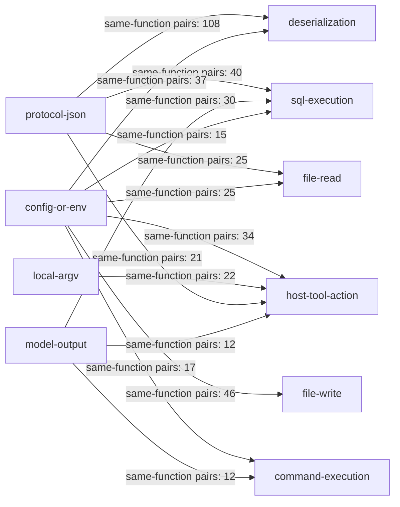

> Generated from `call-graph-slices.json`; edges mean same-function syntactic co-occurrence, not CodeQL taint reachability.

### Machine-generated dashboard guard CFD

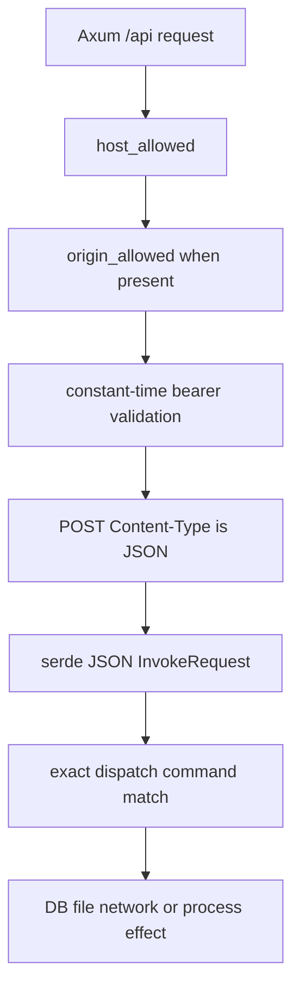

> Generated only after verifying each guard/dispatch token in `packages/dashboard/src-tauri/src/serve/mod.rs`.

### Phase 3 coverage deltas

Fallback entry points not represented as first-class Phase 3 DFD slices include the broad Tauri `#[tauri::command]` IPC surface, npm auto-update checks/installation, CLI diagnostic issue submission, and the loopback RPC WebSocket legacy query-token bridge. Phase 3 mentions these in the attack-surface/trust-boundary tables, but the canonical five DFD diagrams do not give them dedicated slices.

High-risk sink families that remain incompletely modeled are: Tauri command file/process/network effects reached through webview IPC; update metadata flowing into plugin installation/config mutation; OpenCode/Pi external host tool registries; OMP-discovered extension tools that cannot be removed by `--tools`; and subc handshake/peer-credential/connection-file behavior in absent sibling crates. On-demand CodeQL queries for these gaps could not run.

## SAST Enrichment

Low-severity, test-only, CI-only, same-user-equivalent, and correctness-only candidates were dropped before Phase 10. No CodeQL slice existed for the reviewed cross-file candidates; the fallback's 500-pair cap also did not contain their locations. The required on-demand CodeQL fallback was impossible because no database exists.

| Finding | Classification | Attacker Control | Boundary | CodeQL Reachability | Verdict |
|---------|---------------|-----------------|----------|-------------------|---------|
| p4-001 project config enables shell agent | security | Malicious repository contributor controls project JSONC and repository text inspected by the model | Repository/project tier → unattended hidden agent → developer OS shell/files; Pi child also inherits parent environment | no-slice; direct cross-file review | **keep** |
| QuickJS generated check to `evalCodeAsync` | security-sensitive accepted capability | Model output derived from smart-note text | Model output → bounded QuickJS → guarded host capabilities | no-slice | drop: memory/stack/time/code bounds, abort propagation, serialization, disposal, and ambient dynamic-code removal present; A50 capability composition is accepted |
| OpenAI-compatible embedding endpoint | environment/admin-only | Trusted user configuration selects endpoint; repository endpoint/provider fields are stripped | User config → network; private/loopback destinations intentionally supported | no-slice | drop: direct metadata/link-local and redirects blocked; remaining DNS gap is not attacker-reachable under current config contract |
| Bun RPC body materialized before size comparison | correctness/robustness | Client possessing owner-private loopback bearer | Same-user/local token holder → plugin memory | no-slice | drop: token holder is already within equivalent local authority; no cross-user boundary shown |
| Dynamic SQL templates | correctness/robustness | Mostly constants, schema introspection, generated placeholders, clamped numbers, or fixed allowlists | Local operator/model tool → SQLite | no-slice/grouped | drop: reviewed samples did not place untrusted values into SQL syntax without quoting/allowlisting |
| Variable process/PATH/login-shell sites | environment/tooling/admin-only | Local user environment/PATH or fixed internal command strings | Same OS user → child process | no-slice/grouped | drop: local attacker already has equivalent execution; externally influenced arguments use argv APIs in reviewed paths |
| MD5 and `Math.random()` matches | correctness/robustness | No attacker-controlled authentication/token use | Internal fingerprint/jitter/temp naming | no-slice | drop: not used as security primitives |
| Secret-like literals | environment/test-only | Test fixtures | Test runtime only | not applicable | drop immediately |
| Mutable Actions and `curl | bash` | environment/tooling/CI-only | Upstream action/installer compromise | External supply chain → ephemeral hosted CI | workflow-only | drop under CI-only criterion; retain as hardening gap |
| Dashboard Host/Origin/Auth/Content-Type controls | security control reviewed, no candidate defect | Remote client in explicit `--allow-remote` mode | Network → authenticated dispatch | no-slice | drop: centralized guard precedes every `/api` route; no forwarded/tenant/admin/debug/preview/method-override channel found |
| Retina local-fs path/Git provider | environment/admin-only | Local runner supplies paths/refs/needles | Local caller → same-user filesystem/Git predicate | no-slice | drop: strict schema/fence/argv controls; caller already has same-user read authority; external runner source remains a coverage gap |

### Retained finding rationale

For `p4-001`, the attacker controls repository configuration and repository text; OpenCode or Pi executes the vulnerable path; project-tier data crosses into developer-privileged shell/write capabilities; and impact is cross-privilege rather than same-user correctness. The code path is active when the repository enables the valid `maintain-docs` schedule and the activity gate becomes due. Static evidence is retained in `piolium/attack-surface/p4-maintain-docs-static-proof.txt` and the draft.
